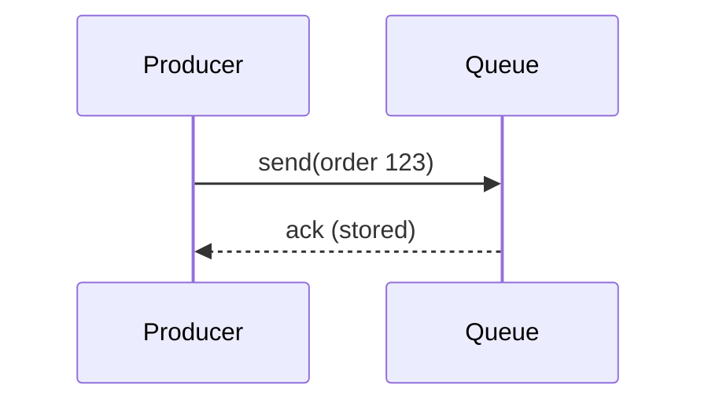
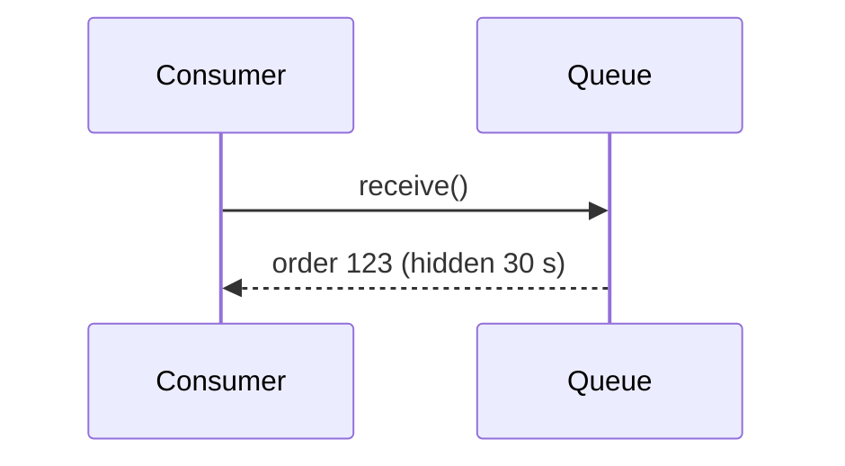
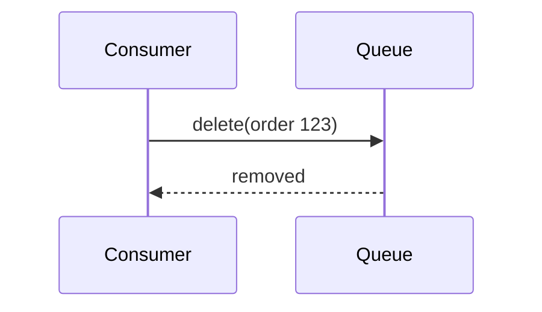
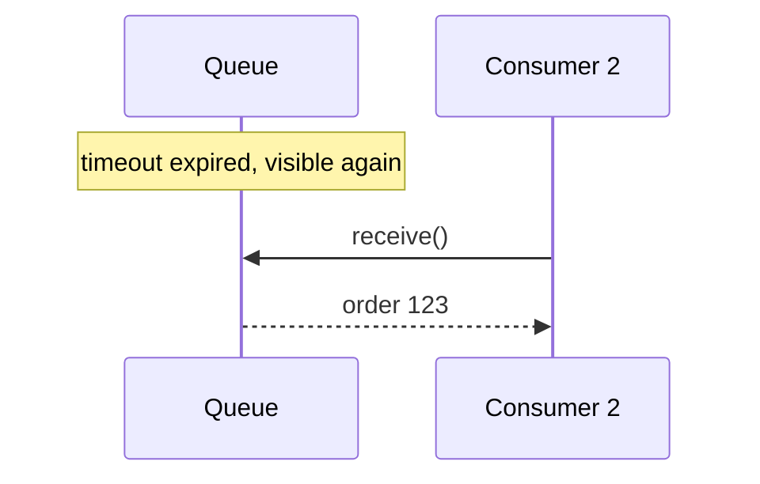
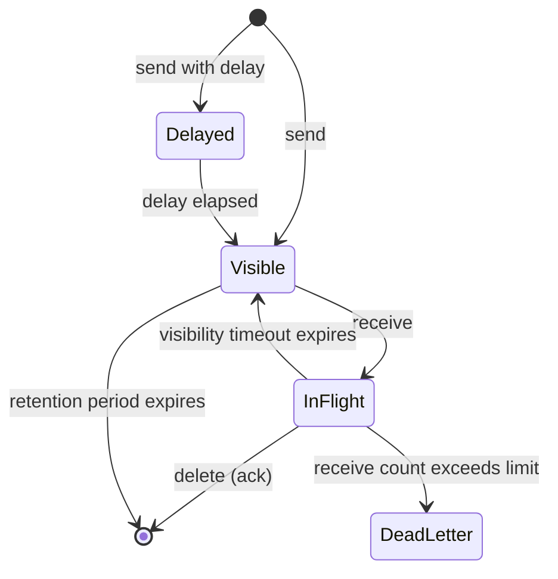

A single in-process queue is a simple data structure. A **distributed** messaging queue shared by many services must offer much stronger guarantees. Let's define them precisely.

## Functional requirements

- **Queue creation and deletion.** Clients create named queues and delete them when no longer needed.
- **Send message.** Producers enqueue messages to a queue.
- **Receive message.** Consumers retrieve messages; each message is processed by one consumer.
- **Acknowledge (delete) message.** After successful processing, the consumer acknowledges the message so it is removed.
- **Visibility timeout.** A received message is hidden from other consumers for a period. If it is not acknowledged in time — because the consumer crashed — it becomes visible again for redelivery.
- **Message ordering** where required, typically first-in, first-out (FIFO).
- **Dead-letter queue.** Messages that repeatedly fail processing are moved aside for inspection instead of blocking the queue forever.
- **Delayed delivery.** A message can be made invisible until a future time, for example "retry in 5 minutes" or "remind in 24 hours".

```text
createQueue(name, options)                 -> queueUrl
send(queue, body, attributes?, delay?, groupKey?, dedupId?) -> messageId
sendBatch(queue, [messages])               -> [messageId]
receive(queue, maxMessages, waitSeconds)   -> [{ body, attributes, receiptHandle }]
changeVisibility(queue, receiptHandle, seconds)   // extend while still working
delete(queue, receiptHandle)               // acknowledge
```

`changeVisibility` lets a consumer that is processing a long job extend its lease instead of having the message redelivered to someone else halfway through.

## Messages and their size

A message has a **body** (up to, say, 256 KB) and **attributes** — small key-value metadata such as content type, trace ID or retry count. Large payloads do not belong in a queue: every byte is replicated and moved through the system. For a 2 GB video, the producer stores the file in a blob store and sends a small message containing its location — the **claim-check** pattern.

```json
{
  "body": { "videoId": "v_8812", "source": "blob://uploads/v_8812.mp4", "profiles": ["1080p", "720p", "480p"] },
  "attributes": { "traceId": "4bf92f35", "contentType": "application/json" }
}
```

## Non-functional requirements

- **Durability.** Once a send is acknowledged, the message must not be lost, even if servers fail.
- **Scalability.** Handle huge numbers of queues and messages per second by adding servers.
- **Availability.** Producers and consumers should almost always be able to send and receive.
- **Performance.** Low latency from send to receive, typically milliseconds.
- **Ordering guarantees** configurable per queue: best effort for maximum throughput, or strict FIFO when needed.
- **Multi-tenancy and isolation.** In a shared service, one customer's busy queue must not slow down another's.

## The lifecycle of a message

<Slides title="Message lifecycle">
<Slide caption="1. The producer sends a message; the queue stores it durably and acknowledges.">



</Slide>
<Slide caption="2. A consumer receives it; the message becomes invisible to others for the visibility timeout.">



</Slide>
<Slide caption="3a. After processing, the consumer deletes the message.">



</Slide>
<Slide caption="3b. If the consumer crashes, the timeout expires and another consumer receives the message.">



</Slide>
</Slides>



<Callout type="warning">
The visibility timeout means a message can be delivered **more than once** — for example, if a slow consumer finishes just after the timeout expires. Consumers must therefore be **idempotent**, so processing the same message twice has no additional effect.
</Callout>

## Choosing the visibility timeout

- **Too short:** messages are redelivered while the first consumer is still working, causing duplicate work and wasted capacity.
- **Too long:** when a consumer crashes, its messages sit invisible and unprocessed until the timeout expires.

A reasonable default is several times the typical processing time, combined with `changeVisibility` heartbeats for occasional long jobs.

## Capacity snapshot

Suppose a cloud queue service must support 100,000 messages per second on average with 1 KB messages and retain messages for up to 4 days:

```text
100,000 msg/s × 1 KB = 100 MB/s ingest
× 86,400 s × 4 days  ≈ 35 TB retained (worst case, if nothing is consumed)
× 3 replicas          ≈ 105 TB
```

In practice most messages are consumed within seconds, so stored volume is far smaller — but the system must handle the worst case when consumers fall behind.

Each message also causes several operations: one send, at least one receive and one delete — about 300,000 API calls per second, before counting empty polls. Batching (up to 10 messages per call) and long polling cut that dramatically, which matters because per-request overhead, not bytes, usually limits queue servers.

<Ponder question="A consumer processes image thumbnails in about 2 seconds, but occasionally a huge image takes 3 minutes. The visibility timeout is 30 seconds. What goes wrong, and how would you fix it?">
The huge image's message becomes visible again after 30 seconds and is picked up by another consumer, then another — several workers end up processing the same image, and the first one's delete may fail because its receipt handle is stale. Fix it by having the consumer extend visibility periodically (a heartbeat via `changeVisibility`) while it works, and cap attempts with a dead-letter queue in case the image can never be processed.
</Ponder>

<KeyTakeaways>
- Core operations: create queues, send, receive, extend visibility and acknowledge messages, with batching variants.
- Visibility timeouts hide in-flight messages and enable redelivery after consumer failures; choose them relative to processing time.
- Delayed delivery and dead-letter queues support retries, reminders and poison-message isolation.
- Large payloads belong in a blob store; queues carry a reference (claim check).
- Durability, scalability, availability, low latency, configurable ordering and tenant isolation are key non-functional requirements.
- Redelivery implies at-least-once processing, so consumers must be idempotent.
</KeyTakeaways>
