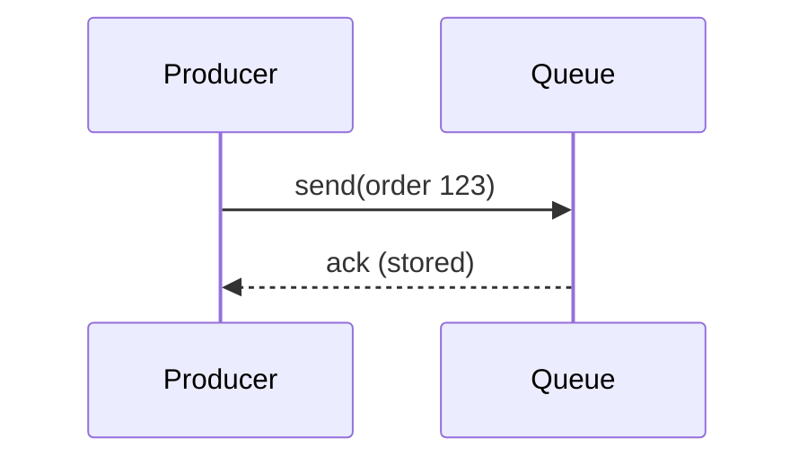
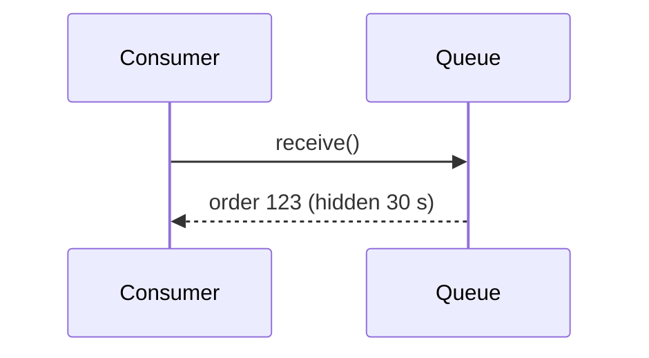
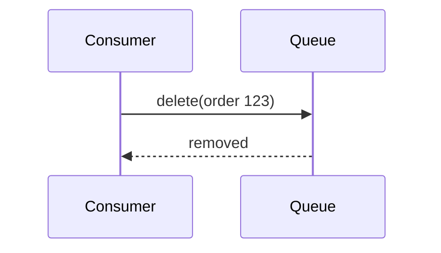
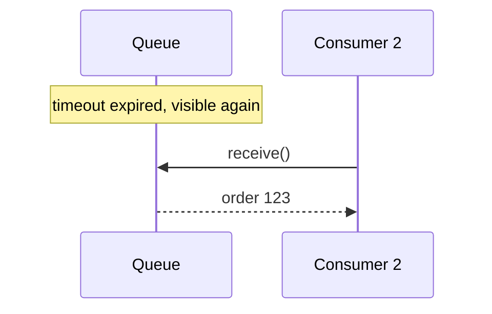

A single in-process queue is a simple data structure. A **distributed** messaging queue shared by many services must offer much stronger guarantees. Let's define them precisely.

## Functional requirements

- **Queue creation and deletion.** Clients create named queues and delete them when no longer needed.
- **Send message.** Producers enqueue messages to a queue.
- **Receive message.** Consumers retrieve messages; each message is processed by one consumer.
- **Acknowledge (delete) message.** After successful processing, the consumer acknowledges the message so it is removed.
- **Visibility timeout.** A received message is hidden from other consumers for a period. If it is not acknowledged in time — because the consumer crashed — it becomes visible again for redelivery.
- **Message ordering** where required, typically first-in, first-out (FIFO).
- **Dead-letter queue.** Messages that repeatedly fail processing are moved aside for inspection instead of blocking the queue forever.

```text
createQueue(name, options)
send(queue, message)                -> messageId
receive(queue, maxMessages, wait)   -> [message, receiptHandle]
delete(queue, receiptHandle)        // acknowledge
```

## Non-functional requirements

- **Durability.** Once a send is acknowledged, the message must not be lost, even if servers fail.
- **Scalability.** Handle huge numbers of queues and messages per second by adding servers.
- **Availability.** Producers and consumers should almost always be able to send and receive.
- **Performance.** Low latency from send to receive, typically milliseconds.
- **Ordering guarantees** configurable per queue: best effort for maximum throughput, or strict FIFO when needed.

## The lifecycle of a message

<Slides title="Message lifecycle">
<Slide caption="1. The producer sends a message; the queue stores it durably and acknowledges.">



</Slide>
<Slide caption="2. A consumer receives it; the message becomes invisible to others for the visibility timeout.">



</Slide>
<Slide caption="3a. After processing, the consumer deletes the message.">



</Slide>
<Slide caption="3b. If the consumer crashes, the timeout expires and another consumer receives the message.">



</Slide>
</Slides>

<Callout type="warning">
The visibility timeout means a message can be delivered **more than once** — for example, if a slow consumer finishes just after the timeout expires. Consumers must therefore be **idempotent**, so processing the same message twice has no additional effect.
</Callout>

## Capacity snapshot

Suppose a cloud queue service must support 100,000 messages per second on average with 1 KB messages and retain messages for up to 4 days:

```text
100,000 msg/s × 1 KB = 100 MB/s ingest
× 86,400 s × 4 days  ≈ 35 TB retained (worst case, if nothing is consumed)
× 3 replicas          ≈ 105 TB
```

In practice most messages are consumed within seconds, so stored volume is far smaller — but the system must handle the worst case when consumers fall behind.

<KeyTakeaways>
- Core operations: create queues, send, receive and acknowledge messages.
- Visibility timeouts hide in-flight messages and enable redelivery after consumer failures.
- Dead-letter queues isolate messages that repeatedly fail.
- Durability, scalability, availability, low latency and configurable ordering are key non-functional requirements.
- Redelivery implies at-least-once processing, so consumers must be idempotent.
</KeyTakeaways>
