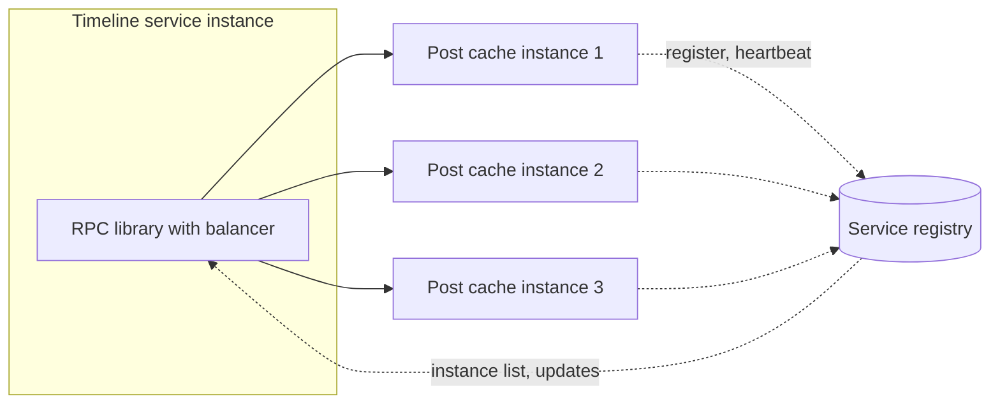

A large microblogging service is built from hundreds of internal services that call each other billions of times a day. Rendering one timeline may involve the timeline service, the post cache, the user service, the counts service and more. How do all these calls find a healthy server? This lesson contrasts dedicated load balancers with **client-side load balancing**, which large platforms commonly use for internal traffic.

## Dedicated load balancers for internal traffic

The traditional approach places a load balancer, a hardware appliance or a proxy fleet, in front of each service. Callers send requests to a virtual IP, and the load balancer forwards them to a healthy instance.

This works, but at scale it has costs:

- **An extra network hop** on every call, adding latency that multiplies across deep call chains.
- **A potential bottleneck and failure point**, since every request for that service passes through the load balancer fleet.
- **Operational overhead**: hundreds of services each need load balancer capacity, configuration and monitoring.
- **Limited intelligence**: the load balancer does not know the caller's context, such as retry budgets or which instances it has seen fail.

## Client-side load balancing

With client-side load balancing, **each caller chooses a backend instance itself**. The caller obtains the list of healthy instances from a **service registry** and picks one per request using a load-balancing algorithm, typically inside a shared RPC library.

### How it works

1. **Registration.** When an instance starts, it registers its address with the registry (backed by a coordination service such as ZooKeeper, etcd or Consul) and keeps a heartbeat or session alive.
2. **Discovery.** Callers subscribe to the list of instances for each service they depend on. The registry pushes changes when instances join or leave.
3. **Selection.** For each request, the library picks an instance. Good algorithms include **power of two random choices** (pick two instances at random and send to the one with fewer outstanding requests) and **least-latency** weighting based on observed response times.
4. **Health handling.** The library tracks errors and latency per instance, temporarily ejects misbehaving ones (outlier detection), applies timeouts and retries on another instance, and respects retry budgets to avoid retry storms.

## Benefits and costs

| Aspect | Dedicated load balancer | Client-side load balancing |
| --- | --- | --- |
| Network hops | Extra hop per call | Direct to backend |
| Bottleneck risk | Load balancer fleet | None centrally; registry is off the request path |
| Intelligence | Generic | Per-caller view of latency and errors |
| Complexity | In the infrastructure | In every client library, for every language |
| Visibility into all traffic | Centralized | Distributed, needs good telemetry |

The main cost is **complexity in clients**: every language needs a well-maintained library, and bugs in it affect every service. Many organizations address this with a **service mesh**, which moves the balancing logic into a sidecar proxy next to each instance. The application talks to its local sidecar, which does discovery, balancing, retries and encryption. This keeps the direct-path benefits while making behavior uniform across languages, at the cost of an extra local hop.

## Why it suits a microblogging service

Timeline rendering fans out to many services with tight latency budgets. Eliminating a network hop per call, balancing on observed latency and failing over instantly to another instance keep tail latency low. And with no central load balancer on the internal path, a burst of traffic during a global event cannot overwhelm a shared balancing tier.

<Ponder question="A new version of the RPC library has a bug that marks healthy instances as unhealthy after one slow response. Why is this worse with client-side load balancing than with a central load balancer, and how would you limit the damage?">
The bug ships inside every service that upgrades the library, so it can affect thousands of callers at once, each independently ejecting healthy backends — potentially concentrating traffic on a few instances and causing cascading overload. Limit the damage with gradual rollouts of library versions, a cap on the fraction of instances any client may eject at once ("panic threshold"), and fleet-wide telemetry comparing ejection rates across library versions.
</Ponder>

<KeyTakeaways>
- Dedicated internal load balancers add a hop, a potential bottleneck and operational overhead at large scale.
- Client-side load balancing lets each caller pick a backend using a service registry and a balancing algorithm.
- Power of two random choices and latency-aware selection, with outlier ejection and retry budgets, work well in practice.
- The cost is client-library complexity, which a service mesh sidecar can centralize.
- Direct calls and latency-aware balancing keep tail latency low for deep call graphs such as timeline rendering.
</KeyTakeaways>
