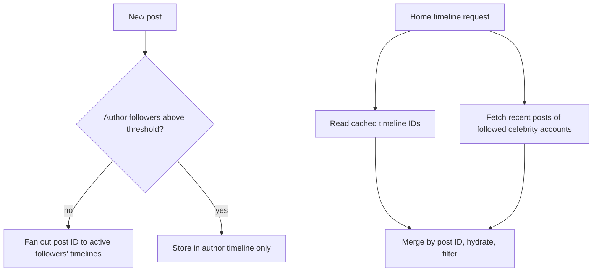

This lesson examines the hybrid fan-out, storage and caching choices, and the pipelines for search and trends.

## The hybrid fan-out

We classify authors by follower count. Accounts below a threshold, say 100,000 followers, are **pushed**: their posts are inserted into followers' cached timelines. Accounts above it are **pulled**: their posts are not fanned out, and the timeline service merges them in at read time.



A typical user follows only a handful of celebrity accounts, so the pull step adds a few extra lookups, each served from a hot cache of that celebrity's recent posts. Because millions of readers request the same celebrity posts, those caches have extremely high hit rates.

The threshold is a tunable trade-off. Lower values reduce fan-out write spikes but add more merge work at read time.

## Timeline cache details

- Each user's home timeline is a list of the most recent several hundred post IDs, stored in an in-memory store such as Redis, sharded by user ID and replicated.
- Inserts are prepends with truncation, so the list stays bounded.
- A user who scrolls beyond the cached range falls back to a slower merge from user timelines.
- The cache is not the source of truth: it can be rebuilt from the social graph and user timelines, so losing a shard causes slower reads for some users, not data loss.

## Storage choices

**Posts** are written once, read many times and looked up by ID, which suits a wide-column or key-value store sharded by post ID. Sharding by post ID spreads load evenly, while a secondary structure keyed by author supports user timelines.

**The social graph** needs two lookups: the followers of an author (for fan-out) and the accounts a user follows (for rebuilds and celebrity merges). Storing edges twice, once per direction and each sharded by its lookup key, makes both lookups single-shard. Follower lists for large accounts are paged.

**Engagement counts** use sharded counters: a like increments one of several counter shards for the post, and reads sum the shards, with the sum cached. Counts are eventually consistent.

## Handling bursts

During a global event, posting rates spike and many posts mention the same topic. The event stream absorbs bursts: fan-out workers consume at their own pace, and timeline delivery is delayed by seconds rather than failing. Autoscaling adds fan-out workers based on consumer lag. Rate limits protect against abusive accounts that post in loops.

## Search

Posts must be searchable within seconds. The search indexer consumes the post stream and writes to an **inverted index** partitioned by time: a small, frequently updated in-memory index covers the last few minutes to hours, and larger, immutable segments cover older periods. Queries search recent partitions first, because most searches want recent posts, and older partitions only if more results are needed. Results are ranked by recency, engagement and author reputation.

## Trends

The trend detector consumes the post stream and counts hashtags and phrases per region in sliding windows, for example five-minute buckets. A topic trends when its current rate is significantly higher than its historical baseline, not merely when it is popular. Approximate counting structures such as count-min sketches keep memory bounded, and spam filters prevent coordinated campaigns from manufacturing trends.

## Choosing the push threshold

Suppose fan-out capacity is 2 million timeline inserts per second, and we want any post to reach followers' timelines within 10 seconds even during bursts.

```text
Budget per post during a burst of 30,000 posts/s:
  2,000,000 inserts/s ÷ 30,000 posts/s ≈ 67 inserts per post on average
Most posts need far fewer (median followers ≈ 100 and many followers inactive),
but any author with more than ~100,000 active followers would consume
the whole capacity for tens of milliseconds per post and delay everyone else.
```

A threshold around 100,000 followers, combined with skipping inactive followers, keeps fan-out bounded. Accounts above it are pulled; since the average user follows only a few of them, read-time merging stays cheap.

## Counting trends with a count-min sketch

Tracking an exact counter for every hashtag and phrase in every region would need huge amounts of memory. A **count-min sketch** uses a small grid of counters: each item is hashed by several hash functions to one counter per row, and all those counters are incremented. The estimated count is the **minimum** across the rows. Collisions can only inflate a counter, so the estimate never undercounts and usually overcounts only slightly — and a few megabytes can track millions of distinct phrases per window. Combined with a small heap of the current top candidates, it finds heavy hitters in a stream cheaply.

<Ponder question="A hashtag used by 5 million people every day of the year does not trend, while one used by 50,000 people in the last ten minutes does. Why is that the right behavior?">
Trending means *unusually* active right now, not merely popular. The first hashtag is always at its normal level — its current rate matches its baseline — so there is nothing new to show. The second is far above its baseline, which signals breaking news or an emerging conversation that users want to discover. Comparing current rates with historical baselines per region captures exactly this.
</Ponder>

<KeyTakeaways>
- Posts from accounts below a follower threshold are pushed; posts from larger accounts are pulled and merged at read time.
- Home timelines are bounded lists of post IDs in a sharded, replicated in-memory store that can be rebuilt.
- The social graph is stored in both directions so fan-out and rebuilds are single-shard lookups.
- The event stream absorbs bursts; fan-out workers scale on consumer lag.
- Search uses a time-partitioned inverted index; trends compare current rates against baselines using sliding windows.
- The push threshold follows from fan-out capacity and burst rates; count-min sketches find trending terms in bounded memory.
</KeyTakeaways>
