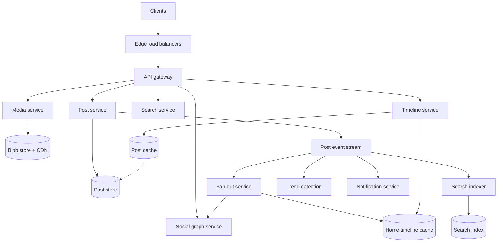
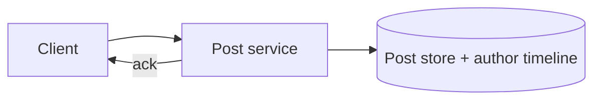
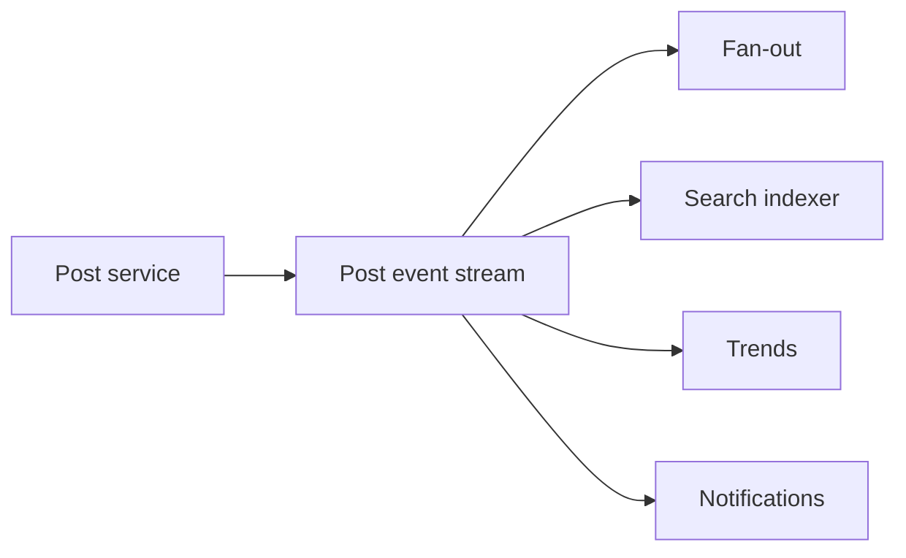
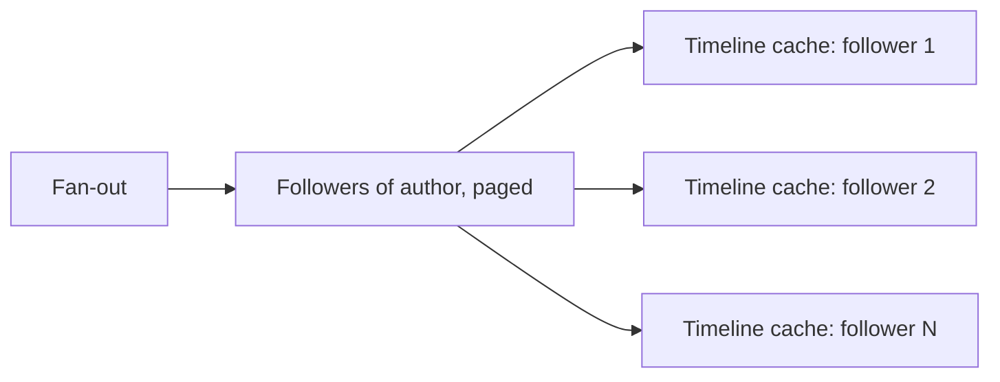
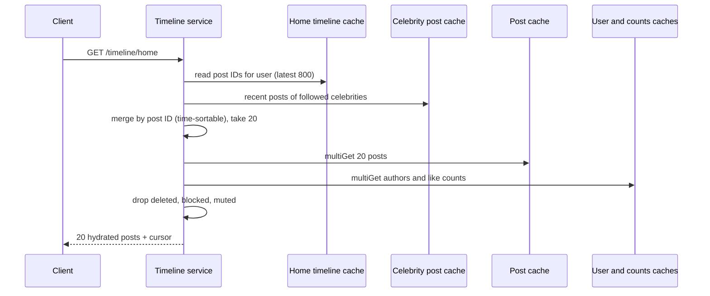

This lesson covers the API, the data model and the service architecture of the microblogging platform, with the timeline at its center.

## API

```http
POST   /v1/posts                        { text, mediaIds?, replyTo?, repostOf? } -> { postId }
DELETE /v1/posts/{id}
GET    /v1/timeline/home?cursor=...     -> { posts: [...], nextCursor }
GET    /v1/users/{id}/posts?cursor=...
POST   /v1/users/{id}/follow
DELETE /v1/users/{id}/follow
POST   /v1/posts/{id}/likes
GET    /v1/search?q=...&cursor=...
GET    /v1/trends?region=...
```

Media is uploaded first to a media service that returns IDs, so the post request itself stays small.

## Data model

| Data | Store | Notes |
| --- | --- | --- |
| Posts | Wide-column or sharded key-value store, keyed by post ID | Immutable after creation, except deletion; IDs are time-sortable (Snowflake-style) |
| User timelines (own posts) | Wide-column store, keyed by author ID, clustered by post ID descending | Efficient "latest N posts by this author" |
| Social graph | Sharded store with two indexes: followers of X and followees of X | Both directions are queried frequently |
| Home timelines | Distributed in-memory cache of post ID lists per user | Rebuildable from the graph and user timelines |
| Engagement counts | Sharded counters with a cache | High write rates on popular posts |
| Media | Blob store behind a CDN | Large and immutable |

Time-sortable post IDs, from the sequencer building block, let timelines sort and paginate by ID without a separate timestamp index.

## Architecture



## Writing a post

<Slides title="The write path">
<Slide caption="1. The post service assigns a time-sortable ID, stores the post and appends it to the author's user timeline. The write is acknowledged to the client.">



</Slide>
<Slide caption="2. A post event is published to the stream. Consumers work independently and asynchronously.">



</Slide>
<Slide caption="3. The fan-out service fetches the author's followers in pages and prepends the post ID to each active follower's cached home timeline.">



</Slide>
</Slides>

Fan-out skips followers who have not been active recently; their timelines are rebuilt on demand when they return. This saves a large share of fan-out work, because many accounts are dormant.

## Reading the home timeline

The timeline service reads the user's list of post IDs from the timeline cache, merges in recent posts from any followed **celebrity accounts** (which are not pushed, as discussed in the detailed design), and then **hydrates** the IDs: it fetches post contents from the post cache in a batch, along with author profiles and engagement counts. It filters out deleted posts and posts from accounts the user has since blocked, then returns a page.

If a user's timeline is missing from the cache, for example after a long absence, the service rebuilds it by pulling recent posts from each followee's user timeline and merging them. This is slow, but it happens rarely.

## The home timeline read, step by step



Every step is a batched lookup in an in-memory store, so the whole read takes tens of milliseconds even though it touches several services.

## Timeline cache operations

In a Redis-like store, each home timeline is a list keyed by user:

```text
LPUSH  home:42  1837465520112 ...     # fan-out prepends new post IDs
LTRIM  home:42  0 799                 # keep only the newest 800
LRANGE home:42  0 19                  # first page
```

Deleting a post does not require removing its ID from millions of lists: hydration drops IDs whose post is marked deleted. The stale IDs age out of the lists naturally.

<Ponder question="A user unfollows an account. Should the fan-out service remove that account's posts from the user's cached timeline?">
It can, but it does not have to. The simplest approach filters at read time: during hydration, the timeline service drops posts from authors the user no longer follows (it already filters blocked and muted accounts). Old posts from the unfollowed account disappear from view immediately and age out of the cached list over time, avoiding a scan-and-delete over the list.
</Ponder>

<KeyTakeaways>
- Posts are stored once with time-sortable IDs; home timelines hold only post ID lists in memory.
- The social graph is stored with both follower and followee indexes.
- Publishing a post acknowledges quickly, then events drive fan-out, indexing, trends and notifications asynchronously.
- Fan-out skips inactive users, whose timelines are rebuilt on demand.
- Reading a timeline merges cached IDs with celebrity posts, hydrates them in batches and filters deleted or blocked content.
- A timeline read is a handful of batched in-memory lookups; deletions and unfollows are handled by filtering at read time.
</KeyTakeaways>
