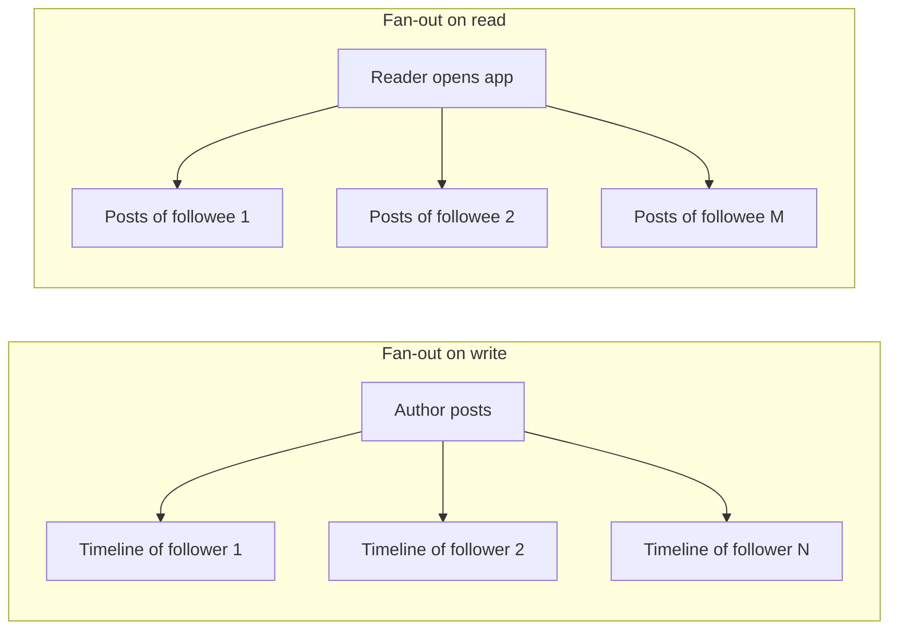

A microblogging service lets people publish short posts that their followers see in a timeline, and lets anyone search, like, reply to and repost those posts. The service is famous in system design for a few reasons: extreme read-to-write asymmetry, a follower graph with enormous skew (a few accounts have tens of millions of followers), bursts of activity during live events, and a timeline that must feel real time.

## The essential challenge: timelines

The home timeline shows recent posts from everyone a user follows. There are two fundamental ways to build it:

- **Pull (fan-out on read).** When the user opens the app, fetch recent posts from each account they follow and merge them. Writes are cheap, but reads are expensive: a user following 500 accounts needs 500 lookups per refresh.
- **Push (fan-out on write).** When someone posts, insert the post ID into the precomputed timeline of each follower. Reads become a single lookup, but writes multiply: a post from an account with 50 million followers means 50 million timeline inserts.

Because reads far outnumber writes, most systems push for ordinary accounts and pull for celebrity accounts, merging both at read time. This **hybrid** approach is a recurring theme of this chapter and the next.

## Other characteristics

- **Skewed graph.** Most accounts have a few hundred followers; a handful have tens of millions. Designs must avoid work proportional to follower count on the hot path for those accounts.
- **Bursty traffic.** Posts per second can jump several-fold during sports finals, elections or breaking news, often concentrated around a few topics.
- **Real-time expectations.** A reply should appear to the conversation participants within seconds.
- **Search and trends.** Recent posts must be searchable almost immediately, and trending topics are computed from a live stream of posts.

## Scope of this chapter

1. **Requirements:** features and capacity estimates.
2. **High-level design:** services, storage and the timeline architecture.
3. **Detailed design:** storage choices, caching, the hybrid fan-out, search and trends.
4. **Client-side load balancing:** how a large microservice deployment routes billions of internal calls without central load balancers.

The newsfeed chapter that follows generalizes timelines into ranked feeds.

<Callout type="interview">
The fan-out decision is the pivotal moment in a microblogging interview. State both options, quantify their costs using the follower distribution, then propose the hybrid.
</Callout>

<KeyTakeaways>
- A microblogging service is read-heavy, bursty and built around a skewed follower graph.
- Timelines can be built by fan-out on write (push) or fan-out on read (pull).
- Push makes reads cheap but multiplies writes; pull makes writes cheap but reads expensive.
- Most systems use a hybrid: push for ordinary accounts and pull for accounts with huge followings.
- Search and trending topics require near-real-time processing of the post stream.
</KeyTakeaways>
