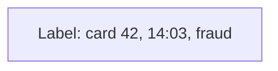
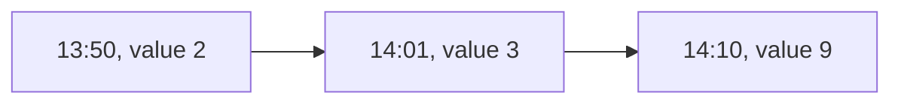
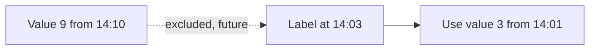
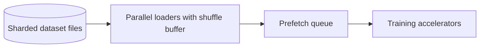

This lesson dives into the mechanisms that make the ML data platform correct and efficient: point-in-time joins, streaming features, dataset versioning, feeding training clusters, and governance.

## Point-in-time joins

A training example consists of an entity, a timestamp and a label, such as "transaction 991 at 14:03 was fraudulent." Its features must reflect what was known at 14:03. The dataset builder performs an **as-of join**: for each example, find the latest feature value with a timestamp at or before the example's timestamp.

<Slides title="An as-of join for one training example">
<Slide caption="1. The label event: card 42 made a transaction at 14:03 that was later marked as fraud.">

</Slide>
<Slide caption="2. The offline store has several values of the feature 'transactions in the last hour' for card 42.">

</Slide>
<Slide caption="3. The join picks 14:01, the latest value before 14:03. Using 14:10 would leak future information.">

</Slide>
</Slides>

At scale, as-of joins are implemented by partitioning both labels and feature histories by entity key, sorting by time within each partition and merging, which a batch engine can parallelize across thousands of workers.

## Streaming features

Some features must be fresh within seconds, such as the number of logins from a device in the last ten minutes. Stream processors maintain **windowed aggregations** keyed by entity, using event time rather than processing time so late-arriving events land in the correct window. Results are written to the online store for serving and appended with timestamps to the offline store, so training sees the same values the model would have seen. Where possible, the same transformation code runs in both batch and streaming engines to avoid skew.

## Serving features online

A prediction request, such as scoring a transaction, needs dozens of features for several entities (card, merchant, device). The online store is a low-latency key-value database, keyed by entity and feature group, so the serving layer fetches all features for an entity in one lookup and issues lookups for different entities in parallel. Each value carries a timestamp, and features older than their freshness requirement fall back to defaults and are flagged in monitoring.

## Dataset versioning and reproducibility

A dataset version records:

- the label query and time range;
- the feature definitions and their code versions;
- the table snapshot IDs read from the lake;
- the output files and their checksums;
- the split into training, validation and test sets.

Because lake tables support snapshots, rebuilding the dataset months later produces identical output. Evaluation sets are stored separately with strict access rules, and deduplication checks ensure test examples never appear in training data.

## Feeding training clusters

Accelerators are expensive, and they should never wait for data. Training data is written in large, sharded files in efficient columnar or record formats, stored close to the training cluster. Data loaders read many shards in parallel, shuffle with a buffer and prefetch batches ahead of the GPUs. For very large text corpora, preprocessing such as tokenization is done once in advance, so training reads ready-to-use token sequences.

## Data quality and monitoring

Pipelines include **data quality checks** on schema, null rates, value ranges and row counts, halting downstream steps when checks fail. In production, the platform compares the distribution of live features with training distributions to detect **drift**, and tracks model accuracy as labels arrive, triggering retraining when performance degrades.

## Governance

- **Access control** at the level of tables and columns, with sensitive fields masked for most users.
- **Consent and deletion:** when a user requests deletion, their records are removed from the lake and feature stores, and datasets built afterwards exclude them. Periodic retraining ensures models stop depending on deleted data.
- **Lineage** answers "which models used this source?" for audits and incident response.

## Evaluating the platform

| Requirement | How the design meets it |
| --- | --- |
| Petabyte-scale storage | Columnar files on object storage with an open table format |
| No training-serving skew | Features defined once and materialized to offline and online stores from the same logic |
| Point-in-time correctness | As-of joins over timestamped feature histories |
| Low-latency serving | Online key-value store, one lookup per entity, parallel across entities |
| Reproducibility | Dataset versions pinned to table snapshots and code versions |
| Governance | Column-level access control, deletion propagation, lineage |

<Ponder question="A user asks for their data to be deleted. It has already been used in a model trained last month. What does the platform do?">
It deletes the user's records from the lake (typically by rewriting affected files through the table format's delete support), the offline and online feature stores and any derived datasets built afterwards, and records the deletion so future dataset builds exclude the user. For models already trained, organizations typically rely on regular retraining schedules so models stop depending on deleted data within a defined period; lineage identifies which models are affected.
</Ponder>

<KeyTakeaways>
- As-of joins attach the latest feature value before each label's timestamp, preventing leakage.
- Streaming features use event-time windows and write to both online and offline stores to avoid skew.
- Online feature serving uses one key-value lookup per entity, with freshness checks and defaults.
- Dataset versions record queries, feature code, table snapshots and splits, making rebuilds exact.
- Sharded files, parallel loaders and prefetching keep accelerators busy; quality checks, drift monitoring and governance keep the platform trustworthy.
- The platform meets scale, consistency, reproducibility and governance needs through layered storage, a shared feature store and lineage.
</KeyTakeaways>
