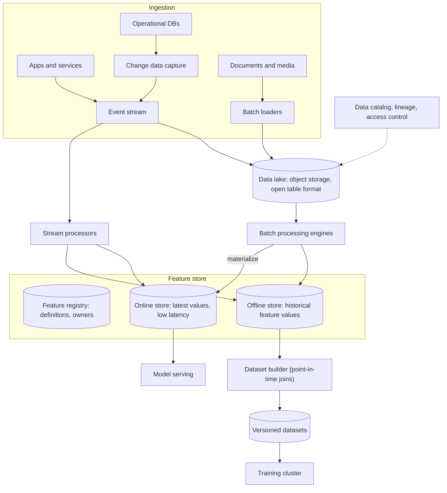

This lesson designs the main layers of an ML data platform for a large consumer company: ingestion, storage, processing, a feature store and dataset management.

## Requirements and scale

- **Functional:** ingest events and database changes; store raw and processed data; let users define features once and use them for training and serving; build versioned datasets; serve features online with low latency; track lineage from raw data to model.
- **Non-functional:** petabyte-scale storage, high-throughput batch processing, online feature reads in under 10 ms at hundreds of thousands of requests per second, reproducibility, and privacy compliance.
- **Estimates:** 50 billion events per day at 1 KB each is 50 TB per day of raw events, around 18 PB per year before compression. Online feature lookups might peak at 500,000 per second across all models.

## Architecture



### Ingestion

Application events flow into a partitioned **event stream**. Database changes are captured with **change data capture**, which turns inserts and updates into events, so analytics never query production databases directly. Documents, images and other unstructured data arrive through batch loaders. Every record gets an event time, a source and a schema version.

### Storage layers

The **data lake** stores data in columnar files on object storage, organized with an **open table format** that adds transactions, schema evolution and snapshots. Data is typically organized in layers:

- **Raw (bronze):** immutable data as received.
- **Cleaned (silver):** validated, deduplicated and joined.
- **Curated (gold):** aggregated tables and features ready for use.

Table snapshots allow queries "as of" a past version, which underpins reproducibility.

### Processing

Batch engines run large transformations, such as daily aggregates, joins and dataset builds. Stream processors compute low-latency features, such as counts over the last five minutes, and write them to the online store. A workflow orchestrator schedules and monitors pipelines, with retries and data quality checks between steps.

### Feature store

The feature store is the heart of the platform. Features are **defined once** in a registry, including their source, transformation, entity key (such as user ID) and freshness requirements. The platform then computes them into two stores:

- The **offline store** keeps the full history of feature values with timestamps, used to build training datasets.
- The **online store**, a low-latency key-value database, keeps the latest value per entity for serving.

Because both are computed from the same definition, training and serving see consistent values, preventing skew.

### Datasets and lineage

The dataset builder joins labels with historical feature values **as of each label's timestamp** and writes a versioned dataset referencing the exact table snapshots used. A catalog records lineage (which sources, code versions and parameters produced each dataset and model) and enforces access control.

## Defining a feature once

```yaml
feature_group: card_activity
entity: card_id
source: stream://payments.transactions
features:
  - name: txn_count_1h
    aggregation: count
    window: 1h
  - name: avg_amount_30d
    aggregation: avg(amount_minor)
    window: 30d
    filter: "type != 'refund'"
freshness:
  online: 60s          # online value must be under a minute old
  offline: 1h          # history written at least hourly
owner: risk-ml-team
```

From this single definition, the platform generates the streaming job that updates the online store, the batch job that backfills and writes history to the offline store, and catalog entries for discovery and lineage.

## Sizing the online store

```text
Entities: 1 billion users + 500 million cards + 100 million merchants
Features per entity: ~200 values × ~8 bytes ≈ 1.6 KB
Online store: ~1.6 billion entities × 1.6 KB ≈ 2.6 TB (replicated: ~8 TB)
Reads: 500,000 lookups/s at peak, p99 under 10 ms → sharded in-memory or SSD-backed key-value store
```

<Ponder question="Why does the design capture database changes with change data capture instead of letting data scientists query the production databases directly?">
Analytical queries scan large amounts of data and can overload the databases that serve users, causing outages. They also see only the current state, not the history of changes needed for point-in-time features. Change data capture streams every change into the lake without touching production query capacity, preserving history, and letting analytics scale independently.
</Ponder>

<KeyTakeaways>
- Events and database changes flow through a stream; documents arrive via batch loaders.
- A data lake on object storage with an open table format provides layered, snapshot-capable storage.
- Batch and stream processing produce features and datasets, orchestrated with quality checks.
- A feature store defines features once and materializes them into offline and online stores, preventing skew.
- Versioned datasets built with point-in-time joins, plus lineage tracking, make training reproducible.
- A single declarative feature definition generates both streaming and batch computations, plus lineage.
</KeyTakeaways>
