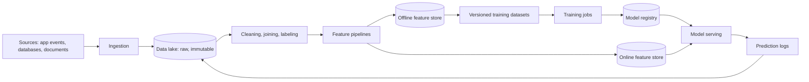

Models are only as good as the data they learn from and the data they receive in production. Behind every recommendation feed, fraud detector and fine-tuned language model sits a data platform that collects raw data, cleans and labels it, turns it into features and datasets, feeds training jobs and serves features to models in real time. This chapter designs that platform.

## Who uses it

- **Data scientists and ML engineers** explore data, define features, build datasets and train models.
- **Training systems** read large, versioned datasets at high throughput.
- **Online services** need fresh feature values within milliseconds to make predictions, such as "how many transactions has this card made in the last hour?"
- **Evaluation and monitoring systems** compare model predictions with outcomes and detect drift.

## Why it is hard

- **Volume.** Event logs, images, text corpora and embeddings can reach petabytes. Training a large model may read the same data many times.
- **Two worlds, one truth.** Features are computed in batch over historical data for training, and in real time for serving. If the two computations differ even slightly, models perform worse in production than in testing: this is **training-serving skew**.
- **Time travel.** Training examples must use feature values as they were at the time of each event, not today's values, or the model learns from information it would not have had. This is called **point-in-time correctness**, and violating it causes **label leakage**.
- **Reproducibility.** Months later, someone must be able to rebuild exactly the dataset a model was trained on, to debug or audit it.
- **Governance.** Data may contain personal information subject to consent, deletion requests and access controls.

## The lifecycle

The loop closes when predictions and their outcomes flow back into the lake, becoming training data for the next model version.

## LLM-era additions

Generative AI adds workloads to the platform:

- **Text and document corpora** for pretraining and fine-tuning, with large-scale deduplication, quality filtering and removal of personal data.
- **Instruction and preference data**, collected from human labelers and user feedback.
- **Embedding pipelines** that convert documents into vectors for retrieval, and keep them updated as documents change.
- **Evaluation datasets** that must be versioned and protected from leaking into training data.

## Chapter plan

1. **High-level design:** ingestion, storage layers, processing, feature store and dataset management.
2. **Detailed design:** point-in-time joins, streaming features, dataset versioning, training data loading and governance.

<Callout type="interview">
Mention training-serving skew and point-in-time correctness early in an ML infrastructure interview. They are the problems that distinguish ML data platforms from ordinary analytics pipelines.
</Callout>

## Training-serving skew, concretely

A fraud model uses the feature "average transaction amount over the last 30 days".

| | Training pipeline (batch SQL) | Serving path (application code) |
| --- | --- | --- |
| Window | Calendar days, UTC | Rolling 30 × 24 hours |
| Refunds | Excluded | Included |
| Currency | Converted at month-end rates | Converted at live rates |

Each difference is small, but together they shift the feature's distribution. The model, trained on one definition and served with another, makes worse predictions in production than in testing — and nothing crashes, so nobody notices until fraud losses rise. Defining the feature once and computing both copies from that definition removes the whole class of bugs.

<Ponder question="A team trains a churn model and gets excellent accuracy, but it performs poorly in production. The training data used each user's current subscription status as a feature. What went wrong?">
Label leakage: "current" status reflects what happened *after* the moment being predicted — a user who churned already shows as cancelled — so the model learned to read the answer from the features. Features must be taken as of each example's timestamp (point-in-time correctness), which is exactly what the dataset builder's as-of joins guarantee.
</Ponder>

<KeyTakeaways>
- ML data infrastructure collects, processes, versions and serves data for training, serving and evaluation.
- Training-serving skew arises when batch and real-time feature computations differ.
- Point-in-time correctness prevents label leakage by using feature values as of each event's time.
- Reproducible datasets and governance of personal data are core requirements.
- LLMs add corpus processing, preference data, embedding pipelines and protected evaluation sets.
- Small differences between batch and online feature code silently degrade production accuracy.
</KeyTakeaways>
