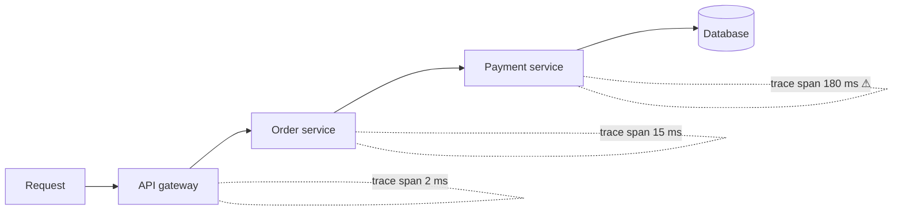

Monitoring a single server is straightforward: log in, run a few commands, read the logs. Monitoring thousands of servers requires automation, aggregation and a clear idea of what to measure. This lesson introduces the main kinds of telemetry and the signals that matter most.

## The three pillars of observability

- **Metrics** — numeric measurements sampled over time: CPU usage, request rate, error count, p99 latency. Metrics are compact, cheap to store and ideal for dashboards and alerts.
- **Logs** — timestamped records of discrete events, often structured as key-value data. Logs capture rich detail for debugging specific requests but are voluminous.
- **Traces** — the path of a single request through many services, with timing for each step. Traces reveal *where* time is spent in a distributed call chain.

Monitoring systems usually start with metrics, the cheapest signal for detecting problems, and link to logs and traces for diagnosis.

## What to measure

Two widely used checklists help decide which metrics matter.

**The four golden signals** for any user-facing service:

1. **Latency** — how long requests take, tracked as percentiles and separately for successes and failures.
2. **Traffic** — demand on the system, such as requests per second.
3. **Errors** — the rate of failed requests, explicit (5xx responses) or implicit (wrong content, slow responses).
4. **Saturation** — how full the service is: CPU, memory, queue depth, connection pool usage.

**The USE method** for resources such as CPUs, disks and network interfaces: **Utilization**, **Saturation** and **Errors**.

## Metric types

- **Counters** only increase (total requests, total errors). Rates are derived by comparing values over time.
- **Gauges** go up and down (memory in use, queue length).
- **Histograms** record the distribution of values (request latencies), enabling percentile calculations.

Each metric carries **labels** or **tags** — service name, region, host, endpoint — so it can be sliced and aggregated. Be careful with **cardinality**: adding a label such as user ID creates a separate time series per user and can overwhelm storage.

## Alerting philosophy

Alerts should be **actionable** and tied to **user impact**. Alerting on symptoms — elevated error rates, SLO burn rate — rather than every possible cause reduces noise. Too many alerts lead to **alert fatigue**, where responders start ignoring pages. Each alert should link to a runbook describing how to investigate and mitigate.

<Callout type="tip">
In a design interview, a sentence like “we'll track the four golden signals per service and alert on SLO burn rate” shows you think about operability without spending too long on it.
</Callout>

<KeyTakeaways>
- Observability relies on metrics, logs and traces, each suited to different questions.
- The four golden signals — latency, traffic, errors and saturation — cover user-facing services.
- The USE method covers resources: utilization, saturation and errors.
- Counters, gauges and histograms with labels are the building blocks of metrics; watch cardinality.
- Alerts should be actionable, symptom-based and linked to runbooks.
</KeyTakeaways>
