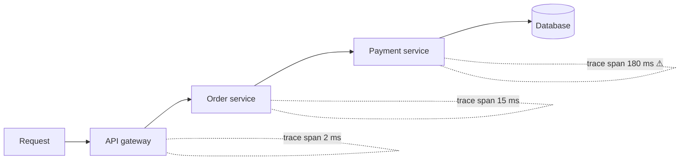

Monitoring a single server is straightforward: log in, run a few commands, read the logs. Monitoring thousands of servers requires automation, aggregation and a clear idea of what to measure. This lesson introduces the main kinds of telemetry and the signals that matter most.

## The three pillars of observability

- **Metrics** — numeric measurements sampled over time: CPU usage, request rate, error count, p99 latency. Metrics are compact, cheap to store and ideal for dashboards and alerts.
- **Logs** — timestamped records of discrete events, often structured as key-value data. Logs capture rich detail for debugging specific requests but are voluminous.
- **Traces** — the path of a single request through many services, with timing for each step. Traces reveal *where* time is spent in a distributed call chain.



Monitoring systems usually start with metrics, the cheapest signal for detecting problems, and link to logs and traces for diagnosis.

| | Metrics | Logs | Traces |
| --- | --- | --- | --- |
| Question | Is something wrong? How much? | What happened in this event? | Where did the time go? |
| Volume | Small, fixed per series | Large, grows with traffic | Large; usually sampled |
| Typical retention | Months to years (downsampled) | Days to weeks | Days |
| Best for | Dashboards, alerts, trends | Debugging specific failures | Latency analysis across services |

## How distributed tracing works

When a request enters the system, the first service assigns it a **trace ID**. Every unit of work — a service handling the request, a database query — becomes a **span** with its own ID, a parent span ID, a start time and a duration. The trace context travels with every outgoing call, usually in an HTTP header:

```text
traceparent: 00-4bf92f3577b34da6a3ce929d0e0e4736-00f067aa0ba902b7-01
             version-trace id------------------------parent span-----flags
```

Each service reports its spans to a tracing backend, which reassembles them into a tree. Recording every request would be expensive, so tracing is **sampled**:

- **Head-based sampling** decides at the start, for example keeping 1% of traces. Cheap, but may miss rare errors.
- **Tail-based sampling** buffers spans briefly and decides after the request completes, keeping all slow or failed traces and a small fraction of normal ones. More useful, more costly.

Including the trace ID in every log line connects the pillars: from a slow trace you can jump to the exact log lines for that request.

## What to measure

Two widely used checklists help decide which metrics matter.

**The four golden signals** for any user-facing service:

1. **Latency** — how long requests take, tracked as percentiles and separately for successes and failures (fast errors can make latency look deceptively good).
2. **Traffic** — demand on the system, such as requests per second.
3. **Errors** — the rate of failed requests, explicit (5xx responses) or implicit (wrong content, slow responses).
4. **Saturation** — how full the service is: CPU, memory, queue depth, connection pool usage.

**The USE method** for resources such as CPUs, disks and network interfaces: **Utilization**, **Saturation** and **Errors**.

## Metric types

- **Counters** only increase (total requests, total errors). Rates are derived by comparing values over time, which also makes them robust to missed scrapes.
- **Gauges** go up and down (memory in use, queue length).
- **Histograms** record the distribution of values (request latencies) in buckets, enabling percentile calculations that can be **aggregated** across servers.

Averaging per-server p99 values does not produce a fleet-wide p99 — percentiles cannot be averaged. Histograms solve this: sum the bucket counts from every server, then compute the percentile from the combined buckets.

## Labels and cardinality

Each metric carries **labels** or **tags** — service name, region, host, endpoint — so it can be sliced and aggregated. Every unique combination of label values is a separate **time series** that must be stored.

```text
http_request_duration_seconds_bucket{service, endpoint, method, status, region, le}
  20 endpoints × 4 methods × 6 status codes × 5 regions × 12 buckets = 28,800 series per service
```

That is manageable. Adding a `user_id` label with 10 million users multiplies it by 10 million — hundreds of billions of series, far beyond any time-series database. High-cardinality details such as user IDs, request IDs and full URLs belong in logs and traces, not in metric labels.

## Alerting philosophy

Alerts should be **actionable** and tied to **user impact**. Alerting on symptoms — elevated error rates, SLO burn rate — rather than every possible cause reduces noise. Too many alerts lead to **alert fatigue**, where responders start ignoring pages. Each alert should link to a runbook describing how to investigate and mitigate.

### Burn-rate alerts

An SLO of 99.9% over 30 days leaves an error budget of 0.1% of requests. The **burn rate** is how fast the current error rate consumes that budget:

```text
burn rate = observed error rate / allowed error rate
error rate 1.44%  →  burn rate 14.4  →  whole month's budget gone in about 2 days
```

A common scheme pages when the burn rate exceeds about 14 over the last hour (a severe, fast burn) and opens a ticket when it exceeds about 1 over the last few days (a slow leak). Combining a long and a short window prevents paging on a spike that has already ended.

<Callout type="tip">
In a design interview, a sentence like "we'll track the four golden signals per service and alert on SLO burn rate" shows you think about operability without spending too long on it.
</Callout>

<Ponder question="A service's average latency is 40 ms and looks healthy, but users complain about slowness. What would you check first?">
Look at the latency **distribution**, not the average: p95, p99 and p99.9, ideally as a heatmap, broken down by endpoint and region. A small fraction of very slow requests barely moves the average but hurts real users — especially those whose pages make many calls. Then use traces of slow requests to find which service or dependency contributes the delay.
</Ponder>

<KeyTakeaways>
- Observability relies on metrics, logs and traces, each suited to different questions.
- Distributed tracing propagates a trace ID across services; head- or tail-based sampling controls cost.
- The four golden signals — latency, traffic, errors and saturation — cover user-facing services; the USE method covers resources.
- Counters, gauges and histograms are the building blocks of metrics; histograms allow correct fleet-wide percentiles.
- Every label combination is a time series, so keep high-cardinality values out of labels.
- Alerts should be actionable, symptom-based, linked to runbooks and preferably driven by SLO burn rate.
</KeyTakeaways>
