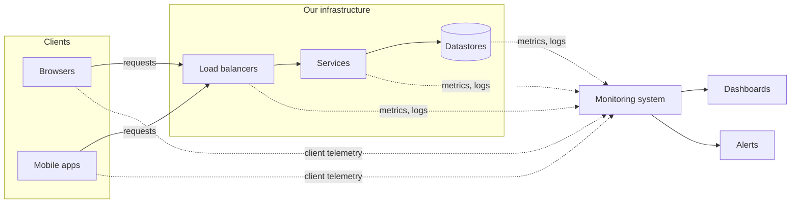

A large system is made of thousands of servers running hundreds of services. At any moment, some disk is filling up, some service's latency is creeping upward, some deployment is causing errors in one region. Without **monitoring**, these problems are discovered by users — usually at the worst possible time. Monitoring gives engineers visibility into the health of the system so they can detect problems early, diagnose them quickly and verify that fixes work.

## Why monitoring is a building block

Every design problem in this course assumes you can answer questions such as:

- Is the service up, and how many requests is it failing?
- Which component is causing the latency spike?
- Are we about to run out of storage, memory or quota?
- Did the last deployment make things better or worse?

Answering these at scale requires a system that collects, stores, analyzes and visualizes enormous amounts of telemetry — itself a distributed system with its own requirements.

## Types of problems to catch

Monitoring must cover two broad categories, which the next two chapters explore separately:

- **Server-side errors** — problems inside our infrastructure: crashed processes, overloaded machines, failing dependencies, full disks, error-rate spikes.
- **Client-side errors** — problems users experience that servers may never see: requests that never reach our data centers because of DNS or routing problems, slow page loads, application crashes on devices.

## Requirements

### Functional

- **Collect** metrics from servers, services and clients.
- **Store** metrics efficiently for recent high-resolution analysis and longer-term trends.
- **Query and visualize** metrics on dashboards.
- **Alert** the right people when metrics cross thresholds or behave anomalously.

### Non-functional

- **Scalability** — ingest millions of data points per second as the fleet grows.
- **Low latency** — detect problems within seconds to minutes, not hours.
- **High availability** — monitoring must work *especially* when the rest of the system is failing.
- **Low overhead** — collection must not noticeably slow down the services being monitored.

<Callout type="warning">
A monitoring system that shares fate with the system it monitors is dangerous. If both run in the same cluster and the cluster fails, you lose visibility exactly when you need it. Isolate monitoring infrastructure and monitor the monitor.
</Callout>

<KeyTakeaways>
- Monitoring provides visibility into system health to detect, diagnose and verify fixes for problems.
- It must cover both server-side and client-side errors.
- Core functions: collect, store, query, visualize and alert.
- Monitoring must be scalable, fast, low-overhead and more available than the system it watches.
</KeyTakeaways>
