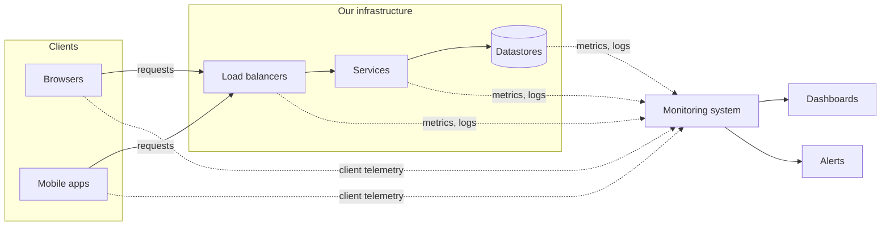

A large system is made of thousands of servers running hundreds of services. At any moment, some disk is filling up, some service's latency is creeping upward, some deployment is causing errors in one region. Without **monitoring**, these problems are discovered by users — usually at the worst possible time. Monitoring gives engineers visibility into the health of the system so they can detect problems early, diagnose them quickly and verify that fixes work.

## Why monitoring is a building block

Every design problem in this course assumes you can answer questions such as:

- Is the service up, and how many requests is it failing?
- Which component is causing the latency spike?
- Are we about to run out of storage, memory or quota?
- Did the last deployment make things better or worse?

Answering these at scale requires a system that collects, stores, analyzes and visualizes enormous amounts of telemetry — itself a distributed system with its own requirements.

## The cost of not knowing

Recall that `availability = MTBF / (MTBF + MTTR)` and that MTTR begins with **detection**. Consider a service that fails once a month:

| Detection method | Time to detect | Effect on a 1-hour-per-month outage budget |
| --- | --- | --- |
| Users complain on social media | 20–60 minutes | Most of the budget gone before anyone starts fixing |
| Periodic manual checks | Up to hours | Budget exceeded |
| Automated alert on error rate | 1–3 minutes | Most of the budget left for mitigation |

Monitoring is therefore not an operational nicety; it is one of the main levers for availability.

## Types of problems to catch

Monitoring must cover two broad categories, which the next two chapters explore separately:

- **Server-side errors** — problems inside our infrastructure: crashed processes, overloaded machines, failing dependencies, full disks, error-rate spikes.
- **Client-side errors** — problems users experience that servers may never see: requests that never reach our data centers because of DNS or routing problems, slow page loads, application crashes on devices.

## White-box and black-box monitoring

| | White-box | Black-box |
| --- | --- | --- |
| Source | Internals the system exposes: metrics, logs, traces | External probes that behave like users |
| Answers | "Why is it broken?" — queue depth, cache hit ratio, GC pauses | "Is it broken for users?" — can I log in, can I check out? |
| Strength | Rich detail, early warning before users notice | Catches failures the system cannot see itself, such as DNS or network issues |
| Weakness | Blind to problems outside the instrumented code | Little diagnostic detail |

Good monitoring uses both: black-box checks to confirm user impact and trigger pages, white-box signals to diagnose causes and warn early.

## Requirements

### Functional

- **Collect** metrics from servers, services and clients.
- **Store** metrics efficiently for recent high-resolution analysis and longer-term trends.
- **Query and visualize** metrics on dashboards.
- **Alert** the right people when metrics cross thresholds or behave anomalously.

### Non-functional

- **Scalability** — ingest millions of data points per second as the fleet grows.
- **Low latency** — detect problems within seconds to minutes, not hours.
- **High availability** — monitoring must work *especially* when the rest of the system is failing.
- **Low overhead** — collection must not noticeably slow down the services being monitored; a common budget is a few percent of CPU at most.

<Callout type="warning">
A monitoring system that shares fate with the system it monitors is dangerous. If both run in the same cluster and the cluster fails, you lose visibility exactly when you need it. Isolate monitoring infrastructure and monitor the monitor.
</Callout>

## Who uses monitoring data

- **On-call engineers** need fast, reliable alerts and dashboards during incidents.
- **Service owners** track SLOs and error budgets week to week.
- **Capacity planners** study months of utilization trends to order hardware in time.
- **Product and business teams** watch sign-ups, orders and conversion rates.

Each group needs a different resolution and retention: seconds for incidents, days for SLOs, years for capacity trends. The storage design in the following chapters reflects this.

<Ponder question="Your monitoring runs in the same data center as your main application. A power failure takes down the data center. What do you see, and how would you redesign?">
You see nothing: dashboards and alerting are down with everything else, so you may not even be paged. Run the alerting path (or at least a minimal watcher) in a different region or provider, use external black-box probes against your public endpoints, and add a dead man's switch — a heartbeat alert that an independent paging service expects to receive constantly, and pages someone when it stops.
</Ponder>

## Chapter roadmap

1. **Introduction** — metrics, logs and traces; what to measure; alerting philosophy.
2. **Prerequisites** — what to monitor, the shape and volume of the data, push versus pull.
3. **Server-side monitoring** (next chapter) — the collection, storage, alerting and visualization pipeline.
4. **Client-side monitoring** (the chapter after) — measuring what users actually experience.

<KeyTakeaways>
- Monitoring provides visibility into system health to detect, diagnose and verify fixes for problems.
- Fast detection shortens MTTR, making monitoring a direct lever on availability.
- It must cover both server-side and client-side errors, using white-box and black-box techniques.
- Core functions: collect, store, query, visualize and alert.
- Monitoring must be scalable, fast, low-overhead and more available than the system it watches.
</KeyTakeaways>
