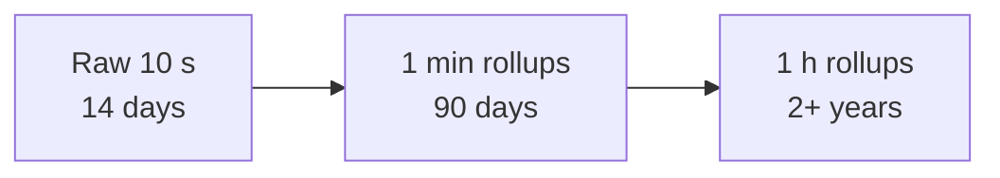

Before designing the monitoring pipeline, we need to decide what data we collect, how it is shaped, and how much of it there will be. These choices determine the storage and processing architecture.

## What gets monitored

A comprehensive monitoring system covers several layers:

| Layer | Examples |
| --- | --- |
| **Hardware and OS** | CPU, memory, disk usage and I/O, network throughput, temperature |
| **Infrastructure services** | Load balancer connections, cache hit ratio, queue depth, database replication lag |
| **Applications** | Request rate, error rate, latency percentiles per endpoint |
| **Business** | Sign-ups, orders per minute, payment success rate |
| **Synthetic checks** | Probes that exercise key user journeys from outside |

Business metrics are often the fastest way to detect a problem that technical metrics miss — a sudden drop in orders is unmistakable, even if every server reports healthy CPU and error rates because a bug silently broke the "buy" button.

## The shape of the data

Almost all monitoring data is **time series**: sequences of `(timestamp, value)` points identified by a metric name and labels.

```text
http_requests_total{service="checkout", region="eu-west", status="500"}
  12:00:00  18231
  12:00:10  18249
  12:00:20  18302
```

Time series data has distinctive properties:

- **Write-heavy.** Millions of points arrive every second; reads are comparatively rare.
- **Append-only.** Points are rarely updated.
- **Recent data is hot.** Dashboards and alerts mostly query the last few hours.
- **Compressible.** Consecutive timestamps and values are similar, so delta and XOR encodings compress points to a few bytes each.
- **Queried in aggregate.** Most queries sum or average many series over a time range, rather than fetching individual points.

These properties make specialized **time-series databases** far more efficient than general-purpose ones for monitoring. A relational database would store each point as a row with an index entry — perhaps 50–100 bytes per point instead of 1–2 — and would struggle with millions of inserts per second.

## Estimating volume

Suppose we monitor 100,000 servers, each emitting 500 metrics every 10 seconds:

```text
Active series:    100,000 × 500             = 50 million series
Ingest rate:      50,000,000 / 10 s         = 5,000,000 points per second
Raw size at ~16 bytes/point                 → ~80 MB/s → ~7 TB/day
With compression to ~2 bytes/point          → ~10 MB/s → < 1 TB/day
```

Two numbers matter for the design: **5 million writes per second**, which rules out a single database node, and **50 million active series**, which determines the size of the in-memory index that maps labels to series.

Keeping full resolution forever is unnecessary. A typical **retention policy** keeps 10-second resolution for two weeks, 1-minute averages for a few months and 1-hour averages for years. This process, called **downsampling** or **rollup**, reduces long-term storage by orders of magnitude while preserving trends.



| Tier | Resolution | Retention | Approximate storage |
| --- | --- | --- | --- |
| Raw | 10 s | 14 days | ~12 TB |
| 1-minute rollups | 60 s | 90 days | ~13 TB |
| 1-hour rollups | 1 h | 2 years | ~2 TB |

When downsampling, keep more than the average: store min, max, sum and count per interval (and histogram buckets for latency), so that a spike is still visible in a year-old chart.

## Push versus pull collection

- **Pull:** the monitoring system periodically scrapes an endpoint on each target (for example, `/metrics`). It knows which targets exist, detects dead targets naturally (the scrape fails) and controls load.
- **Push:** targets send metrics to collectors. This suits short-lived jobs, devices behind firewalls and clients such as browsers and mobile apps.

| | Pull | Push |
| --- | --- | --- |
| Who initiates | Collector | Target |
| Detecting dead targets | Automatic — the scrape fails | Needs heartbeats and timeouts |
| Controlling load | Collector sets the pace | Targets can flood collectors, needs rate limiting |
| Short-lived jobs | May finish before being scraped | Push results before exiting |
| Firewalls and NAT | Collector must reach every target | Targets only need outbound access |
| Service discovery | Required | Not required |

Many systems combine both: pull for long-running services, push for ephemeral jobs and clients.

## A collection agent

Each server runs a small **agent** that:

1. Reads OS and hardware metrics from the kernel.
2. Exposes or forwards application metrics that services register in-process.
3. Buffers data locally if the collector is unreachable, dropping the oldest data if the buffer fills rather than consuming unbounded memory.
4. Keeps its own overhead within a strict budget.

Application code records metrics through a lightweight library: incrementing a counter or recording a histogram observation is an in-memory operation costing nanoseconds, and the agent or collector reads the accumulated values periodically.

<Callout type="note">
Logs are much larger than metrics — often terabytes per day for a large fleet. They are typically shipped to a separate logging pipeline, covered later in the distributed logging chapter.
</Callout>

<Ponder question="A team wants to record the latency of every single request as a separate data point in the time-series database. Why is this a bad idea, and what should they do instead?">
At thousands of requests per second per server, per-request points would multiply storage and write load by orders of magnitude and add little value, since dashboards need distributions, not individual values. Record latencies into an in-process **histogram** (bucket counters) and let the collector scrape the bucket counts every few seconds; for individual slow requests, use sampled traces and logs.
</Ponder>

<KeyTakeaways>
- Monitor hardware, infrastructure, applications and business metrics, plus synthetic checks.
- Monitoring data is time series: write-heavy, append-only, recent-biased, highly compressible and queried in aggregate.
- Volume can reach millions of points per second and tens of millions of series; compression and downsampling keep storage manageable.
- Downsampled data should keep min, max, sum and count so spikes remain visible.
- Pull collection suits long-running services; push suits short-lived jobs and clients.
- Agents collect locally with bounded overhead and buffering; applications record metrics in memory.
</KeyTakeaways>
