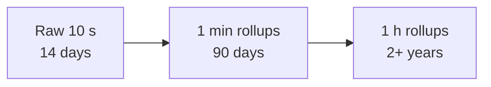

Before designing the monitoring pipeline, we need to decide what data we collect, how it is shaped, and how much of it there will be. These choices determine the storage and processing architecture.

## What gets monitored

A comprehensive monitoring system covers several layers:

| Layer | Examples |
| --- | --- |
| **Hardware and OS** | CPU, memory, disk usage and I/O, network throughput, temperature |
| **Infrastructure services** | Load balancer connections, cache hit ratio, queue depth, database replication lag |
| **Applications** | Request rate, error rate, latency percentiles per endpoint |
| **Business** | Sign-ups, orders per minute, payment success rate |
| **Synthetic checks** | Probes that exercise key user journeys from outside |

Business metrics are often the fastest way to detect a problem that technical metrics miss — a sudden drop in orders is unmistakable.

## The shape of the data

Almost all monitoring data is **time series**: sequences of `(timestamp, value)` points identified by a metric name and labels.

```text
http_requests_total{service="checkout", region="eu-west", status="500"}
  12:00:00  18231
  12:00:10  18249
  12:00:20  18302
```

Time series data has distinctive properties:

- **Write-heavy.** Millions of points arrive every second; reads are comparatively rare.
- **Append-only.** Points are rarely updated.
- **Recent data is hot.** Dashboards and alerts mostly query the last few hours.
- **Compressible.** Consecutive timestamps and values are similar, so delta and XOR encodings compress points to a few bytes each.

These properties make specialized **time-series databases** far more efficient than general-purpose ones for monitoring.

## Estimating volume

Suppose we monitor 100,000 servers, each emitting 500 metrics every 10 seconds:

```text
100,000 × 500 / 10 s = 5,000,000 points per second
Raw size at ~16 bytes/point → ~80 MB/s → ~7 TB/day
With compression to ~2 bytes/point → < 1 TB/day
```

Keeping full resolution forever is unnecessary. A typical **retention policy** keeps 10-second resolution for two weeks, 1-minute averages for a few months and 1-hour averages for years. This process, called **downsampling** or **rollup**, reduces long-term storage by orders of magnitude while preserving trends.



## Push versus pull collection

- **Pull:** the monitoring system periodically scrapes an endpoint on each target (for example, `/metrics`). It knows which targets exist, detects dead targets naturally (the scrape fails) and controls load.
- **Push:** targets send metrics to collectors. This suits short-lived jobs, devices behind firewalls and clients such as browsers and mobile apps.

Many systems combine both: pull for long-running services, push for ephemeral jobs and clients.

<Callout type="note">
Logs are much larger than metrics — often terabytes per day for a large fleet. They are typically shipped to a separate logging pipeline, covered later in the distributed logging chapter.
</Callout>

<KeyTakeaways>
- Monitor hardware, infrastructure, applications and business metrics, plus synthetic checks.
- Monitoring data is time series: write-heavy, append-only, recent-biased and highly compressible.
- Volume can reach millions of points per second; compression and downsampling keep storage manageable.
- Pull collection suits long-running services; push suits short-lived jobs and clients.
</KeyTakeaways>
