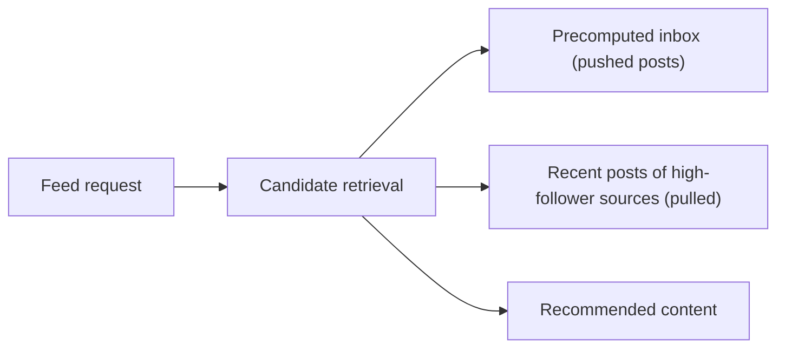
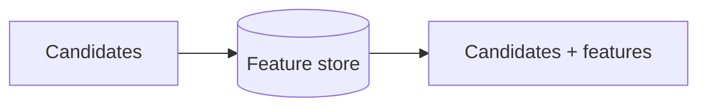
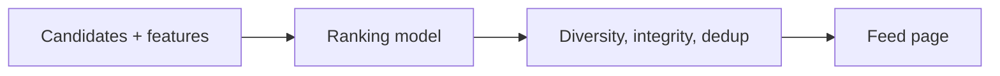
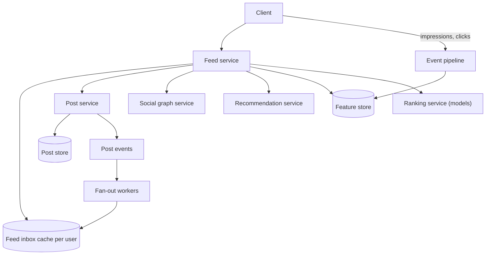

A newsfeed is the scrolling list of posts, photos, links and updates a social network shows on its home screen. It generalizes the microblogging timeline in two ways: content comes from many kinds of sources (friends, pages, groups and recommended content), and it is **ranked** by predicted interest rather than shown strictly by time. This lesson covers the requirements and high-level design; the next lesson dives into fan-out and ranking.

## Requirements

**Functional:**

- Users see a feed of posts from friends, followed pages and groups, plus some recommended content.
- The feed is ranked by relevance, with fresh content favored.
- Users can scroll indefinitely, and new posts appear when they refresh.
- Users can post content that appears in their friends' feeds.

**Non-functional:**

- **Low latency:** the first page of the feed should render in well under a second.
- **High availability:** an empty feed is a broken product.
- **Eventual consistency:** a new post may take a few seconds to reach friends.
- **Scalability:** billions of users, each with hundreds of friends and followed pages.

## Estimates

With 1 billion daily active users, each loading the feed 10 times per day, the service handles 10 billion feed requests per day, about 115,000 per second on average and several hundred thousand at peak. If users create 500 million posts per day and each has an average audience of 300 people, pushing to all would mean 150 billion feed inserts per day. Precomputing feeds for every user is expensive, which pushes the design towards candidate retrieval plus ranking at read time.

## API

```http
GET  /v1/feed?cursor=...&count=20   -> { items: [ { postId, author, content, reason } ], nextCursor }
POST /v1/posts                      { content, audience }
POST /v1/feed/events                [ { postId, type: impression | click | like | hide, ts } ]
```

The feed events endpoint collects implicit feedback, such as impressions, dwell time and hides, that trains the ranking models.

## High-level design

The feed is built by a pipeline that runs, at least in part, when the user requests it:

<Slides title="Generating a feed page">
<Slide caption="1. Candidate retrieval gathers a few thousand recent posts from friends, pages, groups and recommendation sources.">



</Slide>
<Slide caption="2. Feature fetching attaches signals for each candidate: author affinity, post type, age and engagement so far.">



</Slide>
<Slide caption="3. A ranking model scores candidates by predicted engagement. Business rules then enforce diversity and remove seen or hidden items.">



</Slide>
</Slides>



Key components:

- **Feed inbox cache:** for each user, a list of recently pushed candidate post IDs, like the microblogging timeline cache.
- **Post service and store:** the source of truth for posts, with a hot cache.
- **Social graph service:** friends, follows and group memberships.
- **Feature store:** precomputed features such as user–author affinity, per-post engagement velocity and user interests, updated by streaming and batch pipelines.
- **Ranking service:** runs machine-learned models to score candidates.
- **Event pipeline:** collects impressions and interactions to update features and train models.

## Pagination and freshness

Because ranking reorders content, a cursor cannot simply be "posts older than X." Instead, the feed service stores the ranked list generated for the session, perhaps a few hundred items, and the cursor indexes into it. When the user refreshes, a new ranking runs and items already seen are filtered out, so new posts appear at the top without duplicating old ones.

<KeyTakeaways>
- A newsfeed mixes content from friends, pages, groups and recommendations, ranked by predicted interest.
- Feed generation is a pipeline: candidate retrieval, feature fetching, model ranking and business rules.
- Pushed inboxes, pulled high-follower sources and recommendations supply candidates.
- Implicit feedback such as impressions, clicks and hides flows back into features and model training.
- Ranked feeds are paginated from a stored session ranking, and refreshes filter already seen items.
</KeyTakeaways>
