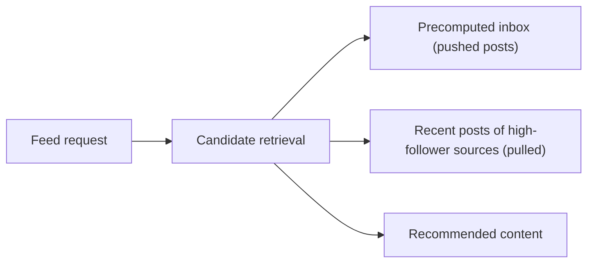
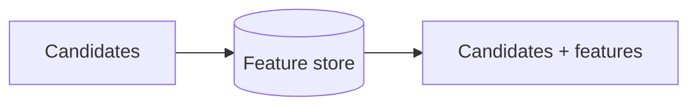
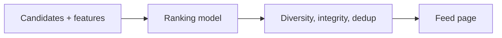
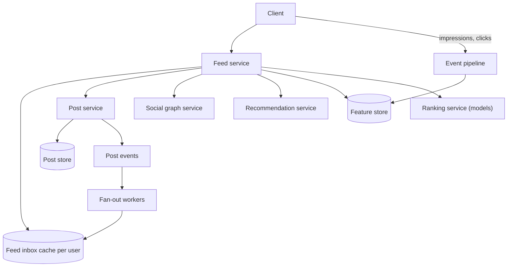
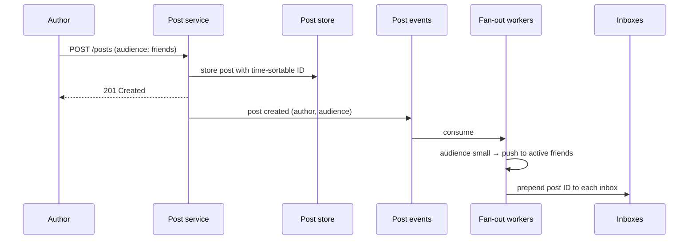

With requirements and estimates in place, this lesson defines the API and data model and lays out the feed generation pipeline — the **API** and **Layout** steps of SCALED. The next lesson goes deep on fan-out and ranking.

## API

```http
GET  /v1/feed?cursor=...&count=20&mode=ranked|chronological
     -> { items: [ { postId, author, content, reason } ], nextCursor }
POST /v1/posts                      { content, mediaIds?, audience }
DELETE /v1/posts/{id}
POST /v1/posts/{id}/reactions       { type }
POST /v1/feed/events                [ { postId, type: impression | click | like | hide, dwellMs, ts } ]
```

The feed events endpoint collects implicit feedback, such as impressions, dwell time and hides, that trains the ranking models. Events are batched on the client and sent every few seconds.

## Data model

| Data | Store | Key | Notes |
| --- | --- | --- | --- |
| Posts | Sharded key-value or wide-column store + post cache | post_id | Author, content, media references, audience, created_at, deleted flag |
| Author posts index | Wide-column store | (author_id, post_id DESC) | "Recent posts by this source", used for pulling |
| Social graph | Graph or sharded edge store | user_id | Friends, follows, group memberships, blocks |
| Feed inbox | In-memory store, sharded by user | user_id | Bounded list of (post_id, author_id, created_at) |
| Features | Feature store (online key-value + offline warehouse) | user_id, post_id, (user_id, author_id) | Affinity, interests, engagement velocity |
| Seen items and session rankings | In-memory store with TTL | (user_id, session) | For pagination and refresh deduplication |

## High-level design

The feed is built by a pipeline that runs, at least in part, when the user requests it:

<Slides title="Generating a feed page">
<Slide caption="1. Candidate retrieval gathers a few thousand recent posts from friends, pages, groups and recommendation sources.">



</Slide>
<Slide caption="2. Feature fetching attaches signals for each candidate: author affinity, post type, age and engagement so far.">



</Slide>
<Slide caption="3. A ranking model scores candidates by predicted engagement. Business rules then enforce diversity and remove seen or hidden items.">



</Slide>
</Slides>



Key components:

- **Feed inbox cache:** for each user, a list of recently pushed candidate post IDs, like the microblogging timeline cache.
- **Post service and store:** the source of truth for posts, with a hot cache.
- **Social graph service:** friends, follows and group memberships.
- **Feature store:** precomputed features such as user–author affinity, per-post engagement velocity and user interests, updated by streaming and batch pipelines.
- **Ranking service:** runs machine-learned models to score candidates, usually on a dedicated fleet (often with accelerators) separate from the feed service.
- **Event pipeline:** collects impressions and interactions to update features and train models.

## Publishing a post



The author gets an immediate acknowledgment; delivery is asynchronous. Pages and creators with very large audiences skip the push step and are pulled at read time, as the deep-dive lesson explains.

## Reading the feed

1. The feed service reads the user's inbox (a few hundred IDs), asks the graph service which high-audience sources the user follows and fetches their recent posts from the author posts index, and asks the recommendation service for a batch of suggested posts.
2. It removes candidates the user has already seen in recent sessions.
3. It fetches features for the remaining candidates in batches and calls the ranking service.
4. It applies rules — diversity, integrity, ad slots — hydrates the top items from the post cache and checks each against current deletion and privacy state.
5. It stores the ranked list for the session and returns the first page with a cursor.

## Pagination and freshness

Because ranking reorders content, a cursor cannot simply be "posts older than X." Instead, the feed service stores the ranked list generated for the session, perhaps a few hundred items, and the cursor indexes into it. When the user refreshes, a new ranking runs and items already seen are filtered out, so new posts appear at the top without duplicating old ones.

<Ponder question="A user's friend deletes a post seconds after it was fanned out to 300 inboxes. How does the design make sure nobody sees it?">
The inboxes still contain the post ID, but step 4 hydrates every candidate from the post store (or its cache) and drops posts marked deleted or no longer visible to this viewer. Deletion therefore takes effect on the next read everywhere, without touching 300 inboxes; the stale IDs simply age out. The post cache must be invalidated on delete so hydration sees the change immediately.
</Ponder>

<KeyTakeaways>
- The API serves ranked or chronological pages, accepts posts with audiences and collects interaction events.
- Posts are stored once; inboxes hold bounded ID lists; features live in an online feature store.
- Feed generation is a pipeline: candidate retrieval, feature fetching, model ranking and business rules.
- Publishing acknowledges immediately and fans out asynchronously to active users' inboxes.
- Integrity is enforced at hydration time, and ranked feeds are paginated from a stored session ranking.
</KeyTakeaways>
