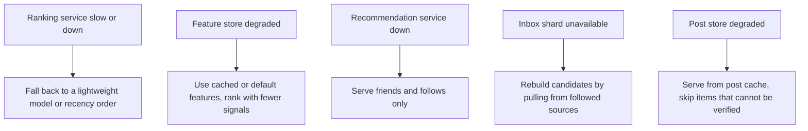

This lesson completes the **Defend** step: we check the newsfeed design against its requirements, walk through failures and discuss the trade-offs it makes.

## Requirements check

| Requirement | How the design meets it |
| --- | --- |
| Low latency | Inboxes of IDs in memory, batched feature and post lookups, multi-stage ranking so the heavy model scores only hundreds of items, session rankings for fast subsequent pages |
| High availability | Stateless feed service; replicated inbox and post caches; fallbacks when ranking, recommendations or features fail |
| Eventual propagation | Asynchronous fan-out through a durable event stream; posts reach friends within seconds |
| Strict integrity | Every candidate is checked against current deletion, audience and block state during hydration |
| Scalability | Hybrid fan-out bounds write amplification; ranking fleet scales independently; inboxes and posts are sharded |

## Graceful degradation

The feed depends on many services, so the design defines what happens when each one fails:

The one thing the design never does during degradation is skip integrity checks: if a post's visibility cannot be verified, it is left out rather than shown.

## Trade-offs

**Push versus pull.** Pushing to inboxes makes reads cheap but multiplies writes; pulling for large sources keeps writes bounded but adds read-time work. The hybrid threshold is tuned from measured fan-out capacity and read latency.

**Ranking quality versus latency and cost.** Bigger models and more candidates improve relevance but cost more compute per request, which is multiplied by hundreds of thousands of requests per second. Multi-stage ranking and aggressive feature caching keep the cost proportional to what users actually see.

**Freshness versus stability.** Re-ranking on every refresh shows new posts quickly but can make the feed feel jumpy; storing the session ranking gives stable scrolling at the cost of not reacting to brand-new posts until the next refresh.

**Engagement versus well-being.** Optimizing only for clicks and dwell time can promote sensational content. Weighting meaningful interactions, capping repetitive content and demoting low-quality posts trades some short-term engagement for long-term satisfaction — a product decision encoded in ranking weights and rules.

## Failure scenarios

| Failure | Effect | Handling |
| --- | --- | --- |
| Fan-out workers fall behind during a global event | Posts reach inboxes late | Stream buffers; autoscale workers; pull recent posts from close friends at read time as a fallback |
| Celebrity page posts during a spike | Potential fan-out storm | Page is on the pull path; its posts are served from a hot cache |
| Cache node holding popular posts fails | Hydration misses for those posts | Replicated cache; post store absorbs the misses with coalescing |
| Bad model deployed | Relevance drops, engagement falls | A/B guardrail metrics trigger rollback; previous model kept warm |
| Event pipeline lag | Features stale; feed reacts slowly to interactions | Ranking still works on older features; alert on feature freshness |

## What would break next

At ten times the load, the ranking fleet's compute cost would dominate, pushing towards cheaper first-stage models, more caching of intermediate scores and accelerator hardware. Inbox memory would grow linearly with active users and could move partly to SSD-backed stores for less active users.

<Callout type="interview">
Close a newsfeed interview by naming the degradation ladder: "If ranking fails we fall back to recency; if recommendations fail we show friends only; but we never skip visibility checks." It shows you designed for failure, not just the happy path.
</Callout>

<Ponder question="A user complains that a friend's post appeared in their feed six hours after it was published. Where in this design could that delay come from?">
Several places: fan-out lag during a spike (the post reached the inbox late); the user being inactive at posting time, so their inbox was not updated and was rebuilt later; the ranking model scoring the post low at first and higher later as engagement grew; or the post being beyond the inbox's size limit when the user opened the app. Checking fan-out lag metrics, the user's activity status and the post's ranking history would identify which.
</Ponder>

<KeyTakeaways>
- The design meets latency, availability, integrity and scale requirements through ID inboxes, hybrid fan-out, staged ranking and hydration-time checks.
- Each dependency has a defined fallback, but integrity checks are never skipped.
- Key trade-offs are push versus pull, ranking quality versus cost, freshness versus stability, and engagement versus well-being.
- Failures such as fan-out lag, cache loss and bad models are handled with buffering, replication and guarded rollouts.
</KeyTakeaways>
