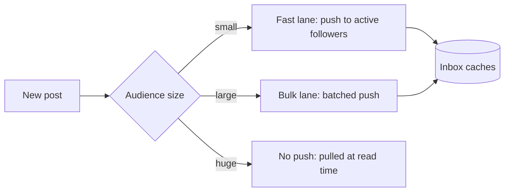

This lesson examines the two hardest parts of a newsfeed in detail: delivering candidates efficiently (fan-out) and ordering them well (ranking).

## Fan-out in depth

The microblogging chapter introduced the hybrid approach: push for most authors, pull for authors with huge audiences. A newsfeed refines this with several practical techniques.

**Push to active users only.** Fan-out workers check a recently-active set and skip dormant users. When a dormant user returns, their inbox is built on demand by pulling from their connections, which is slow once but avoids wasting billions of writes.

**Priority lanes.** Fan-out jobs are placed in queues by priority. Posts from close friends and posts to small audiences go in a fast lane; enormous fan-outs are split into batches and processed in a bulk lane, so they do not delay ordinary posts.

**Inbox size limits.** Each inbox keeps only a few hundred of the most recent candidates. Older items fall off, since the ranker rarely shows them.

**Fan-out of IDs, not content.** Inboxes store post IDs and minimal metadata, such as author and timestamp, so fan-out writes stay tiny.



**Deletions and privacy changes** must propagate too. Rather than removing IDs from millions of inboxes, the read path checks each candidate against the post store's current state and the viewer's permissions during hydration, so deleted or restricted posts are never shown.

## Ranking in depth

Showing posts strictly by time sounds fair, but users miss important updates from close friends buried under frequent posters. Ranking predicts what each user will find most valuable.

### Multi-stage ranking

Scoring thousands of candidates with a large model for every request is too slow. Systems use stages:

1. **Candidate retrieval** gathers perhaps a few thousand items.
2. **Lightweight ranking** with a simple model trims them to a few hundred.
3. **Heavy ranking** with a large model scores the remaining items precisely.
4. **Re-ranking and rules** adjust for diversity, freshness and integrity.

### Signals and objectives

The heavy ranker predicts the probability of several actions, such as like, comment, share, click, long dwell time and hide. The final score is a weighted combination:

```text
score = w1 * P(like) + w2 * P(comment) + w3 * P(share) + w4 * P(dwell > 10s) - w5 * P(hide)
```

The weights encode product goals. Emphasizing meaningful interactions, such as comments from friends, rather than raw clicks produces a healthier feed.

Features include:

- **Affinity** between viewer and author, from past interactions.
- **Content features**: type (photo, video, link), topic and language.
- **Engagement velocity**: how quickly the post is gathering interactions.
- **Freshness**: the post's age.
- **Viewer context**: device, time of day and connection speed, since a video is less appealing on a slow network.

### Diversity and integrity rules

After scoring, rules prevent too many consecutive posts from the same author or of the same type, demote content flagged as misleading or low quality, and insert a limited number of recommendations. These rules keep the feed balanced even when the model favors one kind of content.

### Serving and training

Features come from a **feature store** with two layers: batch features computed daily, such as long-term affinity, and real-time features updated from event streams, such as a post's engagement in the last ten minutes. Models are retrained frequently on logged impressions and outcomes, and new models are evaluated in **A/B tests** that compare engagement and satisfaction metrics before rollout.

## A ranking example

Three candidates for one viewer, with predicted probabilities from the heavy model and weights `w1 = 1` (like), `w2 = 4` (comment), `w3 = 6` (share), `w4 = 0.5` (long dwell), `w5 = 10` (hide):

| Candidate | P(like) | P(comment) | P(share) | P(dwell > 10 s) | P(hide) | Score |
| --- | --- | --- | --- | --- | --- | --- |
| Close friend's wedding photo | 0.40 | 0.10 | 0.02 | 0.60 | 0.01 | 0.40 + 0.40 + 0.12 + 0.30 − 0.10 = **1.12** |
| Viral meme from a page | 0.30 | 0.02 | 0.05 | 0.20 | 0.03 | 0.30 + 0.08 + 0.30 + 0.10 − 0.30 = **0.48** |
| Acquaintance's long article | 0.05 | 0.01 | 0.01 | 0.30 | 0.02 | 0.05 + 0.04 + 0.06 + 0.15 − 0.20 = **0.10** |

The high weight on comments reflects a product choice to favor conversation between people who know each other; the penalty on hides keeps annoying content down even when it would attract clicks.

<Ponder question="Why are some features computed in real time from event streams rather than in the daily batch job?">
Some signals change within minutes and matter immediately: a post's engagement velocity in its first ten minutes, whether the viewer just hid a similar post, or a breaking-news topic surging right now. A daily batch would miss them entirely. Stable signals such as long-term affinity between two people change slowly and are cheaper to compute in batch. Combining both gives fresh responsiveness without recomputing everything continuously.
</Ponder>

<Callout type="interview">
You are not expected to design the model itself. Explain the multi-stage structure, the kinds of signals, how features are served with low latency, and how feedback flows back into training.
</Callout>

<KeyTakeaways>
- Fan-out pushes IDs only to active users, uses priority lanes and bounds inbox sizes.
- Very large audiences are pulled at read time; deletions and privacy are enforced during hydration.
- Ranking runs in stages, from cheap retrieval to heavy models, then applies diversity and integrity rules.
- The score combines predicted probabilities of several actions with weights that encode product goals.
- A feature store serves batch and real-time features, and models are retrained and A/B tested continuously.
</KeyTakeaways>
