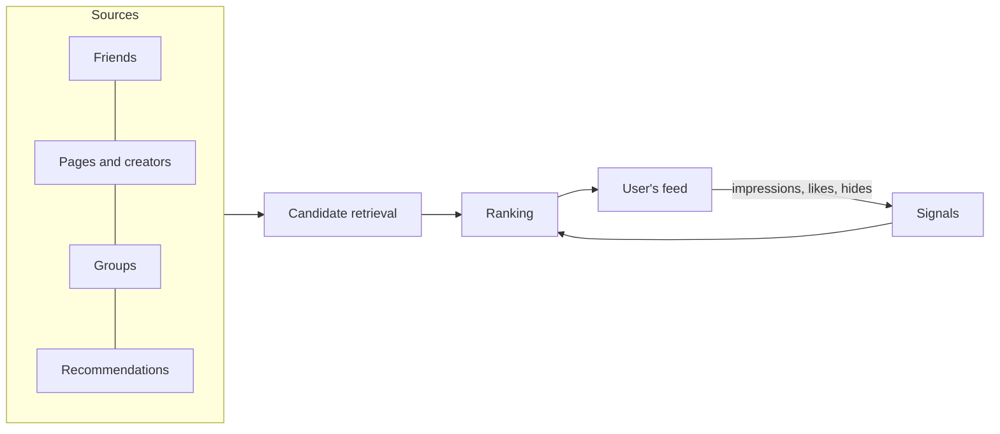

A newsfeed is the scrolling list of posts, photos, videos, links and updates that a social network shows on its home screen. It is often the first thing a user sees when opening the app and the place they spend most of their time. For the business, it is the product: engagement, retention and advertising revenue all flow through it.

A newsfeed generalizes the microblogging timeline from the previous chapter in two important ways:

- **Many kinds of sources.** Content comes from friends, followed pages and creators, groups, events and recommended content from accounts the user does not follow.
- **Ranking.** Items are ordered by predicted interest rather than strictly by time, so a close friend's wedding photos from this morning can appear above a news page's post from a minute ago.

## Why it is hard

- **Enormous read volume.** Billions of users open the feed several times a day, and each open expects a fresh, personalized page in well under a second.
- **Personalization defeats shared caching.** Unlike a video segment or a question page, no two users' feeds are the same. Caching must happen at the level of ingredients — posts, features, candidate lists — not whole pages.
- **Skewed audiences.** A friend with 300 friends and a page with 100 million followers both "post", but delivering their posts requires different strategies.
- **Ranking under a tight budget.** Scoring thousands of candidates with machine-learned models, using hundreds of features each, within about 100 milliseconds is a distributed systems problem as much as a machine-learning one.
- **Feedback loops.** Every impression, like, comment and scroll-past is a signal. Those signals must flow back into features within seconds and into models within hours.
- **Integrity.** Deleted posts, changed privacy settings and blocked users must be respected instantly, even though candidates were gathered earlier.

## Chronological versus ranked feeds

| | Chronological | Ranked |
| --- | --- | --- |
| Order | Newest first | Predicted value to the user |
| Implementation | Merge sorted lists | Retrieval, features, models, rules |
| User experience | Predictable; important posts get buried by frequent posters | Surfaces important posts; can feel opaque |
| Pagination | "Older than this timestamp" | Cursor into a ranked session list |
| Cost per request | Low | Much higher (model inference) |

Many products offer both: a ranked default and a chronological "following" view. The architecture must support either, which is one reason candidate retrieval and ranking are separate stages.

## Chapter roadmap

1. **Requirements** — features, non-functional goals and estimates.
2. **Design** — API, data model and the feed generation pipeline.
3. **Fan-out and ranking deep dive** — delivering candidates efficiently and ordering them well.
4. **Evaluation** — how the design meets its requirements, and its trade-offs.

<Callout type="interview">
The newsfeed is one of the most frequently asked design problems. Interviewers typically probe three things: how you handle fan-out for users with huge audiences, how ranking fits into a latency budget, and how deletions and privacy changes are enforced.
</Callout>

<Ponder question="Why can't the feed service cache each user's rendered feed page the way a CDN caches a popular video?">
Every user's feed is different, and it changes whenever friends post or the user interacts, so a cached page would have a hit ratio near zero and would go stale within minutes. Instead, the design caches shared ingredients — post contents, author profiles, engagement counts, features — and per-user candidate lists, and assembles the page per request.
</Ponder>

<KeyTakeaways>
- A newsfeed mixes content from friends, pages, groups and recommendations and ranks it by predicted interest.
- Read volume is enormous and personalization prevents caching whole pages, so caching happens at the ingredient level.
- Skewed audiences require different delivery strategies for ordinary users and huge pages.
- Ranking must fit into a tight latency budget and is continuously improved by feedback signals.
- Integrity rules — deletions, privacy and blocks — must be enforced at read time.
</KeyTakeaways>
