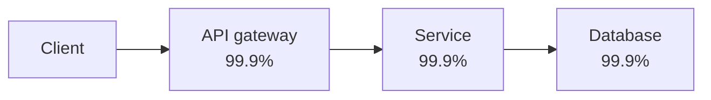

**Availability** is the proportion of time a system is able to serve requests successfully. It is usually expressed as a percentage of uptime over a period, such as a month or a year, and is one of the first non-functional requirements to pin down in any design.

```text
availability = uptime / (uptime + downtime)
```

## The “nines”

Availability targets are often described by their number of nines. Each extra nine cuts the allowed downtime by a factor of ten:

| Availability | Downtime per year | Downtime per month |
| --- | --- | --- |
| 99% (“two nines”) | 3.65 days | 7.3 hours |
| 99.9% | 8.77 hours | 43.8 minutes |
| 99.99% | 52.6 minutes | 4.4 minutes |
| 99.999% | 5.26 minutes | 26 seconds |

Five nines leaves so little room that a single manual intervention can consume a year's budget. Reaching it requires automated failover, redundancy at every layer and careful change management. Each nine typically costs significantly more than the last, so the target should reflect business need.

## Availability of combined components

When a request must pass through several components **in series**, the overall availability is the product of the individual availabilities. Three services at 99.9% each give roughly 99.7% overall:



When components are **redundant in parallel** — any one can serve the request — availability improves dramatically. Two independent replicas at 99% each give `1 - 0.01 × 0.01 = 99.99%`, provided their failures are truly independent.

<Callout type="note">
Redundancy only helps if failures are independent. Two replicas in the same rack, sharing one power supply, will fail together. Spread replicas across racks, availability zones and, for the highest targets, regions.
</Callout>

## Measuring availability

There are two common ways to measure availability:

- **Time-based:** the fraction of time the system is “up,” often measured by synthetic health checks.
- **Request-based:** the fraction of requests that succeed, `successful requests / total requests`. This reflects user experience more accurately, because a partial outage affecting 5% of users counts proportionally.

Service owners formalize targets as **service level objectives (SLOs)**, such as “99.95% of requests succeed each month.” The remaining 0.05% is the **error budget**: while budget remains, teams can ship changes quickly; when it is exhausted, they slow down and invest in reliability.

## Techniques to improve availability

- **Eliminate single points of failure** through replication and redundancy.
- **Automatic failover** so that when a primary fails, a standby takes over without human action.
- **Health checks and load balancing** to route traffic away from unhealthy instances.
- **Graceful degradation** — serving a reduced experience (for example, cached results or disabling recommendations) instead of failing completely.
- **Safe deployments** using canary releases and quick rollbacks, since many outages are caused by changes.
- **Rate limiting and load shedding** to protect the system from overload.

<KeyTakeaways>
- Availability is the fraction of time or requests a system serves successfully.
- Each extra nine reduces allowed downtime tenfold and costs more to achieve.
- Serial dependencies multiply availabilities down; independent redundancy multiplies failure probabilities down.
- Request-based SLOs and error budgets connect availability targets to engineering decisions.
- Redundancy, automatic failover, graceful degradation and safe deployments all raise availability.
</KeyTakeaways>
