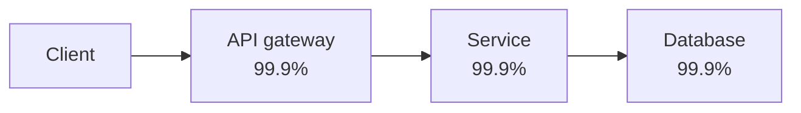

**Availability** is the proportion of time a system is able to serve requests successfully. It is usually expressed as a percentage of uptime over a period, such as a month or a year, and is one of the first non-functional requirements to pin down in any design.

```text
availability = uptime / (uptime + downtime)
```

## The "nines"

Availability targets are often described by their number of nines. Each extra nine cuts the allowed downtime by a factor of ten:

| Availability | Downtime per year | Downtime per month | Downtime per week |
| --- | --- | --- | --- |
| 90% ("one nine") | 36.5 days | 72 hours | 16.8 hours |
| 99% ("two nines") | 3.65 days | 7.3 hours | 1.68 hours |
| 99.9% | 8.77 hours | 43.8 minutes | 10.1 minutes |
| 99.99% | 52.6 minutes | 4.4 minutes | 1 minute |
| 99.999% | 5.26 minutes | 26 seconds | 6 seconds |

Five nines leaves so little room that a single manual intervention can consume a year's budget: if a human must be paged, wake up, log in and diagnose a problem, several minutes are gone before any fix begins. Reaching it requires automated failover, redundancy at every layer and careful change management. Each nine typically costs significantly more than the last, so the target should reflect business need.

## SLIs, SLOs and SLAs

Three related terms appear in every discussion of availability:

| Term | Meaning | Example |
| --- | --- | --- |
| **SLI** — service level indicator | A measured quantity | Fraction of HTTP requests that return a non-5xx response within 500 ms |
| **SLO** — service level objective | An internal target for an SLI | 99.95% of requests per 30-day window meet the SLI |
| **SLA** — service level agreement | A contract with customers, with penalties | 99.9% monthly availability, or a 10% service credit |

SLAs are deliberately looser than SLOs so that the team is alerted and acts well before contractual penalties apply. Public cloud services typically publish SLAs between 99.9% and 99.99% for individual services, with higher figures for services deployed across multiple zones or regions.

## Availability of combined components

When a request must pass through several components **in series**, the overall availability is the product of the individual availabilities. Three services at 99.9% each give roughly 99.7% overall:



```text
A_series = 0.999 × 0.999 × 0.999 ≈ 0.997   (about 26 hours of downtime a year)
```

When components are **redundant in parallel** — any one can serve the request — availability improves dramatically. Two independent replicas at 99% each give:

```text
A_parallel = 1 − (1 − 0.99) × (1 − 0.99) = 1 − 0.0001 = 99.99%
```

### A worked example

A service has a load balancer pair (each 99.9%), three app servers (each 99.5%) and a database with a primary and a standby (each 99.9%). Assuming independence:

- Load balancer tier: `1 − 0.001² ≈ 99.9999%`
- App tier: `1 − 0.005³ ≈ 99.99999%`
- Database tier: `1 − 0.001² ≈ 99.9999%`
- Whole path (in series): about **99.9998%**

The arithmetic is optimistic because it assumes failures are independent and failover is instant. In reality the database failover might take 30 seconds each time, and a bad deployment can take down all three app servers at once. Such calculations are useful for spotting the weakest tier, not for promising a number.

<Callout type="note">
Redundancy only helps if failures are independent. Two replicas in the same rack, sharing one power supply, will fail together. Spread replicas across racks, availability zones and, for the highest targets, regions.
</Callout>

## Active-passive versus active-active

| Model | How it works | Pros | Cons |
| --- | --- | --- | --- |
| Active-passive | A standby takes over when the primary fails | Simple; no conflicting writes | Failover takes time; standby capacity sits idle |
| Active-active | All replicas serve traffic at once | No failover delay; capacity is used | Must handle concurrent writes and conflicts; capacity must survive losing one site |

Active-active across regions is how many global services reach four or five nines, but it forces hard decisions about data consistency, which later chapters explore.

## Measuring availability

There are two common ways to measure availability:

- **Time-based:** the fraction of time the system is "up," often measured by synthetic health checks.
- **Request-based:** the fraction of requests that succeed, `successful requests / total requests`. This reflects user experience more accurately, because a partial outage affecting 5% of users counts proportionally.

Service owners formalize targets as **service level objectives (SLOs)**, such as "99.95% of requests succeed each month." The remaining 0.05% is the **error budget**: while budget remains, teams can ship changes quickly; when it is exhausted, they slow down and invest in reliability. With 100 million requests a month, a 99.95% SLO allows 50,000 failed requests.

Planned maintenance counts too. Users do not care whether downtime was scheduled; systems with high targets perform upgrades as rolling changes with no downtime at all.

## Techniques to improve availability

- **Eliminate single points of failure** through replication and redundancy.
- **Automatic failover** so that when a primary fails, a standby takes over without human action.
- **Health checks and load balancing** to route traffic away from unhealthy instances.
- **Graceful degradation** — serving a reduced experience (for example, cached results or disabling recommendations) instead of failing completely.
- **Safe deployments** using canary releases and quick rollbacks, since many outages are caused by changes.
- **Rate limiting and load shedding** to protect the system from overload.
- **Multi-zone and multi-region deployment** so that a facility-level failure affects only part of the fleet.

<Ponder question="A product manager asks for 99.999% availability on a new internal reporting dashboard. How would you respond?">
Ask what an outage actually costs. Five nines allows about five minutes of downtime a year, which requires multi-region redundancy, automated failover and zero-downtime deployments — and every dependency, including the data warehouse behind the dashboard, must be at least as available. For an internal dashboard, 99.9% (under nine hours a year) is usually ample and far cheaper. Setting availability targets is a business trade-off, not a matter of "higher is always better".
</Ponder>

<KeyTakeaways>
- Availability is the fraction of time or requests a system serves successfully.
- Each extra nine reduces allowed downtime tenfold and costs more to achieve.
- SLIs measure, SLOs set internal targets and SLAs are contracts with penalties.
- Serial dependencies multiply availabilities down; independent redundancy multiplies failure probabilities down.
- Active-active avoids failover delay but must handle concurrent writes; active-passive is simpler but slower to recover.
- Request-based SLOs and error budgets connect availability targets to engineering decisions.
</KeyTakeaways>
