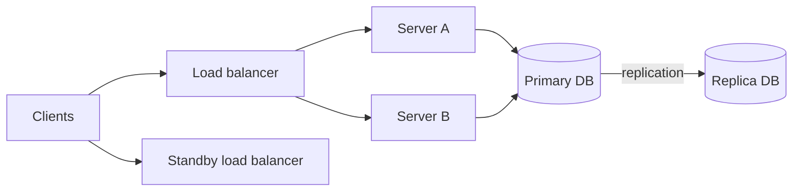

A **fault** is a component deviating from its specification — a disk failing, a process crashing, a network link dropping packets. A **failure** is when the system as a whole stops providing its service. **Fault tolerance** is the ability to keep working correctly despite faults, preventing them from turning into failures.

At scale, faults are constant: with thousands of machines, some disk or server is failing every day. Fault tolerance is therefore not a luxury but a requirement.

## Redundancy is the foundation

Nearly all fault-tolerance techniques rely on some form of **redundancy**:

- **Replication of data** — keeping multiple copies so that losing one does not lose data.
- **Redundant compute** — running several instances of a service so others can take over.
- **Redundant paths** — multiple network routes, power supplies and data centers.
- **Information redundancy** — checksums and erasure codes that detect or even repair corrupted data.

## Detecting faults

You cannot tolerate a fault you do not notice. Common detection mechanisms include:

- **Heartbeats** — components periodically announce they are alive; missing heartbeats trigger suspicion.
- **Health checks** — load balancers probe endpoints and stop routing to unhealthy instances.
- **Checksums** — detect corrupted data on disk or in transit.
- **Timeouts** — bound how long a caller waits before treating a dependency as failed.

## Recovering from faults

Once a fault is detected, the system recovers through:

- **Failover** — promoting a standby to replace a failed primary. Failover must avoid **split brain**, where two nodes both believe they are the primary. Consensus-based leader election and fencing tokens prevent this.
- **Retry** — transient faults often disappear on a second attempt, provided operations are idempotent.
- **Checkpointing** — long-running jobs periodically save progress so they restart from the last checkpoint instead of from scratch.
- **Re-replication** — when a storage node dies, its data is copied from remaining replicas to restore the desired replication factor.

## Containing faults

Even when a fault cannot be masked, good design keeps it from spreading:

- **Bulkheads** isolate resources (thread pools, connection pools, clusters) so one misbehaving dependency cannot exhaust everything.
- **Circuit breakers** stop calls to a failing dependency, failing fast instead of piling up waiting requests.
- **Cell-based architecture** splits users into independent cells; an outage in one cell affects only a fraction of users.
- **Graceful degradation** disables non-essential features — say, recommendations — to keep core features running.

<Callout type="interview">
A strong answer to “what if X fails?” covers all three steps: how the failure is **detected**, how the system **recovers**, and how the **blast radius** is limited in the meantime.
</Callout>

## The cost of fault tolerance

Redundancy costs money: three replicas triple storage costs. Synchronous replication adds latency. Complex failover logic can itself contain bugs. The right level of fault tolerance depends on the cost of failure — a payment ledger deserves far more protection than a cache of thumbnail images that can be regenerated.

<KeyTakeaways>
- Faults are component deviations; failures are system-level outages. Fault tolerance keeps the former from causing the latter.
- Redundancy of data, compute, paths and information underpins fault tolerance.
- Detect faults with heartbeats, health checks, checksums and timeouts.
- Recover with failover (avoiding split brain), retries, checkpoints and re-replication.
- Contain faults with bulkheads, circuit breakers, cells and graceful degradation.
- Match the investment in fault tolerance to the cost of failure.
</KeyTakeaways>
