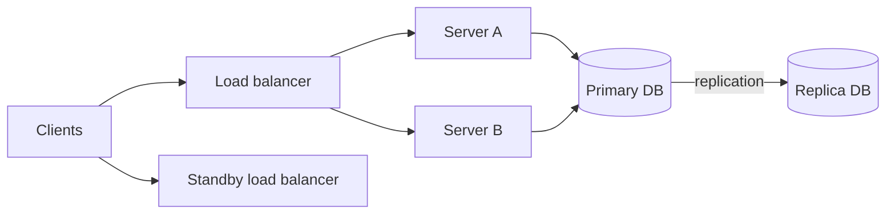
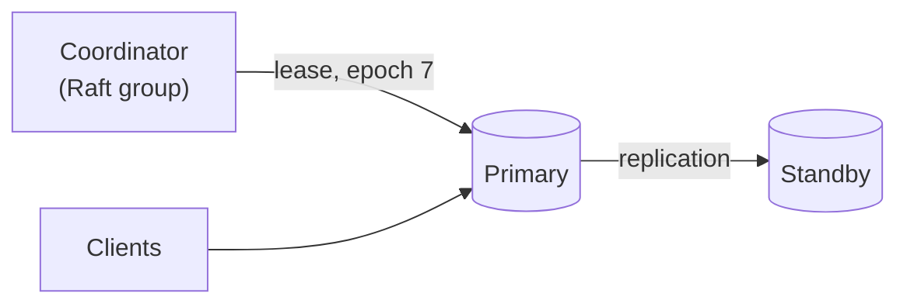
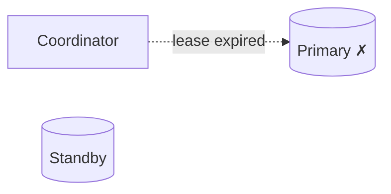
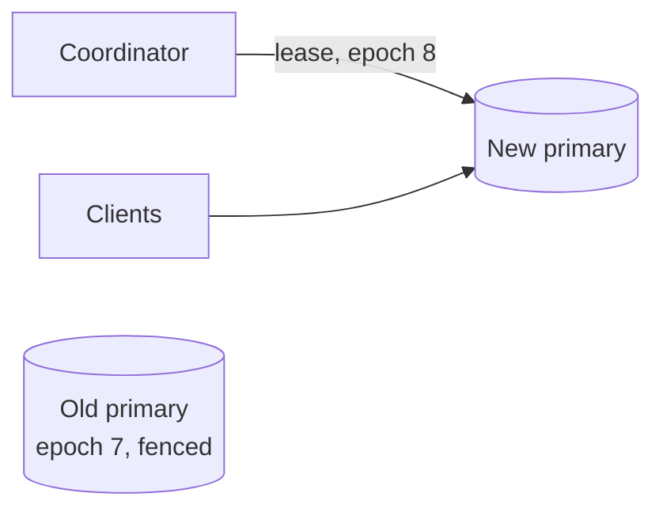
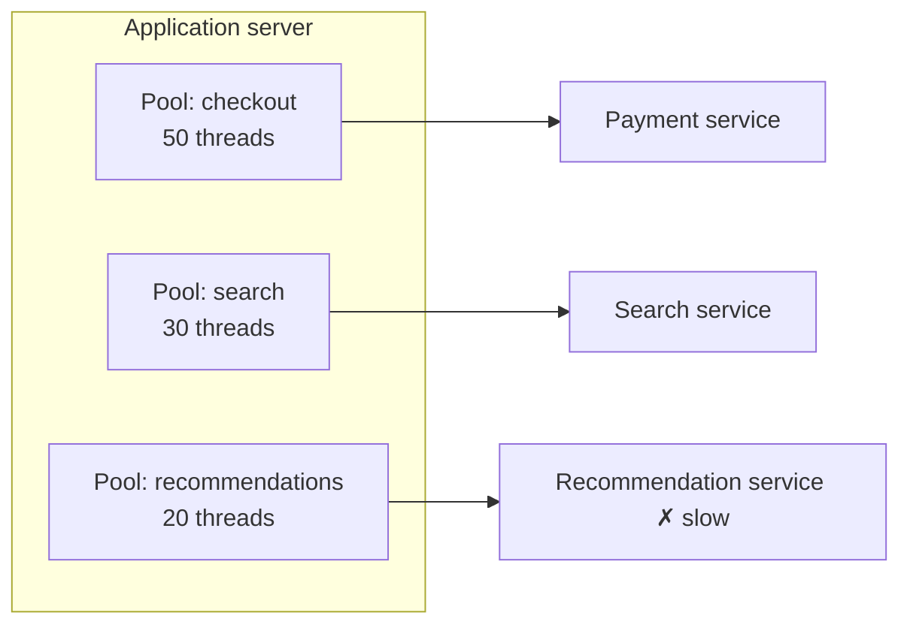

A **fault** is a component deviating from its specification — a disk failing, a process crashing, a network link dropping packets. A **failure** is when the system as a whole stops providing its service. **Fault tolerance** is the ability to keep working correctly despite faults, preventing them from turning into failures.

At scale, faults are constant: with thousands of machines, some disk or server is failing every day. Fault tolerance is therefore not a luxury but a requirement.

## Redundancy is the foundation

Nearly all fault-tolerance techniques rely on some form of **redundancy**:

- **Replication of data** — keeping multiple copies so that losing one does not lose data.
- **Redundant compute** — running several instances of a service so others can take over.
- **Redundant paths** — multiple network routes, power supplies and data centers.
- **Information redundancy** — checksums and erasure codes that detect or even repair corrupted data.

### Replication versus erasure coding

Storing three full copies of every byte tolerates the loss of any two copies but costs 3× the raw storage. **Erasure coding** splits data into `k` data fragments and computes `m` parity fragments; any `k` of the `k + m` fragments can rebuild the data.

| Scheme | Storage overhead | Fragments that can be lost | Typical use |
| --- | --- | --- | --- |
| 3× replication | 200% | 2 | Hot data needing fast reads and repairs |
| Reed-Solomon (6 + 3) | 50% | 3 | Warm and cold data in blob stores |
| Reed-Solomon (10 + 4) | 40% | 4 | Archival storage |

Erasure coding saves a great deal of storage but makes reads and repairs more expensive, because rebuilding a lost fragment requires reading `k` others. Blob stores often keep new, frequently read objects replicated and convert them to erasure-coded form as they cool down.

## Detecting faults

You cannot tolerate a fault you do not notice. Common detection mechanisms include:

- **Heartbeats** — components periodically announce they are alive; missing heartbeats trigger suspicion.
- **Health checks** — load balancers probe endpoints and stop routing to unhealthy instances.
- **Checksums** — detect corrupted data on disk or in transit. Background **scrubbing** reads stored data periodically to find silent corruption before a replica is needed.
- **Timeouts** — bound how long a caller waits before treating a dependency as failed.

## Recovering from faults

Once a fault is detected, the system recovers through:

- **Failover** — promoting a standby to replace a failed primary. Failover must avoid **split brain**, where two nodes both believe they are the primary. Consensus-based leader election and fencing tokens prevent this.
- **Retry** — transient faults often disappear on a second attempt, provided operations are idempotent.
- **Checkpointing** — long-running jobs periodically save progress so they restart from the last checkpoint instead of from scratch. A 10-hour batch job that checkpoints every 10 minutes loses at most 10 minutes of work to a crash.
- **Re-replication** — when a storage node dies, its data is copied from remaining replicas to restore the desired replication factor.

<Slides title="Failover without split brain">
<Slide caption="1. The primary holds a lease from a consensus-backed coordinator and serves writes; the standby replicates.">

</Slide>
<Slide caption="2. The primary stops renewing its lease — it crashed or is cut off. The coordinator waits for the lease to expire.">

</Slide>
<Slide caption="3. The standby is promoted with a higher epoch. Storage and clients reject anything from epoch 7, so the old primary cannot accept writes even if it wakes up.">

</Slide>
</Slides>

## Containing faults

Even when a fault cannot be masked, good design keeps it from spreading:

- **Bulkheads** isolate resources (thread pools, connection pools, clusters) so one misbehaving dependency cannot exhaust everything. If the recommendation service hangs, only the 20 threads reserved for it block; the checkout path still has its own pool.
- **Circuit breakers** stop calls to a failing dependency, failing fast instead of piling up waiting requests.
- **Cell-based architecture** splits users into independent cells, each a complete copy of the stack; an outage in one cell affects only a fraction of users.
- **Load shedding** rejects low-priority work early when the system is overloaded, so high-priority requests still succeed.
- **Graceful degradation** disables non-essential features — say, recommendations — to keep core features running.

<Callout type="interview">
A strong answer to "what if X fails?" covers all three steps: how the failure is **detected**, how the system **recovers**, and how the **blast radius** is limited in the meantime.
</Callout>

<Ponder question="A primary database fails and the standby is promoted using asynchronous replication. What might be lost, and how could you reduce the risk?">
Writes acknowledged by the old primary but not yet replicated are lost — the replication lag at the moment of failure. Options: use **synchronous or semi-synchronous replication** so a write is acknowledged only after at least one standby has it (at the cost of write latency); keep lag small and alert when it grows; or, when the old primary returns, reconcile its unreplicated writes instead of discarding them silently.
</Ponder>

## The cost of fault tolerance

Redundancy costs money: three replicas triple storage costs. Synchronous replication adds latency. Complex failover logic can itself contain bugs — and because it runs rarely, those bugs hide until the worst moment. The right level of fault tolerance depends on the cost of failure — a payment ledger deserves far more protection than a cache of thumbnail images that can be regenerated. Test failover regularly, ideally in production during working hours, so you know it works before you need it.

<KeyTakeaways>
- Faults are component deviations; failures are system-level outages. Fault tolerance keeps the former from causing the latter.
- Redundancy of data, compute, paths and information underpins fault tolerance; erasure coding trades read cost for storage savings.
- Detect faults with heartbeats, health checks, checksums with scrubbing, and timeouts.
- Recover with failover (avoiding split brain with leases and epochs), retries, checkpoints and re-replication.
- Contain faults with bulkheads, circuit breakers, cells, load shedding and graceful degradation.
- Match the investment in fault tolerance to the cost of failure, and exercise failover regularly.
</KeyTakeaways>
