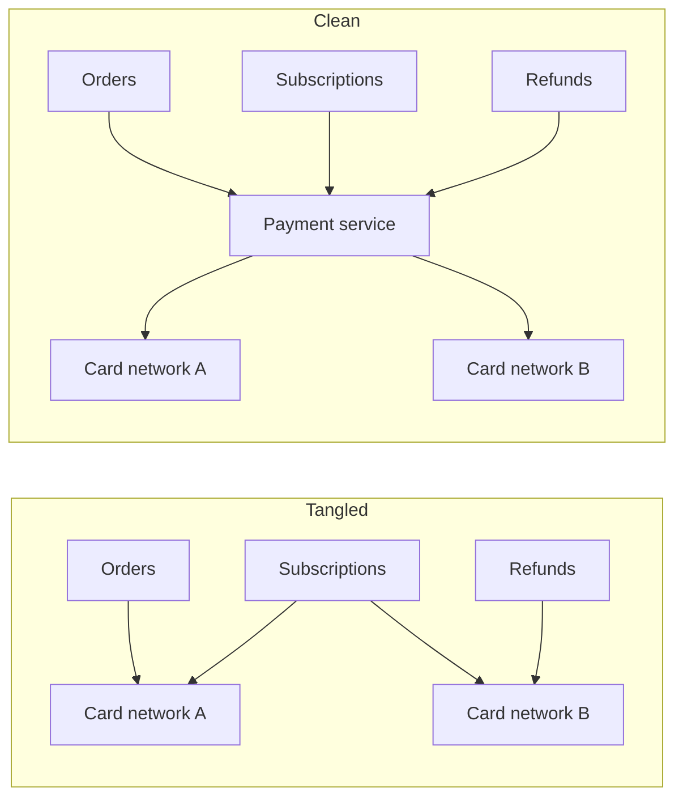
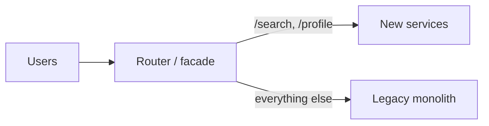

Most of the cost of software is not in building it but in running and changing it over years. **Maintainability** is how easily a system can be operated, understood, fixed and extended by the people responsible for it. A system that is fast and available but impossible to change safely will eventually fail its users.

Maintainability is often broken into three properties.

## Operability

**Operability** means making life easy for the people who keep the system running. An operable system:

- Exposes good **observability** — metrics, logs and traces that show what it is doing.
- Supports **routine tasks** such as deployments, configuration changes and scaling without downtime.
- Behaves **predictably**, with sensible defaults and clear documentation.
- Makes failures **easy to diagnose**, with meaningful error messages and runbooks.
- Allows **safe changes** through feature flags, canary releases and quick rollbacks.

### The three pillars of observability

| Signal | Answers | Example |
| --- | --- | --- |
| **Metrics** | "Is something wrong, and how much?" | Request rate, error rate, p99 latency per endpoint |
| **Logs** | "What exactly happened to this request?" | Structured event with request ID, user ID and error |
| **Traces** | "Where did the time go across services?" | A request spent 12 ms in the gateway, 180 ms waiting on the search service |

A common starting point for service metrics is the **RED method**: rate, errors and duration for every endpoint. For resources such as CPUs, disks and queues, the **USE method** tracks utilization, saturation and errors.

## Simplicity

**Simplicity** means managing complexity so engineers can understand the system. Complexity creeps in through tangled dependencies, inconsistent naming, special cases and leftover workarounds. It slows every change and increases the risk of bugs.

It helps to distinguish **essential complexity**, inherent in the problem (payments really do involve refunds, disputes and currency conversion), from **accidental complexity**, introduced by our implementation (three slightly different retry libraries, or two services that both own the same data). Good design removes accidental complexity and contains essential complexity behind clean interfaces.

The main tool for fighting complexity is **good abstraction**: well-defined components with clear responsibilities and interfaces. A payment service that exposes `authorize`, `capture` and `refund` — and hides the details of each card network — is far easier to reason about than a system where every team talks to card networks directly.

## Evolvability

**Evolvability** (also called extensibility or modifiability) is how easily the system adapts to new requirements. Requirements always change: new features, new regulations, new scale. Evolvable systems:

- Use **loose coupling**, so a change in one component does not ripple through others.
- Version their **APIs and data schemas**, so producers and consumers can change independently.
- Prefer **incremental migrations** — dual writes, backfills and gradual cutovers — over big-bang rewrites.
- Keep **tests** and **automation** that make changes safe to ship.

### Changing a schema without downtime

Renaming a database column looks trivial, but with many servers running old and new code at the same time it needs several steps, often called **expand and contract**:

1. **Expand:** add the new column; deploy code that writes to both columns.
2. **Backfill:** copy existing values from the old column to the new one.
3. **Switch reads:** deploy code that reads from the new column.
4. **Contract:** stop writing the old column, then drop it.

Every step is backward compatible with the one before, so any deployment can be rolled back safely.

### Replacing a system gradually

The **strangler fig** pattern replaces a legacy system piece by piece. A routing layer sends one feature's traffic to the new implementation while everything else still goes to the old one. Features move over one at a time until the old system handles nothing and can be switched off. It avoids the risk of a single "big bang" cutover.

<Callout type="note">
Maintainability is sometimes measured by the time it takes to fix a problem or ship a change. Research on software delivery performance commonly tracks four metrics: deployment frequency, lead time for changes, change failure rate and time to restore service. Short, predictable lead times are a strong sign that a system is maintainable.
</Callout>

## Maintainability in design discussions

It is easy to treat maintainability as an afterthought, but many design choices directly affect it:

- **Microservices versus a monolith.** Microservices allow independent deployment and team autonomy, but add operational overhead and distributed failure modes. A well-structured monolith is often more maintainable for small teams.
- **Managed services versus self-hosting.** Managed databases and queues reduce operational burden at the cost of flexibility and sometimes price.
- **Consistency of technology choices.** Using five different databases may optimize each use case slightly, but multiplies the expertise needed to operate them.
- **Configuration as code.** Keeping infrastructure and configuration in version control, with review, makes changes auditable and reversible.

In an interview, briefly acknowledging these trade-offs — "I'd start with a managed queue to reduce operational load" — shows a mature perspective.

<Ponder question="A team of six engineers is starting a new product and plans to split it into twelve microservices from day one. What would you advise?">
Start with a modular monolith: one deployable unit with clear internal module boundaries. Twelve services for six people means each engineer owns two services' deployments, alerts and on-call, plus network calls and distributed debugging between them — a lot of operational cost before the product has users. Split out a service later when there is a concrete reason: a component with very different scaling needs, a separate team, or a different release cadence.
</Ponder>

<KeyTakeaways>
- Maintainability is how easily a system can be operated, understood and changed over time.
- Operability relies on observability (metrics, logs, traces), predictable behavior and safe change mechanisms.
- Simplicity comes from removing accidental complexity and hiding essential complexity behind good abstractions.
- Evolvability relies on loose coupling, versioned interfaces and incremental migrations such as expand-and-contract and the strangler fig.
- Architecture choices — microservices, managed services, technology diversity — all affect maintainability.
</KeyTakeaways>
