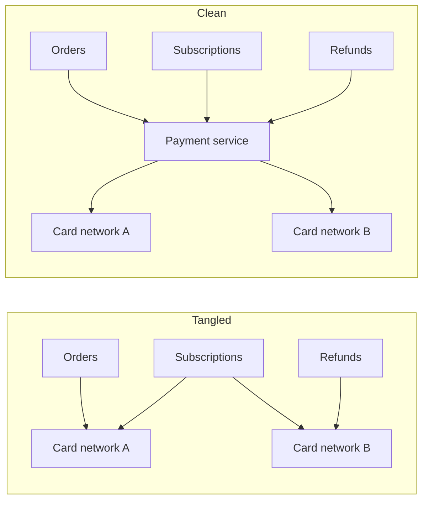

Most of the cost of software is not in building it but in running and changing it over years. **Maintainability** is how easily a system can be operated, understood, fixed and extended by the people responsible for it. A system that is fast and available but impossible to change safely will eventually fail its users.

Maintainability is often broken into three properties.

## Operability

**Operability** means making life easy for the people who keep the system running. An operable system:

- Exposes good **observability** — metrics, logs and traces that show what it is doing.
- Supports **routine tasks** such as deployments, configuration changes and scaling without downtime.
- Behaves **predictably**, with sensible defaults and clear documentation.
- Makes failures **easy to diagnose**, with meaningful error messages and runbooks.
- Allows **safe changes** through feature flags, canary releases and quick rollbacks.

## Simplicity

**Simplicity** means managing complexity so engineers can understand the system. Complexity creeps in through tangled dependencies, inconsistent naming, special cases and leftover workarounds. It slows every change and increases the risk of bugs.

The main tool for fighting complexity is **good abstraction**: well-defined components with clear responsibilities and interfaces. A payment service that exposes `authorize`, `capture` and `refund` — and hides the details of each card network — is far easier to reason about than a system where every team talks to card networks directly.

## Evolvability

**Evolvability** (also called extensibility or modifiability) is how easily the system adapts to new requirements. Requirements always change: new features, new regulations, new scale. Evolvable systems:

- Use **loose coupling**, so a change in one component does not ripple through others.
- Version their **APIs and data schemas**, so producers and consumers can change independently.
- Prefer **incremental migrations** — dual writes, backfills and gradual cutovers — over big-bang rewrites.
- Keep **tests** and **automation** that make changes safe to ship.

<Callout type="note">
Maintainability is sometimes measured by the time it takes to fix a problem or ship a change. Short, predictable lead times are a strong sign that a system is maintainable.
</Callout>

## Maintainability in design discussions

It is easy to treat maintainability as an afterthought, but many design choices directly affect it:

- **Microservices versus a monolith.** Microservices allow independent deployment and team autonomy, but add operational overhead and distributed failure modes. A well-structured monolith is often more maintainable for small teams.
- **Managed services versus self-hosting.** Managed databases and queues reduce operational burden at the cost of flexibility and sometimes price.
- **Consistency of technology choices.** Using five different databases may optimize each use case slightly, but multiplies the expertise needed to operate them.

In an interview, briefly acknowledging these trade-offs — “I'd start with a managed queue to reduce operational load” — shows a mature perspective.

<KeyTakeaways>
- Maintainability is how easily a system can be operated, understood and changed over time.
- Operability relies on observability, predictable behavior and safe change mechanisms.
- Simplicity comes from good abstractions and clear component boundaries.
- Evolvability relies on loose coupling, versioned interfaces and incremental migrations.
- Architecture choices — microservices, managed services, technology diversity — all affect maintainability.
</KeyTakeaways>
