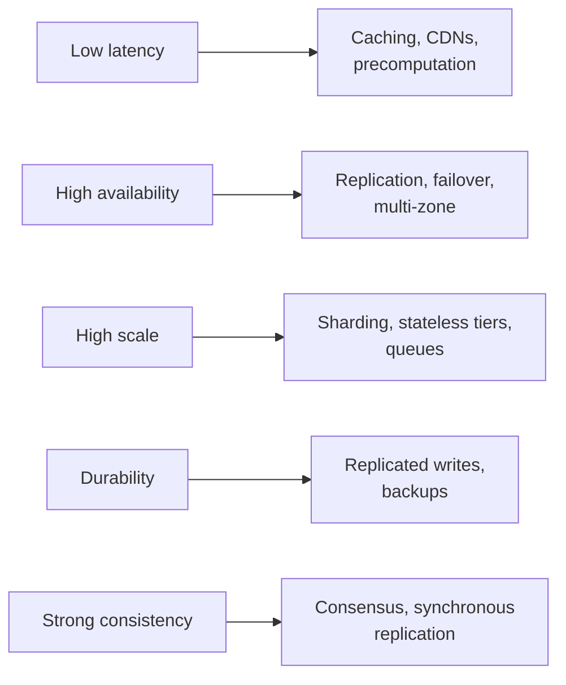

Functional requirements describe *what* a system does. Non-functional requirements (NFRs) describe *how well* it does it — how fast, how available, how consistent, how secure. In interviews, NFRs are where most of the interesting design decisions come from. Two systems with identical features can have completely different architectures because their NFRs differ.

## Why NFRs drive the design

Consider two versions of a "post a comment" feature:

- A small internal tool used by 50 employees: a single server and relational database suffice.
- A global social network with 500 million daily users, 99.99% availability and sub-200 ms latency: you need load balancing, caching, replication, partitioning and multi-region deployment.

The feature is the same; the NFRs changed everything.

## A checklist of NFRs

When scoping a problem, run through the relevant properties and turn each into a concrete, measurable target:

| Property | Example target |
| --- | --- |
| **Scale** | 50M daily active users, 10k writes/s, 200k reads/s at peak |
| **Latency** | p99 read latency under 200 ms |
| **Availability** | 99.99% for reads, 99.9% for writes |
| **Consistency** | Users see their own posts immediately; others within a few seconds |
| **Durability** | No acknowledged write is ever lost |
| **Security and privacy** | Private content visible only to authorized users; data encrypted at rest and in transit |
| **Compliance** | European users' data stays in the EU; deletion requests honored within 30 days |
| **Observability** | Every request traceable end to end; alerts on SLO burn rate |
| **Cost** | Storage cost must stay within a given budget per user |

<Callout type="tip">
Make NFRs specific. "The system should be fast" gives you nothing to design against; "p99 under 200 ms for timeline reads" tells you that timelines probably need to be precomputed and cached.
</Callout>

## Translating NFRs into design choices

Each NFR suggests a set of techniques:

## Latency budgets

A latency target for the whole request must be split among the components on its path. Writing this down reveals quickly whether a design can meet the target.

| Step | Budget |
| --- | --- |
| Client to edge (network) | 40 ms |
| Load balancer and API gateway | 5 ms |
| Timeline service logic | 10 ms |
| Cache lookup for precomputed timeline | 5 ms |
| Hydrating 20 posts from the post cache (parallel) | 20 ms |
| Response to client | 40 ms |
| **Total (p99 target 200 ms)** | **120 ms, leaving headroom** |

If the design instead required a database query joining followers and posts across shards, a single step could take hundreds of milliseconds — a clear sign that the timeline must be precomputed.

## Handling conflicting NFRs

NFRs frequently pull in opposite directions. Strong consistency conflicts with low latency and high availability across regions. High durability conflicts with low write latency. Low cost conflicts with nearly everything.

When NFRs conflict, prioritize explicitly and differentiate by data type or operation:

- "For the payment ledger, correctness wins; we accept higher latency."
- "For the activity feed, availability and latency win; slight staleness is fine."

This kind of per-component reasoning is one of the strongest signals of seniority in an interview.

## Worked example: a photo-sharing app

Suppose the interviewer asks for a photo-sharing app like Instagram. A strong candidate might state:

1. **Scale:** 500 million daily active users; 100 million photo uploads a day; 50 feed views per user a day → about 1,200 uploads per second and 300,000 feed reads per second on average.
2. **Latency:** feed loads with p99 under 300 ms; photos appear in under a second on a typical connection.
3. **Availability:** reads 99.99%; uploads may be slightly lower because clients can retry.
4. **Consistency:** a user sees their own upload immediately; followers may see it after a few seconds.
5. **Durability:** an uploaded photo is never lost.

Each line maps to a design decision: the read volume implies precomputed feeds and heavy caching; the latency target implies a CDN for images; durability implies replicated blob storage; the relaxed consistency for followers lets feed updates be asynchronous.

<Ponder question="The interviewer asks for strong consistency and 50 ms global write latency for a multi-region social network. How would you respond?">
Point out the conflict: a linearizable write across regions needs a round trip to a majority of regions, and inter-continental round trips alone are often 100–200 ms. Then offer options — keep each user's data "homed" in one region so their writes are strongly consistent and fast locally, while other regions receive them asynchronously; or relax consistency for this data type. Naming the physical constraint and proposing alternatives is exactly what interviewers look for.
</Ponder>

## Revisiting NFRs at the end

In the final minutes, evaluate your design against each NFR you listed: "We meet the latency target through the cache; availability comes from multi-zone replicas; the remaining risk is the single-region write path, which I'd address with multi-region replication if requirements demand it." Closing the loop shows the design was driven by the requirements from start to finish.

<KeyTakeaways>
- NFRs describe how well a system performs its functions and drive most architectural decisions.
- Make each NFR specific and measurable: scale, latency, availability, consistency, durability, security, compliance and cost.
- Each NFR maps to techniques such as caching, replication, sharding and consensus.
- Latency budgets split an end-to-end target across components and expose infeasible designs.
- When NFRs conflict, prioritize explicitly, often differently per component, and name physical limits.
- Evaluate the final design against the NFRs to close the loop.
</KeyTakeaways>
