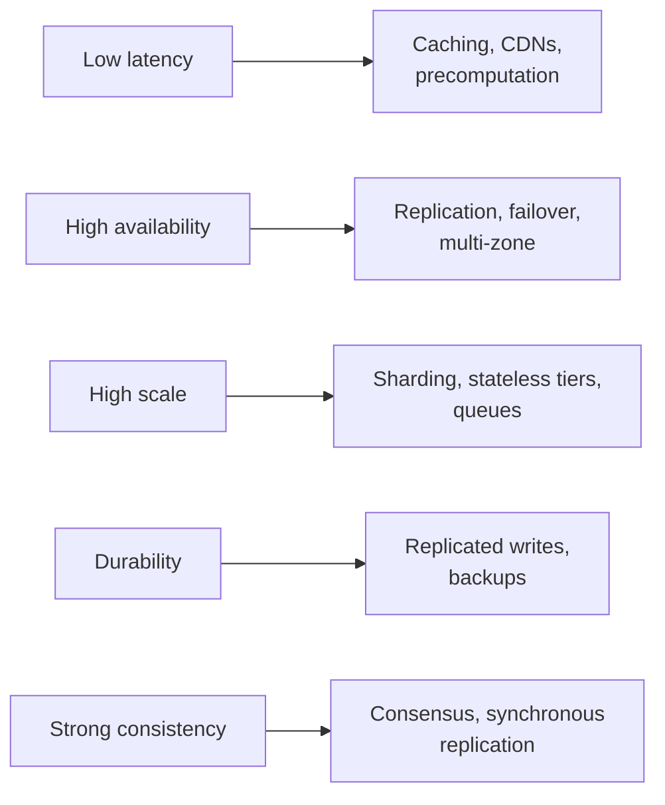

Functional requirements describe *what* a system does. Non-functional requirements (NFRs) describe *how well* it does it — how fast, how available, how consistent, how secure. In interviews, NFRs are where most of the interesting design decisions come from. Two systems with identical features can have completely different architectures because their NFRs differ.

## Why NFRs drive the design

Consider two versions of a “post a comment” feature:

- A small internal tool used by 50 employees: a single server and relational database suffice.
- A global social network with 500 million daily users, 99.99% availability and sub-200 ms latency: you need load balancing, caching, replication, partitioning and multi-region deployment.

The feature is the same; the NFRs changed everything.

## A checklist of NFRs

When scoping a problem, run through the relevant properties and turn each into a concrete, measurable target:

| Property | Example target |
| --- | --- |
| **Scale** | 50M daily active users, 10k writes/s, 200k reads/s at peak |
| **Latency** | p99 read latency under 200 ms |
| **Availability** | 99.99% for reads, 99.9% for writes |
| **Consistency** | Users see their own posts immediately; others within a few seconds |
| **Durability** | No acknowledged write is ever lost |
| **Security and privacy** | Private content visible only to authorized users |
| **Cost** | Storage cost must stay within a given budget per user |

<Callout type="tip">
Make NFRs specific. “The system should be fast” gives you nothing to design against; “p99 under 200 ms for timeline reads” tells you that timelines probably need to be precomputed and cached.
</Callout>

## Translating NFRs into design choices

Each NFR suggests a set of techniques:

## Handling conflicting NFRs

NFRs frequently pull in opposite directions. Strong consistency conflicts with low latency and high availability across regions. High durability conflicts with low write latency. Low cost conflicts with nearly everything.

When NFRs conflict, prioritize explicitly and differentiate by data type or operation:

- “For the payment ledger, correctness wins; we accept higher latency.”
- “For the activity feed, availability and latency win; slight staleness is fine.”

This kind of per-component reasoning is one of the strongest signals of seniority in an interview.

## Revisiting NFRs at the end

In the final minutes, evaluate your design against each NFR you listed: “We meet the latency target through the cache; availability comes from multi-zone replicas; the remaining risk is the single-region write path, which I'd address with multi-region replication if requirements demand it.” Closing the loop shows the design was driven by the requirements from start to finish.

<KeyTakeaways>
- NFRs describe how well a system performs its functions and drive most architectural decisions.
- Make each NFR specific and measurable: scale, latency, availability, consistency, durability, security and cost.
- Each NFR maps to techniques such as caching, replication, sharding and consensus.
- When NFRs conflict, prioritize explicitly, often differently per component.
- Evaluate the final design against the NFRs to close the loop.
</KeyTakeaways>
