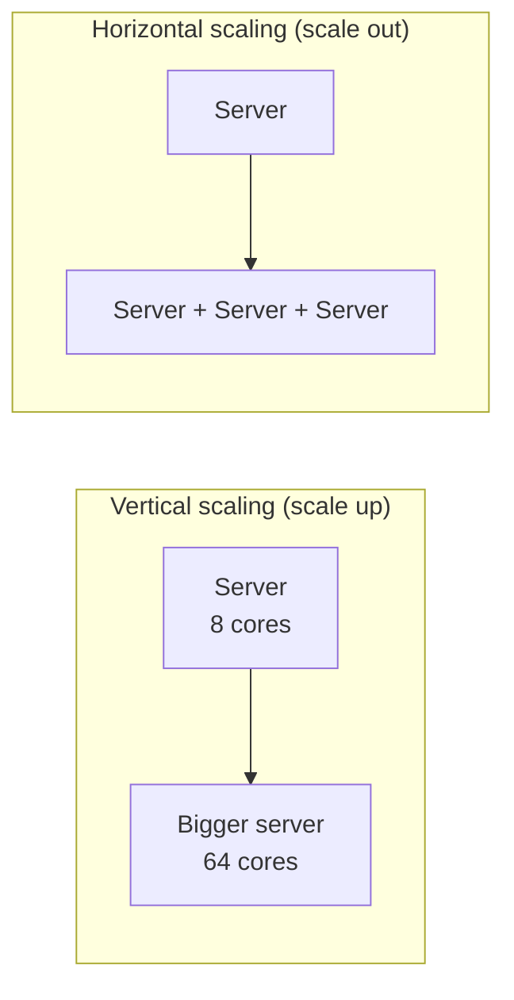

**Scalability** is a system's ability to handle growing load — more users, more data, more requests — by adding resources, while keeping performance acceptable. A scalable system does not need to be redesigned every time traffic doubles.

## Describing load

Before discussing scaling, define what “load” means for your system. Useful load parameters include:

- Requests per second to a web service.
- Ratio of reads to writes in a database.
- Number of simultaneously connected users in a chat system.
- Size of the data set or the rate at which it grows.
- **Fan-out** — how much work one request triggers. When a user with millions of followers posts, a single write can create millions of feed updates.

Performance under load is best described with **percentiles**, not averages. The median (p50) tells you the typical experience; p95 and p99 reveal the slow tail, which often affects your most active users.

## Vertical versus horizontal scaling

**Vertical scaling** means using a more powerful machine: more CPU, memory or faster disks. It is simple — no code changes — but has a hard ceiling, gets expensive at the top end, and leaves a single point of failure.

**Horizontal scaling** means adding more machines and spreading the load across them. It can grow almost without limit and improves fault tolerance, but introduces distributed-systems complexity: load balancing, data partitioning, coordination and consistency.

Most large systems scale horizontally, but vertical scaling remains a sensible first step and is often the right choice for components that are hard to distribute, such as a primary relational database at moderate scale.

## Scaling different layers

- **Stateless application servers** scale horizontally easily: put them behind a load balancer and add instances. Keeping servers stateless — storing session data in a shared cache or database — is the key enabler.
- **Read-heavy data** scales with **caching** and **read replicas**.
- **Write-heavy or very large data** requires **partitioning (sharding)** so that each machine holds and handles only a portion.
- **Slow or bursty work** scales with **asynchronous processing** through queues, letting workers absorb spikes.

<Callout type="interview">
When asked “how does this scale?”, identify the bottleneck first. Doubling stateless servers does nothing if the database is saturated. Name the component that will fail first as load grows and explain how you would scale it.
</Callout>

## Elasticity

**Elasticity** is the ability to add and remove resources automatically as load changes. Autoscaling groups add servers during peak hours and remove them at night, saving cost. Elastic systems need fast startup times, stateless components and metrics to trigger scaling decisions.

## Limits to scaling

Scaling is not free. Coordination between machines adds overhead, so doubling machines rarely doubles throughput. Shared resources — a single database, a global lock, a hot partition — become bottlenecks. Good scalable designs minimize coordination and distribute load evenly.

<KeyTakeaways>
- Scalability is the ability to handle growing load by adding resources.
- Define load with concrete parameters and measure performance with percentiles.
- Vertical scaling is simple but limited; horizontal scaling is powerful but adds complexity.
- Stateless servers, caching, replicas, partitioning and queues each scale a different kind of load.
- Always identify the bottleneck before proposing how to scale.
</KeyTakeaways>
