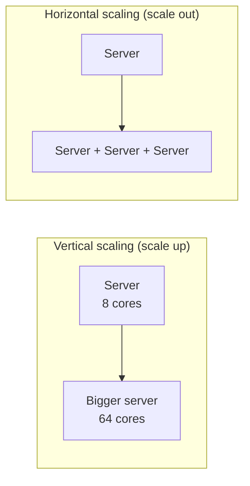
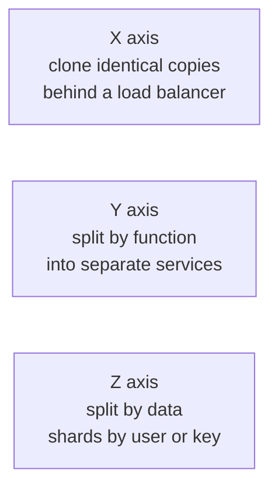

**Scalability** is a system's ability to handle growing load — more users, more data, more requests — by adding resources, while keeping performance acceptable. A scalable system does not need to be redesigned every time traffic doubles.

## Describing load

Before discussing scaling, define what "load" means for your system. Useful load parameters include:

- Requests per second to a web service.
- Ratio of reads to writes in a database.
- Number of simultaneously connected users in a chat system.
- Size of the data set or the rate at which it grows.
- **Fan-out** — how much work one request triggers. When a user with millions of followers posts, a single write can create millions of feed updates.

Performance under load is best described with **percentiles**, not averages. The median (p50) tells you the typical experience; p95 and p99 reveal the slow tail, which often affects your most active users.

Tail latency matters more than it seems. If a page makes 100 backend calls in parallel and each has a 1% chance of being slow, the chance that at least one is slow is `1 − 0.99¹⁰⁰ ≈ 63%`. The p99 of a component becomes the median of the page.

## Vertical versus horizontal scaling

**Vertical scaling** means using a more powerful machine: more CPU, memory or faster disks. It is simple — no code changes — but has a hard ceiling, gets expensive at the top end, and leaves a single point of failure.

**Horizontal scaling** means adding more machines and spreading the load across them. It can grow almost without limit and improves fault tolerance, but introduces distributed-systems complexity: load balancing, data partitioning, coordination and consistency.

| | Vertical | Horizontal |
| --- | --- | --- |
| Code changes | None | Often significant (statelessness, sharding) |
| Upper limit | Largest available machine | Practically unbounded |
| Failure impact | Whole service | One node's share |
| Cost curve | Rises steeply at the top end | Roughly linear with commodity machines |
| Operational complexity | Low | Higher: balancing, partitioning, coordination |

Most large systems scale horizontally, but vertical scaling remains a sensible first step and is often the right choice for components that are hard to distribute, such as a primary relational database at moderate scale. Modern servers with hundreds of cores and terabytes of memory push that point further than many people expect.

## The scale cube

A helpful model describes three independent ways to scale a service:

- **X-axis (cloning):** run N identical copies of a stateless service. Simple and effective until shared state becomes the bottleneck.
- **Y-axis (functional decomposition):** split a monolith into services such as search, checkout and profiles, each scaled independently.
- **Z-axis (data partitioning):** each instance handles a subset of the data, for example users A–M and N–Z. This is sharding.

Large systems use all three: cloned instances of many services, each backed by sharded data.

## Scaling different layers

- **Stateless application servers** scale horizontally easily: put them behind a load balancer and add instances. Keeping servers stateless — storing session data in a shared cache or database — is the key enabler.
- **Read-heavy data** scales with **caching** and **read replicas**.
- **Write-heavy or very large data** requires **partitioning (sharding)** so that each machine holds and handles only a portion.
- **Slow or bursty work** scales with **asynchronous processing** through queues, letting workers absorb spikes.
- **Static and media content** scales with **CDNs**, which serve it from edge locations near users.

<Callout type="interview">
When asked "how does this scale?", identify the bottleneck first. Doubling stateless servers does nothing if the database is saturated. Name the component that will fail first as load grows and explain how you would scale it.
</Callout>

## Elasticity

**Elasticity** is the ability to add and remove resources automatically as load changes. Autoscaling groups add servers during peak hours and remove them at night, saving cost. Elastic systems need fast startup times, stateless components and metrics to trigger scaling decisions — for example, "keep average CPU near 60%" or "keep queue depth below 1,000 messages per worker". Scaling out takes minutes, so leave **headroom** for sudden spikes and pre-scale for known events such as product launches.

## Limits to scaling

Scaling is not free. Coordination between machines adds overhead, so doubling machines rarely doubles throughput.

- **Amdahl's law.** If 5% of the work is inherently serial (for example, a global lock), the maximum speed-up from adding machines is 20×, no matter how many you add.
- **Coherency cost.** When nodes must keep each other up to date, the communication grows with the number of nodes; beyond a point, adding nodes makes throughput *worse*.
- **Hotspots.** A shared resource — a single database, a global counter, one celebrity's partition — becomes the bottleneck regardless of total capacity.

Good scalable designs minimize coordination, avoid shared mutable state and distribute load evenly.

<Ponder question="A service scales from 10 to 20 servers, but throughput only rises from 10,000 to 12,000 requests per second. What might be happening?">
Something shared is saturated: the database, a cache node, a lock, or a downstream dependency with fixed capacity. The extra servers just wait on it. Check utilization of shared components, look for lock contention and hot keys, and profile where requests spend their time before adding more servers.
</Ponder>

## Load testing

You cannot be sure a design scales until you test it. **Load tests** drive synthetic traffic at increasing rates to find the breaking point; **soak tests** run at high load for hours to catch memory leaks and slow degradation. Capacity planning then compares the measured limit with forecast growth, so you know months in advance when a component needs to scale.

<KeyTakeaways>
- Scalability is the ability to handle growing load by adding resources.
- Define load with concrete parameters and measure performance with percentiles; tail latency compounds with fan-out.
- Vertical scaling is simple but limited; horizontal scaling is powerful but adds complexity.
- The scale cube combines cloning, functional decomposition and data partitioning.
- Serial work, coordination and hotspots limit how far adding machines helps.
- Always identify the bottleneck before proposing how to scale, and verify with load tests.
</KeyTakeaways>
