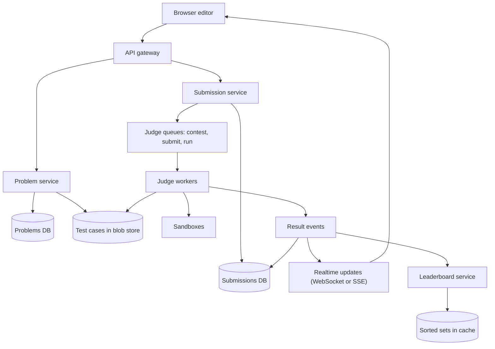
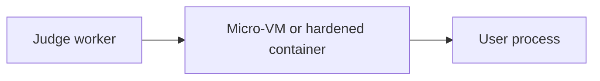
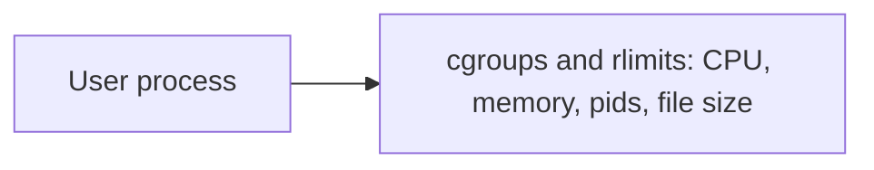
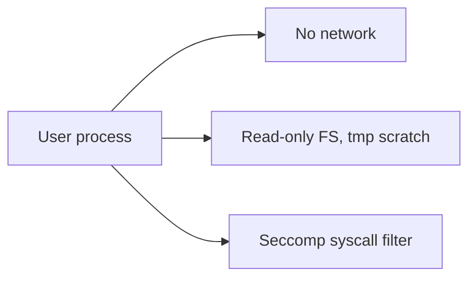
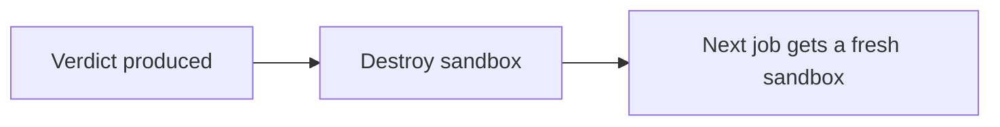

This lesson designs an online judge that serves millions of users and survives contest-time spikes, with a strong focus on safely executing untrusted code.

## Estimates

Assume 5 million daily active users making 10 runs or submissions each: 50 million executions per day, about 580 per second on average. A popular contest with 50,000 participants can produce 5,000 submissions per minute near the end, with each submission running against 50 test cases. If a typical execution takes 2 seconds of CPU across all tests, the average load needs about 1,200 cores busy, and contest peaks several times more. Execution capacity is the dominant resource.

## Architecture

## Submission flow

1. The client sends code, language and problem ID to the submission service, which validates size limits, applies per-user rate limits, stores the submission with status `queued` and returns its ID.
2. The submission is placed on a **priority queue**: contest submissions first, practice submissions next, and "run" requests in their own lane so debugging traffic cannot starve official judging.
3. A judge worker takes the job, fetches the problem's test cases (cached locally on the worker) and runs the code in a sandbox.
4. The worker publishes progress and the final verdict. The client receives updates over a WebSocket or server-sent events, falling back to polling.

Workers acknowledge a job only after writing the verdict, so a crashed worker's job is redelivered. Judging is deterministic, so rerunning it is safe.

## Sandboxing untrusted code

Defense in depth is essential: each layer assumes the others might fail.

<Slides title="Layers of the sandbox">
<Slide caption="1. Isolation boundary: each execution runs in a fresh container with a hardened runtime, or in a lightweight micro-VM for stronger isolation.">

</Slide>
<Slide caption="2. Resource limits: CPU time, wall time, memory, process count, output size and file size are capped with cgroups and rlimits.">

</Slide>
<Slide caption="3. Restrictions: no network, a read-only file system except a small scratch directory, a non-root user and a syscall filter that blocks dangerous calls.">

</Slide>
<Slide caption="4. Disposal: the environment is destroyed after each submission, so nothing persists between users.">

</Slide>
</Slides>

Pools of pre-warmed sandboxes, with language runtimes already loaded, keep start-up overhead low. Compilation also runs inside the sandbox, because compilers can be abused too.

## Fair measurement

Time limits are measured as **CPU time** of the user process, not wall-clock time, which is affected by other load. Workers run on dedicated cores (pinned, with no overcommit) and the same hardware class, so results are consistent. Many judges run each test a second time if it lands close to the limit, and apply per-language multipliers for slower runtimes.

## Handling contest spikes

- **Autoscale** the worker pool ahead of scheduled contests, since start times are known.
- **Prioritize** contest submissions and throttle practice runs during contests.
- **Show queue position** so users see progress rather than an unexplained wait.
- **Stop early**: judging stops at the first failed test, saving time for wrong answers.

## Leaderboard

Contest standings rank users by problems solved, then by penalty time. The leaderboard service updates a **sorted set** in an in-memory store when a verdict arrives, keyed by a composite score, so ranks and top-N pages are fast. Near the end of contests, many platforms **freeze** the public leaderboard, which also reduces read load.

## Data model

| Table | Key | Main fields |
| --- | --- | --- |
| problems | problem_id | Statement reference, limits, checker reference, test set version |
| submissions | submission_id | user_id, problem_id, contest_id, language, code reference, status, verdict, runtime, memory, created_at |
| submission_tests | (submission_id, test_index) | Per-test verdict, time, memory (only kept for recent submissions) |
| contest_scores | (contest_id, user_id) | Solved count, penalty, per-problem attempts |

Code and large outputs are stored in the blob store; the submissions table keeps references. Test sets are **versioned**, so a verdict always records which version it was judged against, and re-judging after a test fix is a deliberate batch job.

<Ponder question="A submitted program contains an infinite loop that also forks new processes as fast as it can. Which sandbox layers stop it, and what does the judge report?">
The process-count limit (a pids cgroup) stops the fork bomb from creating more than a handful of processes; the CPU-time limit and a wall-clock timeout stop the loop; and the whole sandbox is destroyed afterwards, so nothing survives. The judge reports Time Limit Exceeded (or a runtime error if process creation failed first), and the host and other submissions are unaffected because each sandbox has its own limits.
</Ponder>

<KeyTakeaways>
- Execution capacity is the dominant resource; contests multiply load several times near deadlines.
- Submissions are stored, queued by priority and judged asynchronously, with verdicts pushed to clients.
- Sandboxes layer isolation, resource limits, no network, read-only file systems, syscall filters and disposal.
- CPU-time limits on dedicated, uniform hardware make verdicts fair and reproducible.
- Pre-scaled workers, prioritized queues and sorted-set leaderboards handle contest traffic.
- Versioned test sets make verdicts reproducible and re-judging a deliberate operation.
</KeyTakeaways>
