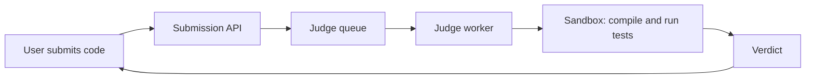

An online judge lets users read programming problems, write solutions in a browser, submit them and get a verdict within seconds: accepted, wrong answer, time limit exceeded, memory limit exceeded, runtime error or compilation error. Coding interview practice sites and competitive programming platforms are online judges. So are automated graders in online courses.

## Why it is an interesting design problem

At first glance, an online judge is a web app with a "run my code" button. The challenges are hidden in that button:

- **Running untrusted code.** Every submission is arbitrary code written by strangers. It might try to read files, open network connections, fork thousands of processes, fill the disk or attack the host. Execution must be **sandboxed** with strong isolation.
- **Fair, reproducible limits.** Verdicts depend on time and memory limits. Measurements must be consistent regardless of which machine runs the code or what else is running on it.
- **Bursty load.** During contests, tens of thousands of users submit in the same minutes, especially near the end. Load can spike by an order of magnitude.
- **Many languages.** Each language needs its own compiler or runtime, versions and limits, often with adjusted time limits for slower languages.
- **Real-time feedback.** Users expect to see progress ("running test 12 of 40") and a verdict within seconds.

## Core concepts

- **Problem:** statement, constraints, examples, time and memory limits, and a hidden set of **test cases** (input and expected output). Some problems need a **checker** program because many outputs are valid.
- **Submission:** code, language, user, problem and timestamp.
- **Judging:** compile, then run against each test case under limits, compare output, and produce a verdict.
- **Contest:** a timed event with a leaderboard, often with penalties for wrong submissions.

## Run versus submit

Most platforms offer two actions:

- **Run** executes the code against the visible examples or custom input the user provides, to help them debug. It should be fast but can be rate-limited more strictly.
- **Submit** executes against all hidden test cases and records an official verdict, which affects the user's progress or contest score.

Both use the same execution infrastructure, but submissions may get priority during contests.

## What the next lesson designs

We will design the problem and submission services, the queue-based judging pipeline, the sandbox for untrusted code, real-time verdict delivery and a contest leaderboard, and consider how to survive contest-time traffic spikes.

<Callout type="interview">
The security of running untrusted code is the centerpiece of this problem. Interviewers expect a layered answer: containers or micro-VMs, no network, resource limits, syscall filtering and disposable environments.
</Callout>

## Verdicts and what they mean

| Verdict | Cause | Detected by |
| --- | --- | --- |
| Accepted | Correct output on every test within limits | Output comparison or checker |
| Wrong Answer | Output differs from expected on some test | Output comparison or checker |
| Time Limit Exceeded | CPU time above the limit | CPU-time accounting in the sandbox |
| Memory Limit Exceeded | Peak memory above the limit | cgroup memory accounting |
| Runtime Error | Crash, uncaught exception, non-zero exit | Exit status and signals |
| Compilation Error | Code does not compile | Compiler exit status and output |

<Ponder question="Why do many problems need a custom checker rather than comparing output byte for byte?">
Many problems have several correct answers — "print any shortest path", "output the result with an absolute error below 1e-6", or answers in any order. Byte comparison would reject valid solutions. A checker program reads the input, the expected answer and the user's output, and decides whether the user's output satisfies the problem's conditions. The checker itself must be trusted code, and it runs outside the user's sandbox.
</Ponder>

<KeyTakeaways>
- An online judge compiles and runs user code against hidden tests under time and memory limits and returns a verdict.
- Running untrusted code safely requires strong sandboxing.
- Limits must be measured fairly and reproducibly across machines.
- Contests create bursty load, especially near deadlines.
- Run and submit share execution infrastructure but differ in test sets and importance.
- Each verdict maps to a specific detection mechanism in the sandbox or comparison step.
</KeyTakeaways>
