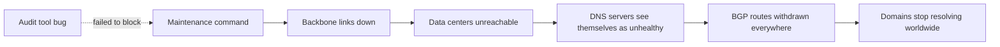

On October 4, 2021, Facebook, Instagram, WhatsApp and Messenger disappeared from the internet for roughly six hours. Billions of users could not reach the services, businesses that relied on them lost sales and even the company's own employees struggled to get into buildings and internal tools. This lesson summarizes what the company's public engineering write-up described and draws out lessons for system design.

## What happened

The company operates a global **backbone network** connecting its data centers. During routine maintenance, an engineer ran a command intended to assess the available capacity of the backbone. The command unintentionally took down all of the backbone's connections, effectively disconnecting the data centers from each other and from the internet. An audit tool meant to catch dangerous commands had a bug and did not stop it.

A second mechanism turned a severe network failure into a complete disappearance. The company's **DNS servers** were designed to withdraw their **BGP route advertisements** if they could not reach the data centers, on the theory that an unhealthy DNS location should stop attracting traffic. With the backbone down, every DNS location concluded it was unhealthy and withdrew its routes at the same time. The rest of the internet could no longer find the company's DNS servers, so domain names stopped resolving everywhere.

## Why recovery took hours

- **Remote access was gone.** The tools engineers normally use to diagnose and fix the network depended on the same network and DNS that had failed.
- **Physical access was slow.** Engineers had to be sent to data centers, and the hardened physical security that protects those facilities made access deliberately difficult.
- **Coming back carefully.** Once the backbone was restored, turning everything back on at once risked power surges and overloaded systems as billions of devices reconnected. The company brought services back gradually, drawing on earlier "storm" exercises that simulated major failures.

## Lessons for system design

**Safety mechanisms can amplify failures.** The DNS withdrawal logic was a sensible local health rule: stop advertising if you cannot serve. But every location applied it simultaneously for the same reason, which turned a partial failure into total unavailability. Health checks should consider the possibility that the failure is global, and some systems keep a minimum set of locations advertising no matter what.

**Guard dangerous operations in depth.** A single command could disconnect the whole backbone, and a single tool was the only guard. Layered protections help: dry runs, staged changes applied to a small part of the network first, automatic rollback and limits on the blast radius of any one command.

**Keep an independent path for recovery.** Out-of-band management networks, emergency access procedures and tools that do not depend on the production network or DNS are essential. If your recovery tools share fate with the system they recover, a large outage disables both.

**Plan for the thundering herd on recovery.** Restoring service is itself a load event. Gradual reactivation, as rehearsed in drills, prevents a second outage caused by the recovery.

**Practice.** Regular disaster exercises made the eventual recovery more controlled. Game days and failure drills are part of the design, not an afterthought.

<Callout type="interview">
When asked about reliability in an interview, cite concrete failure modes such as correlated health checks, shared-fate recovery tools and recovery surges. They show you understand how real outages unfold.
</Callout>

## Applying the lessons to your own design

| Pattern in the outage | Question to ask of any design |
| --- | --- |
| Every DNS site withdrew itself at once | If every instance's health check fails for the same reason, does the whole service disappear? |
| One command could reach the entire backbone | What is the largest blast radius of a single operation, and what stops it? |
| Recovery tools needed the failed network | Can we diagnose and fix production if production's network, DNS and authentication are all down? |
| Recovery risked a surge | Can we bring service back gradually, or does everything reconnect at once? |

<Ponder question="How could the DNS sites' 'withdraw if unhealthy' rule be changed so that it still removes genuinely broken sites but cannot remove all of them at once?">
Make the decision aware of the global picture: a site withdraws only if it is unhealthy *and* enough other sites remain healthy (for example, a coordinator or a peer quorum confirms that at least N sites will keep advertising), or cap the fraction of sites that can withdraw within a time window. A last-resort rule — if everyone appears unhealthy, keep advertising, because the problem is probably not local — prevents a correlated failure from turning into total disappearance.
</Ponder>

<KeyTakeaways>
- A maintenance command disconnected the backbone, and a buggy audit tool failed to stop it.
- DNS servers withdrew their BGP routes because they judged themselves unhealthy, making every domain unresolvable.
- Recovery was slowed by lost remote access, physical security and the need for gradual reactivation.
- Local health rules can fail globally; dangerous commands need layered safeguards and limited blast radius.
- Recovery tools must not share fate with production, and recovery itself must be staged and rehearsed.
- Every design should be checked for correlated health checks, large blast radii, shared-fate recovery tools and recovery surges.
</KeyTakeaways>
