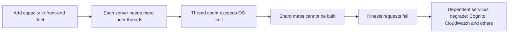

On November 25, 2020, Amazon Kinesis Data Streams in the US-East-1 region suffered a prolonged disruption. Because many other AWS services used Kinesis internally, the failure spread to services such as Cognito and CloudWatch, and to the many customer applications that depended on them. This lesson summarizes the public post-event summary and the design lessons it offers.

## Background: the front-end fleet

Kinesis has a **front-end fleet** of servers that authenticate requests, throttle them and route them to the back-end clusters that store data. To route requests, each front-end server maintains a **shard map**, built partly by communicating with the other servers in the front-end fleet. According to the summary, each front-end server created an **operating-system thread for every other server** in the fleet.

## What happened

The trigger was a small, routine addition of capacity to the front-end fleet. Adding servers increased the number of threads every existing server needed. The new total pushed servers past the **maximum number of threads allowed by the operating system configuration**. Servers could no longer build complete shard maps and could not route requests properly.



## Why recovery was slow

The team removed the added capacity, but recovery still took many hours. Restarting a front-end server required it to learn about all its peers again, and restarting too many servers at once risked overwhelming resources, so servers had to be brought back gradually at a limited rate. Diagnosis was also complicated because some of the tools and dashboards relied on the affected services.

## Cascading impact

Services that used Kinesis for internal data pipelines degraded as well. CloudWatch metrics were delayed, which in turn affected features that depended on metrics, such as some autoscaling decisions. Even the channel for communicating service status to customers was affected, because it depended on an impacted service, which made communication during the event harder.

## Remediations described

The post-event summary described several changes, including:

- Moving to larger servers, so the same capacity needs fewer servers and therefore fewer threads per server.
- Adding fine-grained alarms on thread consumption and testing higher thread limits.
- Accelerating **cellularization** of the front-end fleet, so that each cell is a smaller, independent unit and a problem in one cell cannot affect every server.
- Reducing dependencies that the status communication channel had on affected services.

## Lessons for system design

**Watch for hidden O(N) per-node costs.** A design where each server keeps a connection or thread per peer scales as N² across the fleet. It works until N crosses a limit that nobody is watching. Prefer designs where per-node cost is constant, such as fetching membership from a central service or using a gossip protocol with bounded fan-out.

**Know your limits and alarm on them.** Operating system limits on threads, file descriptors and memory are easy to forget. Monitor utilization against every hard limit, not just CPU and latency.

**Cells limit the blast radius.** Splitting a fleet into independent cells means a bad change or a scaling limit affects a fraction of customers rather than all.

**Beware of cold-start costs.** If restarting a component is expensive, recovery will be slow precisely when you need it fast. Design for quick, safe restarts.

**Keep dependencies of critical tools minimal.** Monitoring and status communication should not depend on the services they report on.

## Why per-peer threads explode

With N front-end servers, each holding one thread per peer:

```text
Threads per server   = N − 1
Threads in the fleet = N × (N − 1)
N = 1,000  → ~1,000 threads per server, ~1 million in total
N = 1,100  → ~1,100 threads per server — a 10% capacity add raises every server's count by 10%
```

If the operating system limit sits just above the current count, a modest capacity addition pushes *every* server over it at the same moment — a correlated failure caused by the very act of scaling up. Designs whose per-node cost grows with fleet size need explicit headroom alarms, or better, a structure (cells, gossip with bounded fan-out, a membership service) whose per-node cost stays constant.

<Ponder question="Why did adding capacity — normally a safe, routine operation — cause this outage, and what general testing practice would have caught it?">
Adding servers increased a per-server cost (threads per peer) that was close to a hard limit nobody was monitoring, so the "safe" change triggered a limit on every existing server. Load and scale tests that grow the fleet size (not just request volume) beyond production levels, combined with alarms on utilization of every hard limit (threads, file descriptors, connections), would have revealed the cliff before production reached it.
</Ponder>

<KeyTakeaways>
- A small capacity addition pushed every front-end server past the operating system's thread limit, because each server kept a thread per peer.
- Front-end servers could not build shard maps, and failures cascaded to services that depended on Kinesis.
- Recovery was slow because servers had to be restarted gradually and learn about their peers again.
- Per-node costs that grow with fleet size, unmonitored hard limits and expensive restarts are dangerous patterns.
- Cellular architecture and independent monitoring and status paths limit blast radius and aid recovery.
- Per-peer resources grow quadratically across a fleet, so scale tests must grow fleet size, not only traffic.
</KeyTakeaways>
