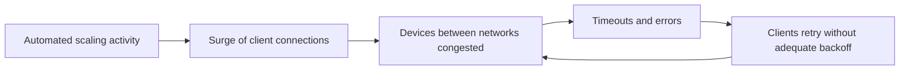

On December 7, 2021, a disruption in the AWS US-East-1 region lasted most of a business day. Many AWS services and customer applications that depended on them were affected, including control-plane operations such as launching new instances. Instances that were already running mostly kept working, but the ability to change, scale and manage infrastructure was impaired. This lesson summarizes the public post-event summary and its lessons.

## Background: two networks

AWS runs its internal services, such as monitoring, internal DNS and parts of the control planes, on an **internal network** that is separate from the **main network** where customer workloads and most AWS services run. Networking devices connect the two, and some internal services need to call services on the main network.

## What happened

An **automated activity to scale capacity** of a service hosted on the main network triggered unexpected behavior from a large number of clients on the internal network. Those clients produced a sudden **surge of connection activity** that overwhelmed the networking devices between the two networks. Communication between the networks slowed down and began to fail.

The failures made things worse. Clients saw timeouts and errors, and **retried**, adding even more connection attempts to already congested devices. According to the summary, a latent issue meant that some clients did not back off as intended under these conditions. The congestion became self-sustaining.

## Why diagnosis was hard

The congestion affected internal DNS and the monitoring systems that engineers would normally use to understand the problem. The operators had reduced visibility into the very networks that were failing, and had to work from other signals, such as logs, to identify the congested devices and the source of the traffic. Remediation steps, such as moving traffic and disabling the triggering activity, took time to apply safely and to show effect.

## Customer impact

Because control planes, internal services and management APIs depended on communication across the congested devices, customers experienced failures when launching instances, calling certain APIs and using services that relied on the affected components. The status dashboard used to inform customers was also affected, delaying communication.

## Remediations described

The summary described disabling the scaling activities that triggered the event until fixes were deployed, fixing the client back-off behavior, adding network configuration to protect the connecting devices from similar surges, and improving the independence of the status communication channel.

## Lessons for system design

**Retries need backoff, jitter and budgets.** Retries are essential for resilience, but uncontrolled retries turn a brief overload into a sustained one. Exponential backoff with jitter spreads retries out; retry budgets cap the share of traffic that can be retries; circuit breakers stop calling a failing dependency entirely for a while.

**Test failure behavior, not just success behavior.** The latent back-off issue appeared only under a specific failure condition that had not occurred before. Load and chaos tests should deliberately create congestion and measure how clients behave.

**Protect shared chokepoints.** Devices or services that connect large parts of a system are single points of congestion. They need admission control, rate limits and headroom, and changes that can produce connection surges need to be ramped gradually.

**Observability must survive the outage.** Monitoring that depends on the failing network is least available when most needed. Out-of-band telemetry paths help.

**Data planes should survive control-plane failures.** A strength shown during the event was that running instances largely continued to work. Designing data planes to operate without constant control-plane contact, a principle often called **static stability**, limits the impact of control-plane outages.

<KeyTakeaways>
- An automated scaling activity triggered a surge of connections that overwhelmed devices between AWS's internal and main networks.
- Client retries without adequate backoff sustained the congestion.
- Monitoring and internal DNS were impaired, slowing diagnosis; running instances largely kept working.
- Retries need backoff, jitter, budgets and circuit breakers, and failure behavior must be tested.
- Protect shared chokepoints, keep observability independent and design data planes to be statically stable.
</KeyTakeaways>
