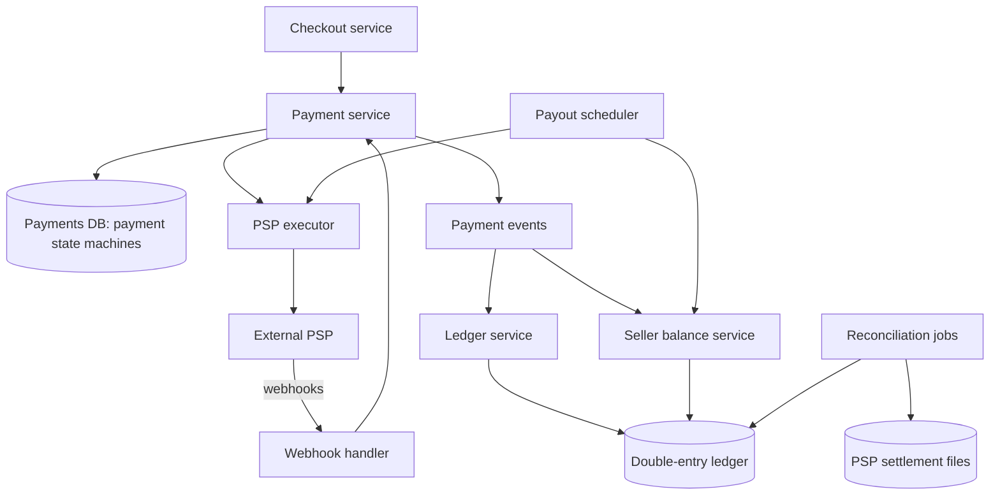
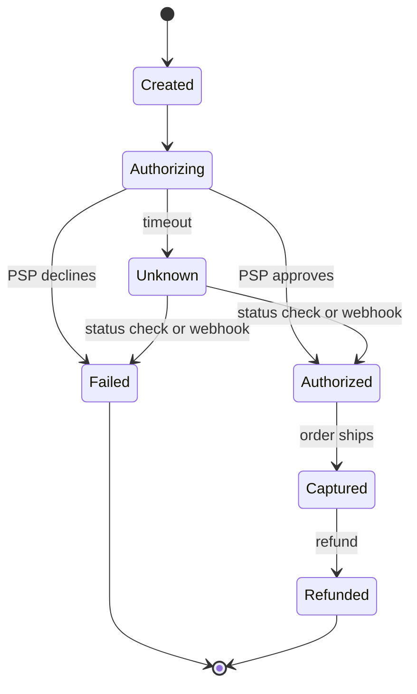
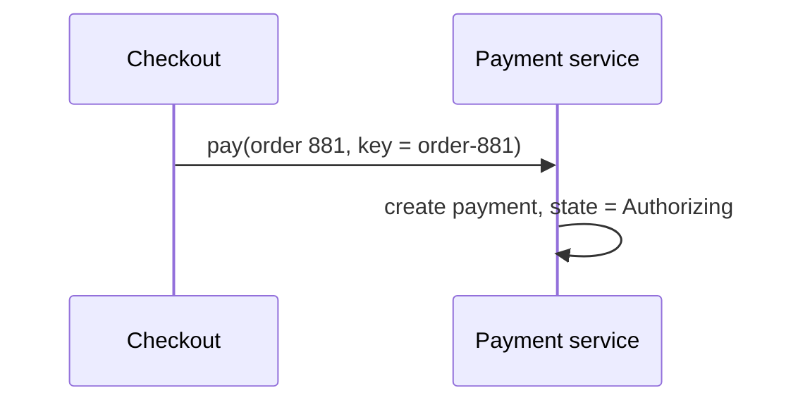
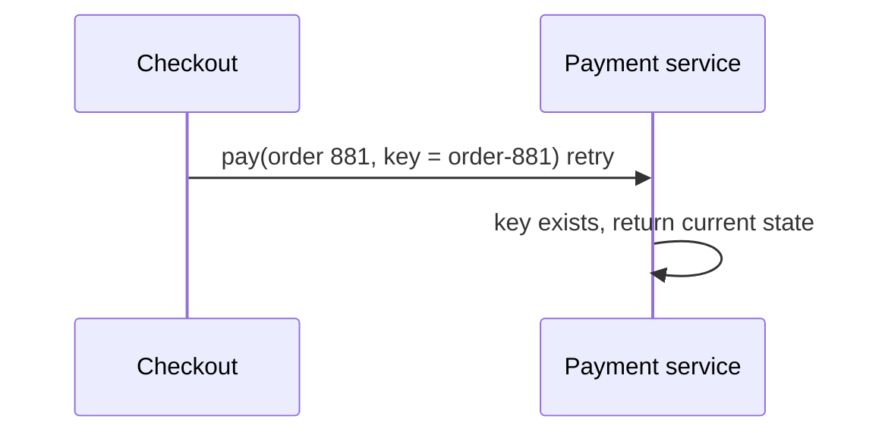
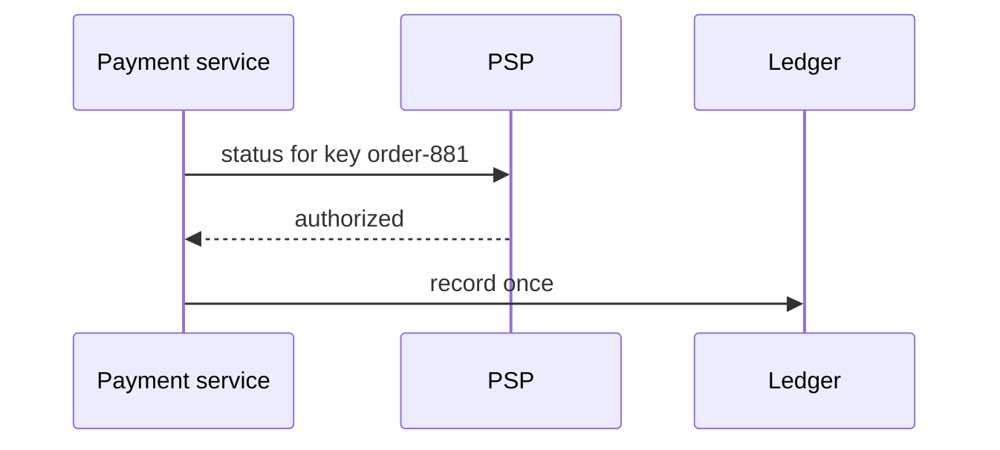

This lesson designs the payment system for an e-commerce marketplace: customers pay for orders, and the marketplace pays out sellers after deducting its fees.

## Requirements and scale

- **Functional:** accept payments for orders, handle refunds, record balances for sellers, pay sellers on a schedule and give finance teams accurate reports.
- **Non-functional:** no double charges or lost payments, strong consistency for balances, full audit trail, high availability for checkout, and security for payment data.
- **Scale:** 10 million orders per day is about 115 payments per second on average, perhaps 1,000 per second at peak. The challenge is correctness, not throughput.

## Architecture

- **Payment service** owns payment records and their state machines, and exposes idempotent APIs to checkout.
- **PSP executor** is the only component that calls the external PSP. It attaches idempotency keys, handles retries and timeouts, and records every request and response.
- **Webhook handler** receives asynchronous notifications from the PSP, such as captures, failures and chargebacks, and feeds them into the state machines.
- **Ledger service** records every money movement as balanced double-entry transactions.
- **Seller balance service** derives balances from the ledger and tracks funds available for payout.
- **Payout scheduler** creates payouts to sellers and executes them through the PSP.
- **Reconciliation jobs** compare internal records with PSP settlement reports.

## The payment state machine

Each transition is written to the database **before** calling the PSP (recording intent) and **after** receiving the result (recording outcome). If the service crashes between the two, a recovery job finds payments stuck in intermediate states and asks the PSP for their status using the same idempotency key.

The **Unknown** state is essential: a timeout does not mean failure. The system never retries with a new key, and never tells the customer the payment failed, until it has determined the true outcome.

## Idempotency end to end

<Slides title="A retried checkout, charged once">
<Slide caption="1. Checkout sends a payment request with an idempotency key derived from the order ID.">

</Slide>
<Slide caption="2. The PSP call times out. The customer's browser retries the checkout with the same key.">

</Slide>
<Slide caption="3. The executor queries the PSP with the same key and learns the charge succeeded. The payment moves to Authorized and the ledger records it once.">

</Slide>
</Slides>

A unique constraint on the idempotency key in the payments database guarantees that duplicate requests map to the same payment record.

## The double-entry ledger

For a 100.00 order with a 10 percent marketplace fee, the ledger records:

| Account | Debit | Credit |
| --- | --- | --- |
| Customer funds receivable (PSP) | 100.00 | |
| Seller payable | | 90.00 |
| Marketplace fee revenue | | 10.00 |

Debits equal credits in every transaction, so the books always balance. Entries are **append-only**: a refund is a new, reversing transaction, never an edit. Amounts are stored as integers in the smallest currency unit to avoid floating-point errors. Seller balances are sums over their ledger entries, cached for fast reads.

## Payouts and reconciliation

The payout scheduler periodically selects sellers with available balances, creates payout records with idempotency keys and executes them. Reconciliation jobs run daily: they match every internal payment and payout against the PSP's settlement file, flagging missing, extra or mismatched records for investigation. Reconciliation is the safety net that catches bugs every other mechanism missed.

<KeyTakeaways>
- A dedicated executor is the only caller of the PSP, attaching idempotency keys and logging every request.
- Payment state machines record intent before and outcome after each external call; an Unknown state handles timeouts.
- Recovery jobs resolve stuck payments by querying the PSP with the same idempotency key.
- A double-entry, append-only ledger with integer amounts keeps money balanced and auditable.
- Daily reconciliation against PSP settlement files catches discrepancies that other mechanisms miss.
</KeyTakeaways>
