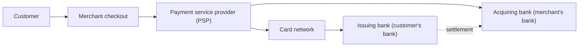
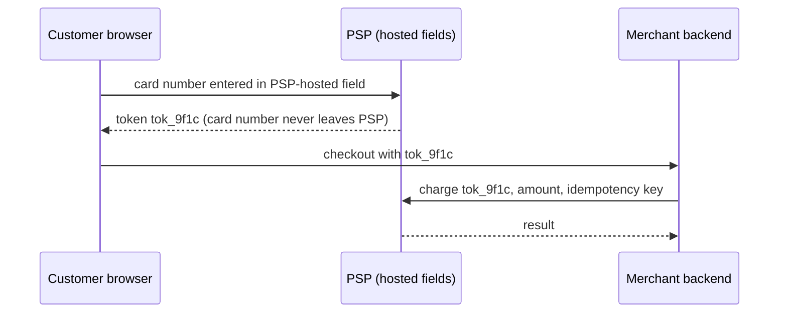

A payment system moves money: from a customer's card or bank account to a merchant, from a marketplace to its sellers, from an employer to employees. Unlike most systems in this course, where a lost like or a stale count is harmless, a payment system must be **exactly right**. Charging twice, losing a payment or paying the wrong seller has real financial and legal consequences. The design therefore puts correctness, auditability and recovery from failure above raw speed.

## The actors

Card payments involve several parties, most of which are external to the system you design:

- The **payment service provider** exposes an API to merchants and handles communication with card networks and banks.
- The **card network** routes authorization requests between the acquiring and issuing banks.
- The **issuing bank** approves or declines the charge based on the customer's funds and fraud checks.
- The **acquiring bank** receives funds on the merchant's behalf.

Money does not move instantly: an **authorization** reserves funds within seconds, but **settlement**, the actual transfer between banks, happens later in batches, often a day or more afterwards.

## The flows

- **Pay-in:** the customer pays the platform or merchant. Usually authorize, then capture.
- **Pay-out:** the platform pays sellers, drivers or creators, often in scheduled batches to bank accounts.
- **Refunds and chargebacks:** money flows back to the customer, either initiated by the merchant or disputed through the bank.

## Why payments are hard

- **External calls fail ambiguously.** A request to a PSP can time out after the PSP has already charged the card. The system cannot tell whether the charge happened without asking.
- **Retries are dangerous.** Blindly retrying a charge can charge twice.
- **Multiple sources of truth.** The internal database, the PSP and the bank each record the payment. They must agree, and disagreements must be detected.
- **Regulation and security.** Card data is subject to strict standards (PCI DSS), and financial records must be kept and auditable for years.
- **Money must be conserved.** Every amount leaving one account must arrive in another. Rounding errors, currency conversion and fees must balance.

## Principles we will apply

1. **Idempotency everywhere:** every operation that moves money carries a unique key so it can be retried safely.
2. **State machines:** each payment moves through explicit, persisted states.
3. **Double-entry ledger:** every movement is recorded as balanced debits and credits, append-only.
4. **Reconciliation:** internal records are compared regularly with PSP and bank reports.
5. **Minimize card data exposure:** use PSP tokenization so raw card numbers never touch our servers.

<Callout type="interview">
In a payment system interview, lead with correctness: "The top requirement is that we never double-charge or lose money, even when calls time out. Let's design for idempotency and reconciliation first, then scale."
</Callout>

## Keeping card numbers out of your systems

Tokenization shrinks the scope of strict card-data compliance to the PSP:

The merchant's servers only ever see a token that is useless outside the merchant's PSP account, so a breach of the merchant's database does not expose card numbers.

<Ponder question="Why do payment systems record amounts as integers in the smallest currency unit rather than as floating-point numbers?">
Floating-point numbers cannot represent most decimal fractions exactly: 0.1 + 0.2 is not exactly 0.3 in binary floating point. Across millions of transactions, fees and currency conversions, tiny rounding errors accumulate and the books stop balancing. Storing 1999 cents instead of 19.99 dollars, with explicit rounding rules for divisions such as fee splits, keeps every calculation exact.
</Ponder>

<KeyTakeaways>
- Payment systems must be exactly right; correctness and auditability come before speed.
- Card payments involve a PSP, card networks, issuing and acquiring banks, with authorization now and settlement later.
- Pay-ins, pay-outs, refunds and chargebacks are the main flows.
- Ambiguous failures, dangerous retries, multiple sources of truth and regulation make payments hard.
- Idempotency, state machines, a double-entry ledger, reconciliation and tokenization are the core principles.
- Tokenization keeps raw card numbers with the PSP, shrinking compliance scope and breach impact.
</KeyTakeaways>
