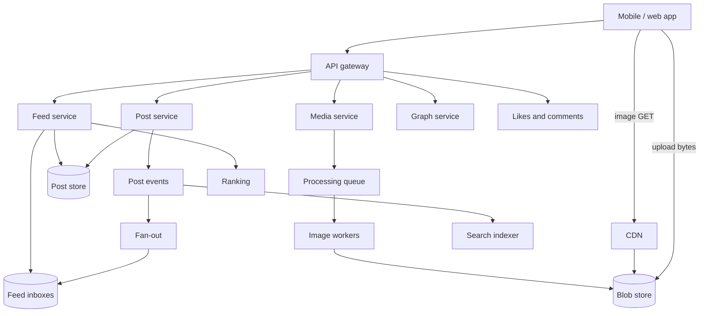
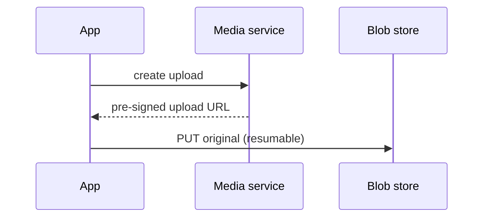
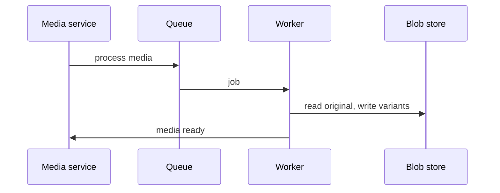
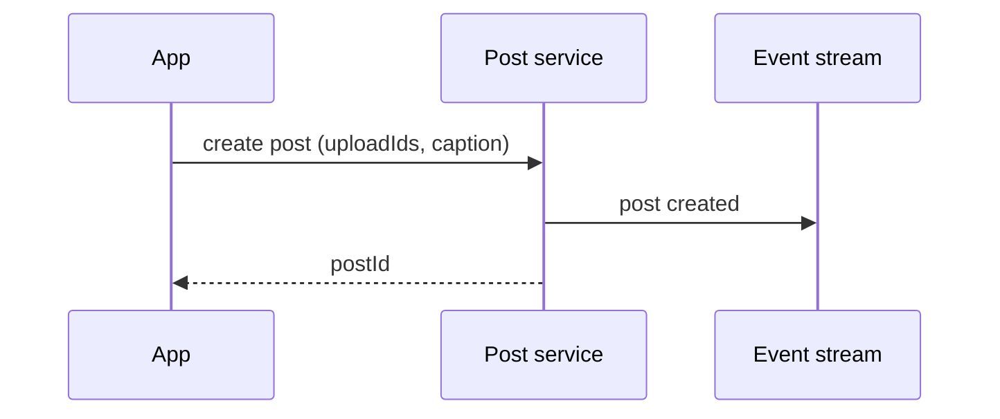

This lesson presents the API, data model and high-level architecture of the photo-sharing service.

## API

```http
POST /v1/media/uploads                    -> { uploadId, uploadUrl }      (pre-signed, resumable)
POST /v1/posts                            { uploadIds, caption, location? } -> { postId }
GET  /v1/feed?cursor=...                  -> { posts: [ { postId, author, caption, media: { thumb, small, medium, large } } ] }
GET  /v1/users/{id}/posts?cursor=...
POST /v1/posts/{id}/likes
POST /v1/posts/{id}/comments              { text }
POST /v1/users/{id}/follow
GET  /v1/search?q=...
```

The feed response includes URLs for each image variant, so the client can pick the right one for its screen size and network.

## Data model

| Data | Store | Key design |
| --- | --- | --- |
| Users, profiles | Relational DB sharded by user ID | Includes the public or private flag |
| Posts | Sharded key-value or wide-column store | Partition by post ID; author index clustered by time for profile grids |
| Follow graph | Graph store with follower and followee indexes | Paged for large accounts; follow requests for private accounts |
| Likes, comments | Wide-column store keyed by post ID | Counts via sharded counters |
| Media | Blob store | Keys such as media ID plus variant name; originals in a colder tier |
| Feed inboxes | In-memory cache per user | Post IDs only |

## High-level architecture



## Uploading a post

<Slides title="Upload and publish">
<Slide caption="1. The app requests an upload session and sends the photo directly to the blob store. The app shows the post immediately using the local file.">



</Slide>
<Slide caption="2. The media service enqueues processing. Workers produce variants, strip metadata and mark the media ready.">



</Slide>
<Slide caption="3. The app creates the post referencing the media. The post service stores it and publishes an event that drives fan-out.">



</Slide>
</Slides>

The app may create the post before processing finishes. The post is then held as **pending** and becomes visible to followers once its media is ready, so followers never see a broken image.

## Viewing the feed

The feed service works like the newsfeed design: it reads the user's inbox of pushed post IDs, merges posts pulled from high-follower accounts, adds some recommended posts and ranks the candidates. It hydrates the top results with post metadata and variant URLs, filtering out posts from private accounts the viewer no longer follows. The app then loads images from the CDN, choosing variants based on screen density and network quality, and **pre-fetches** images for posts just below the visible area so they are ready when the user scrolls.

## Privacy for private accounts

Images from private accounts must not be accessible to arbitrary users who obtain a URL. Media URLs for these posts are **signed** with an expiry and checked at the CDN edge, so a leaked URL stops working after a short time. Public posts can use long-lived, highly cacheable URLs.

## Post and media records

```json
{
  "postId": "1837465520112",
  "authorId": "u_42",
  "caption": "Sunset at the pier",
  "media": [
    { "mediaId": "m_9f1c", "status": "ready", "width": 4032, "height": 3024,
      "variants": { "thumb": "m_9f1c/150.webp", "small": "m_9f1c/640.webp",
                    "medium": "m_9f1c/1080.webp", "large": "m_9f1c/2048.webp" },
      "placeholder": "LEHV6nWB2yk8pyo0adR*.7kCMdnj" }
  ],
  "visibility": "public",
  "createdAt": "2026-09-27T18:04:11Z"
}
```

Variant paths are derived from the media ID, so the CDN URL for any variant can be computed without another lookup, and the tiny `placeholder` string lets the app paint a blurred preview before the image loads.

<Ponder question="Why does the app upload the photo before creating the post, rather than sending both in one request?">
Separating them lets the large, failure-prone transfer happen directly to the blob store with resumable chunks, while the post request stays small and fast. The app can start the upload as soon as a photo is chosen — while the user is still typing the caption — so by the time they tap "share", most of the bytes are already uploaded, and the post feels instant.
</Ponder>

<KeyTakeaways>
- Uploads go directly to the blob store with pre-signed URLs; workers create variants asynchronously.
- Posts stay pending until their media is ready, so followers never see broken images.
- The feed reuses hybrid fan-out and ranking, and responses include variant URLs for the client to choose from.
- Clients pre-fetch images just below the viewport to make scrolling feel instant.
- Signed, expiring media URLs protect private posts, while public media uses long-lived cacheable URLs.
</KeyTakeaways>
