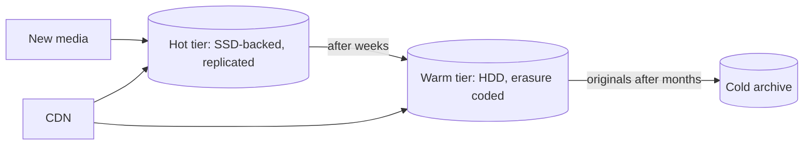

This lesson dives into image processing, storage efficiency, CDN delivery and scaling the metadata tier.

## Image processing

Each worker performs a pipeline on the original:

1. **Validate** the file type and size, and decode it safely in a sandbox, since malformed images are a classic attack vector.
2. **Normalize** orientation using the camera's rotation flag, then **strip metadata** such as GPS coordinates and camera serial numbers.
3. **Resize** into variants, for example 150 px thumbnails, 640 px feed images, 1080 px full-screen images and a larger archival version.
4. **Encode** in efficient formats. Modern formats such as WebP and AVIF are typically 25 to 50 percent smaller than JPEG at similar quality. Serving them to clients that support them, with JPEG as a fallback, saves a large share of bandwidth.
5. **Compute** a perceptual hash for duplicate and abuse detection, a small **blurred placeholder** (a few dozen bytes) and dominant colors, which the app displays while the real image loads.
6. **Moderate** content with classifiers, possibly asynchronously after publishing, and hide flagged posts pending review.

Jobs are idempotent: variant keys are derived from the media ID and variant name, so a retried job simply overwrites the same objects.

## Storage tiering

Access to photos is highly skewed by age: a post receives most of its views in the first days. Storage can exploit this.

- **Variants** of recent posts live in a hot tier with fast reads.
- **Older variants** move to a warm tier using erasure coding, which provides durability with about 1.5× overhead instead of 3× for replication.
- **Originals** are rarely read after processing, so they move to cold storage quickly. They are kept to allow re-encoding into new formats later.
- **Deduplication** by content hash avoids storing the same image many times, for example when a popular meme is reposted.

## CDN strategy

Images have immutable URLs: if the image changes, it gets a new key. This allows very long cache lifetimes. A tiered CDN, with edge caches in front of regional shield caches, keeps the origin load low even for the long tail. For very popular posts, such as those from celebrity accounts, images can be **pushed** proactively to edges when the post is published, because we know millions of views will follow.

The client helps too: it requests the variant that matches its display, shows a blurred placeholder instantly and pre-fetches upcoming images while the user scrolls.

## Scaling the metadata tier

Post metadata is sharded by post ID for even distribution. Profile grids need "posts by user, newest first," so a secondary table keyed by user ID with post IDs clustered by time serves them. Time-sortable post IDs make this ordering cheap.

Likes and comments are high-volume writes. Likes go into a wide-column store keyed by post ID, with counts maintained by sharded counters and cached. Comments are stored per post and paginated. Both are updated asynchronously from an event stream for very popular posts to avoid hot partitions.

## Feed generation specifics

The feed uses the hybrid fan-out from the newsfeed chapter. Two photo-specific concerns stand out:

- **Private accounts** require permission checks during hydration; if a follower is removed, their inbox may still contain the post ID, but hydration filters it out.
- **Media readiness**: fan-out happens only after the post leaves the pending state.

<KeyTakeaways>
- Image workers validate safely, strip metadata, resize into variants, encode modern formats and compute placeholders and hashes.
- Idempotent jobs with deterministic variant keys make retries safe.
- Storage tiers match access patterns: hot for new variants, erasure-coded warm storage for older ones and cold archives for originals.
- Immutable image URLs, tiered CDN caching and proactive pushing for popular posts keep delivery fast and cheap.
- Metadata is sharded by post ID with user-keyed secondary tables; likes and comments use sharded counters and event streams.
</KeyTakeaways>
