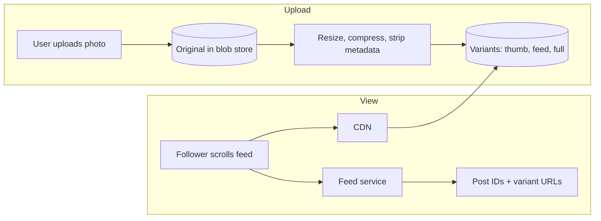

A photo-sharing service lets users upload photos and short videos, follow other users and scroll a feed of visual posts. It combines two systems studied earlier: a **media pipeline**, similar to the video platform but for images, and a **social feed**, similar to the microblogging and newsfeed designs. The interesting parts are how these combine, and how to serve billions of images quickly and cheaply to phones around the world.

## Why it is interesting

- **Media-heavy.** Almost every post is an image or video. Storage and bandwidth for media dwarf everything else, so media handling drives cost.
- **Many sizes per image.** A feed needs a small, fast-loading version; a profile grid needs a square thumbnail; the full-screen view needs a high-resolution version. Each upload is processed into several variants.
- **Read-heavy and visual.** Users scroll quickly through dozens of images per minute. Latency is judged visually: images must appear as they scroll into view.
- **Social graph and feed.** Following, likes, comments and a ranked feed bring all the fan-out and ranking challenges of the newsfeed.
- **Mobile first.** Uploads happen over mobile networks, often interrupted, and clients have limited bandwidth and battery.

## Core flows

The upload path writes the original and produces variants asynchronously. The view path uses the feed service to decide which posts to show, and the CDN to deliver the images themselves.

## Design goals

We will aim for these goals, which shape the rest of the chapter:

1. **Uploads should feel instant.** The app shows the post immediately while the upload and processing complete in the background.
2. **Images should load in the time it takes to scroll to them.** That means small variants, aggressive CDN caching and pre-fetching.
3. **Storage should be efficient.** Billions of photos are uploaded per year; modern formats and deduplication can save a lot of space.
4. **The feed should be personalized and fresh**, reusing the hybrid fan-out and ranking from the newsfeed chapter.

## Chapter plan

1. **Requirements:** features and estimates, with a focus on storage and bandwidth.
2. **Design:** API, data model and the high-level architecture of upload, processing, feed and delivery.
3. **Detailed design:** image processing, storage tiers, CDN strategy, feed generation and scaling metadata.

<Callout type="tip">
If you have already designed a video platform and a newsfeed, a photo-sharing interview is largely about combining them well. Focus your deep dives on image variants, CDN delivery and the feed.
</Callout>

<Ponder question="The chapter says media storage and bandwidth dominate cost. If you could make only one change to cut cost, what would it be?">
Serve smaller images. Modern formats such as WebP or AVIF and right-sized variants for each screen cut bytes per image view by 25–50% or more, and image views number in the hundreds of billions per day — so this reduces CDN egress, the largest recurring cost, as well as storage for variants. Tiering old originals to cold storage is the next biggest lever.
</Ponder>

<KeyTakeaways>
- Photo sharing combines a media pipeline with a social feed.
- Media storage and bandwidth dominate cost, so image handling drives the design.
- Each upload is processed into several variants for thumbnails, feeds and full-screen views.
- Uploads should feel instant through optimistic UI and background processing.
- The feed reuses hybrid fan-out and ranking from the newsfeed design.
</KeyTakeaways>
