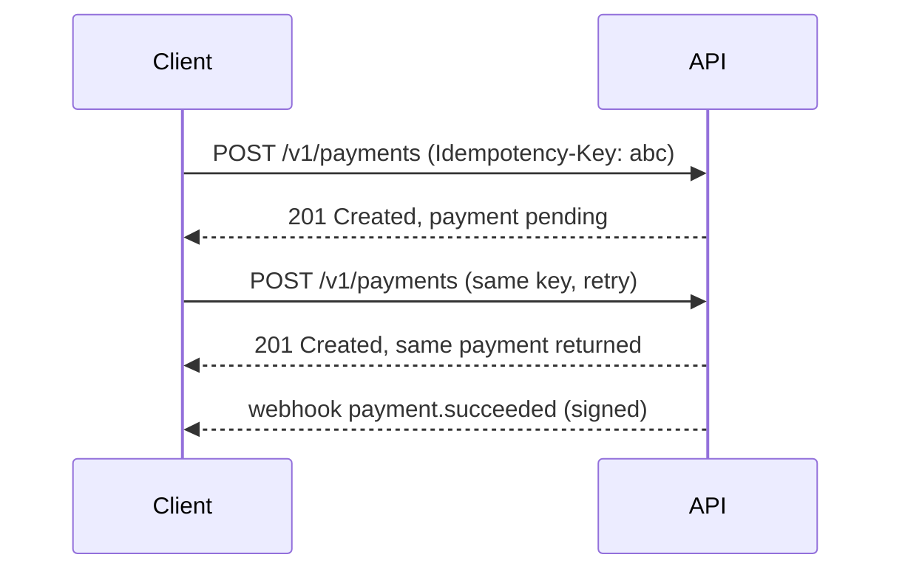

Some companies run a separate **API design** interview alongside, or instead of, a system design interview. The two overlap, but they reward different things. This lesson explains the differences and how to prepare for an API design round.

## What each interview evaluates

**System design interviews** ask you to design a complete system, such as a video platform or a messaging app. The focus is architecture: components, data flow, storage, scaling, reliability and trade-offs. APIs appear, but briefly, as a few endpoints that define the system's boundary.

**API design interviews** ask you to design the interface itself, for example a public API for a payments product, a booking platform or a file storage service. The focus is on how developers use the API: resources, operations, naming, error handling, pagination, versioning, authentication and evolution over time. The backend architecture is discussed only as far as it affects the interface.

| Aspect | System design | API design |
| --- | --- | --- |
| Main artifact | Architecture diagram | Resource model and endpoint specification |
| Key concerns | Scale, availability, consistency, storage | Usability, consistency of conventions, correctness, evolvability |
| Typical deep dives | Sharding, caching, fan-out, replication | Idempotency, pagination, error models, versioning, rate limits |
| Audience | Engineers running the system | Developers consuming the API |

## Core topics for API design

**Resource modeling.** Identify nouns (orders, payments, customers) and their relationships. Use consistent naming and predictable URLs such as `/v1/customers/{id}/orders`.

**Operations and semantics.** Map operations to HTTP methods correctly: GET is safe and idempotent, PUT and DELETE are idempotent, POST is not unless you add an idempotency key.

**Idempotency.** For operations with side effects, such as creating a payment, accept an `Idempotency-Key` header so clients can retry safely after timeouts.

**Pagination.** Prefer cursor-based pagination for large or changing collections; offset pagination skips or repeats items when data changes.

**Filtering and sorting.** Offer explicit, documented query parameters rather than arbitrary query languages.

**Errors.** Use appropriate status codes (400 for invalid input, 401 and 403 for authentication and authorization, 404, 409 for conflicts, 429 for rate limits, 5xx for server errors) with a consistent error body containing a machine-readable code and a human-readable message.

**Versioning and evolution.** Add fields without breaking clients, never change the meaning of existing fields, and version the API (in the path or a header) for breaking changes, with deprecation periods.

**Security.** Authentication with API keys or OAuth tokens, scoped permissions, rate limits and quotas per client.

**Asynchronous operations and events.** For long-running operations, return a job resource that clients can poll, and offer webhooks with signatures and retries for event notifications.



## How to prepare

- Study well-regarded public APIs and notice their conventions for errors, pagination and idempotency.
- Practice by designing APIs for problems in this course, writing out endpoints, request and response bodies and error cases.
- In the interview, start with use cases and consumers, then resources, then endpoints, then cross-cutting concerns such as errors, pagination, versioning and security.

## A consistent error body

```json
{
  "error": {
    "code": "card_declined",
    "message": "The card was declined by the issuer.",
    "param": "payment_method",
    "requestId": "req_7f3a2c",
    "docUrl": "https://docs.example.com/errors#card_declined"
  }
}
```

A machine-readable `code` lets clients handle errors programmatically, the human-readable `message` helps developers debug, and the `requestId` connects a customer's report to server logs.

<Ponder question="Why is offset pagination (`?page=3&size=20`) problematic for a feed of items that changes constantly?">
When new items are inserted at the top between page requests, everything shifts down: the client sees duplicates on the next page, and deletions make it skip items. Offsets also get slower for deep pages because the database must count past them. A cursor that encodes the position of the last item returned ("items after this ID and timestamp") stays stable as data changes and is efficient at any depth.
</Ponder>

<KeyTakeaways>
- System design interviews focus on architecture; API design interviews focus on the developer-facing interface.
- Core API topics are resource modeling, method semantics, idempotency, pagination, errors, versioning and security.
- Cursor pagination, idempotency keys and consistent error bodies are hallmarks of a well-designed API.
- Long-running operations use job resources and signed, retried webhooks.
- Prepare by studying strong public APIs and designing APIs for the problems in this course.
</KeyTakeaways>
