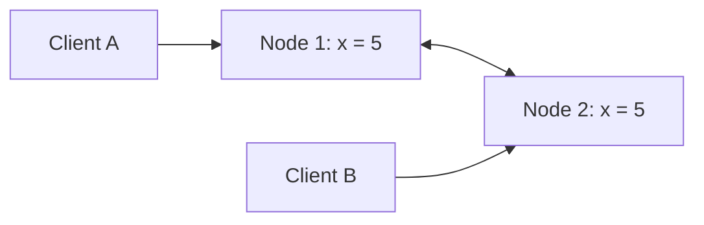
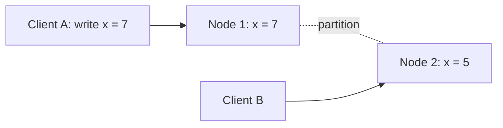
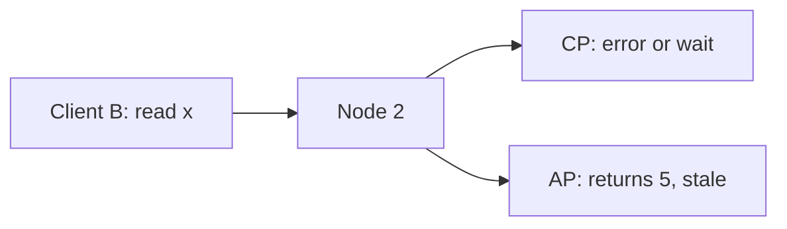

The CAP theorem is one of the most quoted and most misunderstood results in distributed systems. PACELC extends it to describe the trade-offs systems make even when nothing is broken. Together they give a precise vocabulary for discussing consistency and availability in interviews.

## CAP

CAP considers three properties of a replicated data store:

- **Consistency (C):** every read returns the most recent write or an error. This is linearizability, a stronger notion than the "C" in ACID transactions.
- **Availability (A):** every request to a non-failing node receives a non-error response, although it may not reflect the latest write.
- **Partition tolerance (P):** the system continues to operate despite messages between nodes being lost or delayed.

The theorem states that **when a network partition occurs, a system must choose between consistency and availability**. Partitions are not optional in real networks, so the practical choice is between:

- **CP:** during a partition, some requests are refused or time out to avoid returning stale or conflicting data.
- **AP:** during a partition, all nodes keep answering, accepting that reads may be stale and writes may conflict, to be reconciled later.

<Slides title="A partition forces a choice">
<Slide caption="1. Two replicas normally stay in sync.">

</Slide>
<Slide caption="2. A partition separates them. Client A writes x = 7 to Node 1.">

</Slide>
<Slide caption="3. Client B reads from Node 2. A CP system refuses or waits; an AP system answers x = 5, which is stale.">

</Slide>
</Slides>

A common misconception is "pick two of three." Since partitions happen regardless, you cannot give up P; the real choice is C or A **during** a partition. When there is no partition, a system can offer both.

## PACELC

CAP says nothing about normal operation. PACELC fills the gap:

> **If** there is a **P**artition, choose **A** or **C**; **E**lse, choose **L**atency or **C**onsistency.

Even without failures, keeping replicas strongly consistent requires coordination, such as waiting for a quorum or a leader round trip, which adds latency. Systems that favor low latency serve reads from any nearby replica and replicate asynchronously.

| System style | Partition (PA or PC) | Else (EL or EC) | Examples of behavior |
| --- | --- | --- | --- |
| PA/EL | Available | Low latency | Leaderless stores with tunable, often eventual consistency |
| PC/EC | Consistent | Consistent | Consensus-based databases, strongly consistent coordination services |
| PA/EC | Available | Consistent | Rare combination; some systems default to consistency but stay available under partition |
| PC/EL | Consistent | Low latency | Some systems relax consistency for speed normally but refuse writes during partitions |

## Applying it in design

- **Money, inventory, locks, unique identifiers:** choose PC/EC. Being unavailable briefly is better than being wrong.
- **Feeds, likes, presence, recommendations:** choose PA/EL. Serving slightly stale data is better than failing.
- Many systems mix them: a payment ledger is PC/EC while the product catalog is PA/EL.
- Many stores are **tunable**, for example through quorum settings or per-query consistency levels, so the choice can be made per operation.

<Ponder question="A team says their database is 'CA' because they have never experienced a network partition. What is wrong with that claim?">
Partitions are not something you get to opt out of; they happen through switch failures, misconfigurations, overloaded links and long garbage-collection pauses that look like partitions. The question is only what the system does when one occurs — refuse some requests (CP) or keep answering with possibly stale data (AP). A system that has not decided will make that choice accidentally, often in the worst way.
</Ponder>

<KeyTakeaways>
- CAP: during a network partition, a replicated system must choose between consistency and availability.
- Partitions are unavoidable, so "pick two" really means choosing C or A when a partition happens.
- PACELC adds that, without partitions, systems trade latency against consistency.
- Use consistency-first designs for money and inventory, and availability- and latency-first designs for social features.
- Many systems are tunable, allowing the choice per operation.
</KeyTakeaways>
