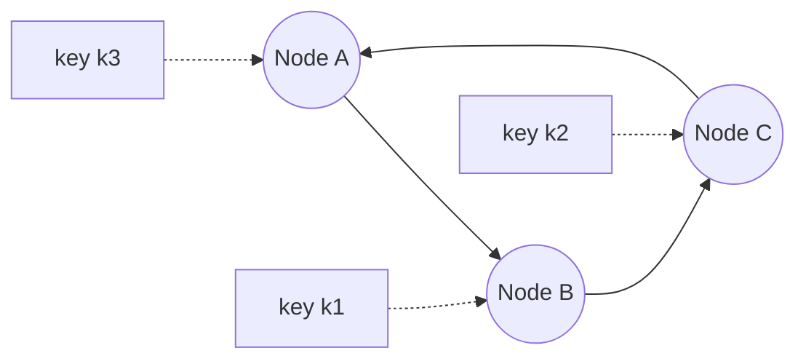
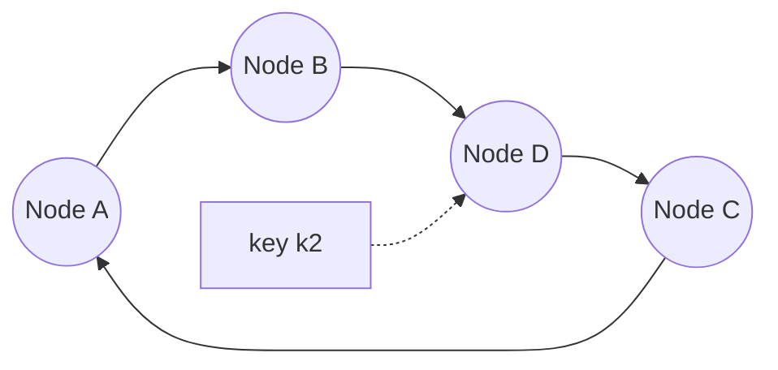
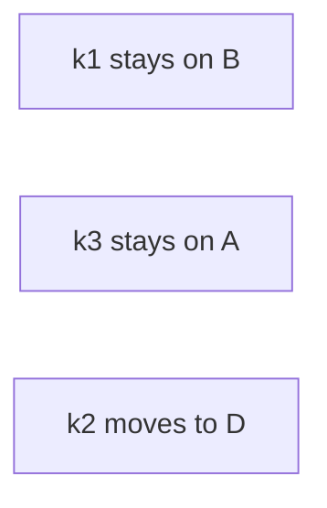

Consistent hashing is the standard technique for spreading keys across a changing set of nodes, used by distributed caches, key-value stores, CDNs and load balancers. This lesson explains the problem it solves, how it works and the refinements used in practice.

## The problem with modulo hashing

The simplest way to assign a key to one of N nodes is `node = hash(key) mod N`. It spreads keys evenly, but when N changes, almost every key maps to a different node. Going from 4 to 5 nodes moves about 80 percent of keys. For a cache, that means a sudden flood of misses; for a database, a massive data migration.

## The hash ring

Consistent hashing maps both **nodes** and **keys** onto the same circular hash space, often visualized as a ring from 0 to 2³² − 1. Each key belongs to the first node found by moving clockwise from the key's position.

<Slides title="Adding a node to the ring">
<Slide caption="1. Three nodes on the ring. Each owns the keys between its predecessor and itself.">

</Slide>
<Slide caption="2. Node D joins between B and C. It takes over only the keys between B and itself, such as k2.">

</Slide>
<Slide caption="3. All other keys stay where they were. On average only 1/N of keys move.">

</Slide>
</Slides>

When a node leaves, its keys move to its clockwise successor, and nothing else changes.

## Virtual nodes

With only a few positions on the ring, the arcs between nodes are uneven, so some nodes own much more of the key space than others. And when a node fails, its entire load lands on a single successor.

**Virtual nodes** fix both problems. Each physical node is placed at many points on the ring, perhaps 100 to 200, by hashing names such as "A-1", "A-2" and so on. The key space is then divided into many small arcs, statistically balanced. When a node fails, its many small arcs are spread across many other nodes. Nodes with more capacity can be given more virtual nodes.

## Replication on the ring

To replicate each key to R nodes, store it on the first R **distinct physical nodes** found clockwise from the key. Placement can also consider racks or zones so replicas never share a failure domain.

## Lookups

Nodes' positions are kept in a sorted array. Finding the owner of a key is a binary search for the first position greater than or equal to the key's hash, wrapping around at the end: O(log V) for V virtual nodes. Clients or routers cache the ring and refresh it when membership changes, typically via a coordination service or gossip.

## Alternatives

- **Rendezvous (highest random weight) hashing:** for each key, compute a score for every node and pick the highest. It moves a similarly minimal set of keys and needs no ring, but lookups cost O(N).
- **Jump consistent hash:** a fast, memory-free algorithm for mapping keys to numbered buckets, suited to cases where nodes are added and removed only at the end of the list.
- **Bounded-load consistent hashing** caps each node's load at a multiple of the average, overflowing to the next node, which helps with hot keys.

<KeyTakeaways>
- Modulo hashing remaps most keys when the node count changes; consistent hashing moves only about 1/N.
- Nodes and keys share a hash ring, and each key belongs to the next node clockwise.
- Virtual nodes balance load, spread the impact of failures and support heterogeneous capacity.
- Replicas go to the next R distinct physical nodes, ideally in different failure domains.
- Rendezvous hashing, jump hash and bounded-load variants are useful alternatives.
</KeyTakeaways>
