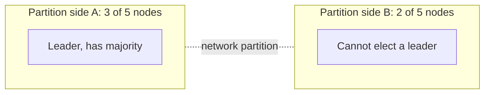

Certain small mechanisms recur across distributed systems. Knowing them by name lets you describe designs precisely and quickly. This lesson covers the most useful ones, with where each appeared in the course.

## Bloom filter

A compact probabilistic set that answers "definitely not present" or "possibly present." It uses a bit array and several hash functions; false positives are possible, false negatives are not.

**Used for:** skipping disk lookups for keys that do not exist in LSM-tree databases, the URL-seen check in web crawlers, and avoiding recommending already seen items.

## Quorum

With N replicas, a write succeeds after W acknowledgements and a read queries R replicas. If W + R is greater than N, every read overlaps at least one replica with the latest write.

**Used for:** tunable consistency in leaderless key-value stores.

## Leader and followers

One node, the leader, accepts writes and replicates them to followers, which serve reads and can take over if the leader fails. Leader election uses consensus or leases.

**Used for:** relational database replication, per-partition leaders in logs and queues, and the single owner per document in collaborative editing.

## Heartbeat

Nodes periodically send "I am alive" messages. Missing several heartbeats marks a node as suspected failed. Timeouts must balance fast detection against false alarms during brief slowdowns.

**Used for:** failure detection in clusters, session directories and lease renewal.

## Lease

A lock with an expiry. The holder must renew it before it expires; if the holder crashes, the lease lapses and another node can take over. Combined with **fencing tokens**, leases prevent a paused former holder from acting after it has lost the lease.

**Used for:** document ownership, driver reservations in ride-hailing, and leader election.

## Checksum

A small value computed from data (such as CRC32 or SHA-256) and stored with it. On read, recomputing and comparing detects corruption from disks, networks or bugs.

**Used for:** blob stores, artifact distribution in deployment systems and content deduplication.

## Write-ahead log

Before applying a change, append it to a durable, sequential log. After a crash, replaying the log restores all acknowledged changes. Sequential appends are fast, even on disks.

**Used for:** databases, message queues and the operation log in collaborative editing.

## Split-brain

When a network partition divides a cluster, both sides may believe they should lead, accepting conflicting writes. Defenses include requiring a **majority quorum** to act as leader (so only one side can), fencing tokens and generation numbers that let storage reject writes from stale leaders.

## Other patterns

- **Merkle trees** compare large datasets efficiently by hashing ranges hierarchically; used for anti-entropy repair between replicas.
- **Gossip protocols** spread membership and state through random peer exchanges, scaling to large clusters.
- **Vector clocks** track causality between versions to detect concurrent updates.
- **Hinted handoff** temporarily stores writes for an unavailable replica on another node and delivers them later.
- **Consistent hashing** maps keys to nodes so that membership changes move few keys.
- **Outbox pattern** writes an event to a table in the same transaction as the business change, then publishes it, ensuring events are never lost or sent for rolled-back changes.

<KeyTakeaways>
- Bloom filters answer "definitely not" cheaply; quorums with W + R greater than N give overlapping reads and writes.
- Leaders with followers, heartbeats and leases coordinate ownership and detect failure.
- Checksums detect corruption; write-ahead logs make changes durable and recoverable.
- Split-brain is prevented with majority quorums, fencing tokens and generation numbers.
- Merkle trees, gossip, vector clocks, hinted handoff, consistent hashing and the outbox pattern round out the toolkit.
</KeyTakeaways>
