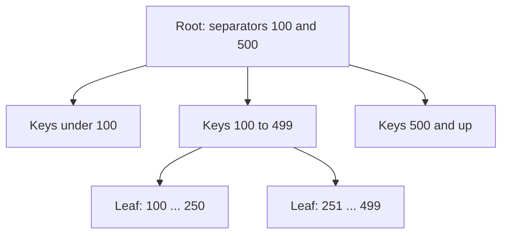

An index is an additional data structure that lets a database find rows without scanning the whole table. Choosing the right indexes is often the single biggest performance lever in a data-heavy system, and understanding their costs helps you reason about write-heavy workloads.

## Why indexes matter

Without an index, finding the rows where `email = 'ana@example.com'` in a table of 100 million users means reading every row: a **full table scan**. With an index on `email`, the database follows a small structure directly to the matching row in a handful of steps.

## B-tree indexes

The most common index is the **B-tree** (or B+ tree). It keeps keys sorted in a balanced tree of pages, typically a few kilobytes each. Each internal page points to child pages covering key ranges; leaf pages hold keys and pointers to rows (or the rows themselves).

Because each page has hundreds of children, a tree only three or four levels deep can index billions of rows. B-trees support equality lookups, **range queries** (`created_at BETWEEN ...`) and ordered scans efficiently.

## LSM-tree indexes

Write-heavy stores often use **log-structured merge trees**. Writes go to an in-memory sorted table and a write-ahead log; when the table fills, it is flushed to disk as an immutable sorted file. Background **compaction** merges files. Reads check the memory table and then files from newest to oldest, using Bloom filters to skip files that cannot contain the key.

| Aspect | B-tree | LSM tree |
| --- | --- | --- |
| Writes | In-place page updates, random I/O | Sequential appends, very fast |
| Reads | Fast, predictable | May check several files; Bloom filters help |
| Space | Some fragmentation | Temporary duplication until compaction |
| Typical use | Relational databases | Wide-column and key-value stores |

## Kinds of indexes

- **Primary (clustered) index:** determines how rows are physically ordered; lookups by primary key are fastest.
- **Secondary index:** an extra structure on another column that points back to the rows.
- **Composite index:** on several columns, such as (user_id, created_at). It serves queries that filter on a **leftmost prefix** of the columns: user_id alone, or user_id plus a created_at range, but not created_at alone.
- **Covering index:** includes all columns a query needs, so the database never reads the table rows.
- **Hash index:** fast equality lookups but no range queries.
- **Specialized indexes:** inverted indexes for full-text search, spatial indexes (R-trees, geohashes) for location queries and vector indexes for similarity search.

## The costs

Every index must be updated on every insert, update and delete that touches its columns, which slows writes and consumes storage and memory. An index on a low-selectivity column, such as a boolean flag, rarely helps. In distributed databases, **secondary indexes** add another trade-off: a local index per shard means queries by that column must ask every shard (scatter-gather), while a global index partitioned by the indexed value makes reads efficient but writes touch multiple shards, usually updated asynchronously.

<Callout type="interview">
When you propose a table in an interview, name its key indexes and the queries they serve: "Posts are keyed by post ID, with a secondary index on (author_id, created_at) for profile pages."
</Callout>

## The leftmost-prefix rule, by example

With a composite index on `(user_id, created_at)`:

| Query | Uses the index? |
| --- | --- |
| `WHERE user_id = 42` | Yes |
| `WHERE user_id = 42 AND created_at > '2026-01-01'` | Yes, as a range within the user |
| `WHERE user_id = 42 ORDER BY created_at DESC LIMIT 20` | Yes, reads 20 entries in order |
| `WHERE created_at > '2026-01-01'` | No — the leading column is missing |

<Ponder question="A write-heavy events table has nine secondary indexes, and inserts are slow. How would you decide which indexes to drop?">
Check which queries actually use each index (most databases report index usage statistics), and weigh read benefit against write cost. Drop unused or redundant indexes (for example, an index on `(a)` when `(a, b)` exists), consider moving rarely needed analytical queries to a replica or warehouse, and keep only the indexes that serve latency-critical reads. Each dropped index removes one extra write per insert.
</Ponder>

<KeyTakeaways>
- Indexes avoid full scans by letting the database navigate directly to matching rows.
- B-trees support equality, range and ordered queries and power most relational databases.
- LSM trees favor fast sequential writes, with compaction and Bloom filters to keep reads efficient.
- Composite indexes follow the leftmost-prefix rule; covering indexes avoid reading table rows.
- Indexes cost write speed and storage; in distributed databases, local versus global secondary indexes trade read efficiency for write cost.
</KeyTakeaways>
