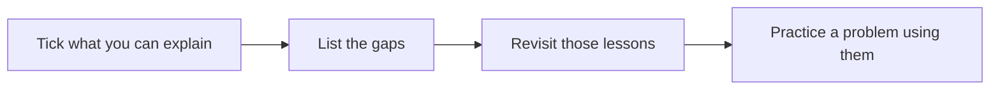

Use this checklist to test yourself before an interview. For each concept, you should be able to explain what it is, when to use it and what it costs, in under a minute. Concepts you cannot explain confidently point you to the lessons to revisit.

## Foundations

- [ ] Availability as a number of nines, and what 99.99 percent allows per year (about 53 minutes)
- [ ] Reliability versus availability
- [ ] Latency percentiles (p50, p99) and why tail latency matters in fan-out
- [ ] Throughput and bandwidth estimates
- [ ] Failure models: crash, omission, Byzantine
- [ ] Consistency models: linearizable, sequential, causal, eventual

## Networking and traffic

- [ ] DNS resolution and TTLs
- [ ] Layer 4 versus layer 7 load balancing
- [ ] Global server load balancing and anycast
- [ ] CDN push versus pull, cache keys and invalidation
- [ ] Forward versus reverse proxies
- [ ] Long polling, WebSockets and server-sent events
- [ ] Rate limiting algorithms: token bucket, leaky bucket, fixed and sliding windows

## Data

- [ ] SQL versus NoSQL and how to choose
- [ ] Indexes: B-trees, LSM trees, secondary indexes
- [ ] Replication: leader-follower, multi-leader, leaderless
- [ ] Partitioning: range, hash, consistent hashing, hot spots
- [ ] Quorums: N, W and R
- [ ] Transactions and isolation levels
- [ ] Vector clocks and conflict resolution
- [ ] Change data capture

## Caching and messaging

- [ ] Cache-aside, write-through, write-back
- [ ] Eviction policies: LRU, LFU, TTL
- [ ] Cache stampede protection (request coalescing, early refresh)
- [ ] Queues versus pub-sub versus logs
- [ ] At-most-once, at-least-once, exactly-once processing
- [ ] Back-pressure and dead-letter queues

## Distributed coordination

- [ ] Leader election and leases
- [ ] Consensus (Raft or Paxos) at a high level
- [ ] Fencing tokens
- [ ] Heartbeats and failure detection (gossip, phi accrual)
- [ ] Unique ID generation (UUID, Snowflake-style IDs)
- [ ] Logical clocks (Lamport, vector) and TrueTime-style bounded clocks

## Reliability patterns

- [ ] Idempotency keys
- [ ] Retries with exponential backoff and jitter; retry budgets
- [ ] Circuit breakers and bulkheads
- [ ] Graceful degradation and load shedding
- [ ] Cell-based architecture
- [ ] Canary releases, feature flags, rollbacks
- [ ] Static stability of data planes

## Specialized structures

- [ ] Bloom filters and count-min sketches
- [ ] Tries and inverted indexes
- [ ] Geohashes, quadtrees, S2 and H3
- [ ] Merkle trees for anti-entropy
- [ ] CRDTs and operational transformation

## AI-era concepts

- [ ] Tokens, context windows, prefill and decode
- [ ] KV cache, continuous batching, prefix caching
- [ ] Embeddings, vector indexes, hybrid search and reranking
- [ ] Retrieval-augmented generation and grounding
- [ ] Prompt injection and guardrails
- [ ] Feature stores, point-in-time correctness and training-serving skew

<Callout type="tip">
Explaining a concept aloud to someone else, or to a recording, is the fastest way to find out whether you really understand it.
</Callout>

<KeyTakeaways>
- For each concept, be able to explain what it is, when to use it and what it costs.
- The checklist spans foundations, networking, data, caching and messaging, coordination, reliability, specialized structures and AI concepts.
- Gaps in the checklist tell you which lessons to revisit before an interview.
- Practice explaining concepts aloud to confirm real understanding.
</KeyTakeaways>
