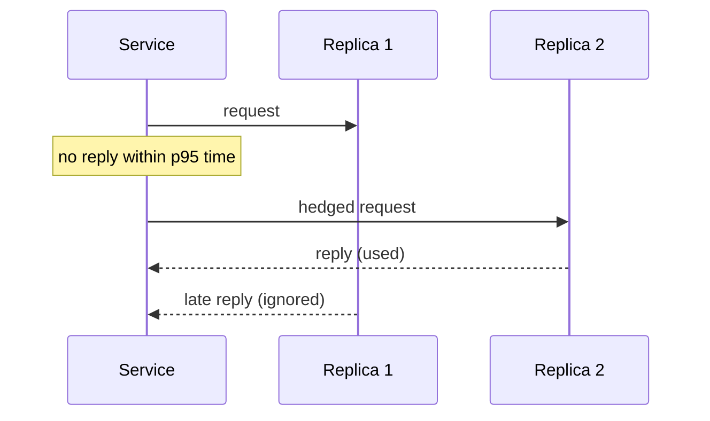

Latency is often the most visible quality of a system: users notice a slow page long before they notice a missing feature. This lesson collects practical techniques for reducing latency, organized from the network down to the data layer.

## Know where the time goes

Before optimizing, measure. Distributed tracing shows how a request's time is spread across services, and percentile metrics (p50, p95, p99) show the experience of typical and unlucky users. Averages hide the tail, and in systems that fan out to many backends, the tail dominates.

Useful reference points:

| Operation | Approximate latency |
| --- | --- |
| Main memory reference | 100 ns |
| Read 1 MB sequentially from memory | a few microseconds to tens of microseconds |
| Round trip within a data center | about 0.5 ms |
| Read 1 MB from SSD | about 1 ms or less |
| Disk seek | about 5 to 10 ms |
| Round trip across a continent | 40 to 80 ms |
| Round trip across an ocean | 100 to 150 ms |

Network distance usually matters more than anything inside a server.

## Network and edge

- **Serve from close to users:** CDNs for static and cacheable content, and multiple regions for dynamic content.
- **Reuse connections:** keep-alive, connection pools and HTTP/2 or HTTP/3 avoid repeated TCP and TLS handshakes.
- **Reduce round trips:** batch requests, return everything a page needs in one call, and avoid chains of dependent requests from clients.
- **Compress responses** and choose compact formats for large payloads.

## Application

- **Cache aggressively:** in-process caches for tiny hot data, distributed caches for shared data and precomputed results for expensive queries.
- **Parallelize independent calls** instead of making them sequentially.
- **Move work off the request path:** anything the user does not need immediately, such as notifications, analytics and indexing, goes to a queue.
- **Set timeouts** on every dependency, and use **hedged requests** for tail latency: if a replica has not answered within the p95 time, send a second request to another replica and use whichever answers first.
- **Degrade gracefully:** return partial results when a non-critical dependency is slow.

## Data layer

- **Index for your queries** and avoid full scans on the request path.
- **Denormalize** to avoid joins for hot reads.
- **Keep hot data in memory** when it fits.
- **Choose partition keys** that keep a request's data on one shard, avoiding scatter-gather.
- **Avoid hot spots** that create queues behind a single node.

## Perceived latency

Users judge speed by what they see. Techniques such as optimistic UI updates, streaming responses, skeleton screens, pre-fetching likely next content and showing low-resolution placeholders make systems feel faster even when total work is unchanged.

<Callout type="interview">
When asked how to make something faster, start with where the time goes, then address the network (distance and round trips), then caching, then the data layer. It shows structured thinking.
</Callout>

## A latency makeover, by example

A product page takes 1,200 ms. Tracing shows three sequential backend calls of 150 ms each, a 300 ms database query without an index, 200 ms of image loading from a distant origin and 250 ms of other work.

| Change | Saving |
| --- | --- |
| Run the three independent calls in parallel | ~300 ms |
| Add an index for the slow query and cache its result | ~280 ms |
| Serve images through a CDN | ~150 ms |
| **New total** | **~470 ms** |

None of the changes required faster servers — only fewer sequential round trips, better data access and less distance.

<Ponder question="A service's p50 latency is 20 ms, but its p99 is 900 ms. Where would you look first?">
The tail usually comes from something intermittent: garbage-collection pauses, a slow replica or disk, lock contention, cache misses on cold keys, retries after timeouts, or requests that fan out to many backends and wait for the slowest. Compare traces of slow and fast requests to see which step differs, and consider hedged requests, timeouts and eliminating the intermittent cause.
</Ponder>

<KeyTakeaways>
- Measure with tracing and percentiles; tail latency dominates in fan-out systems.
- Network distance and round trips usually cost more than computation; serve from the edge and reuse connections.
- Cache, parallelize, move work off the request path, set timeouts and hedge requests for tail latency.
- Index, denormalize and choose partition keys to avoid scatter-gather and hot spots.
- Optimistic updates, streaming and pre-fetching improve perceived latency.
</KeyTakeaways>
