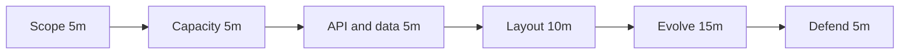

This lesson is a one-page cheat sheet for any system design interview. It lists what to cover in each SCALED step, the questions to ask and a suggested time budget for a 45-minute session. Review it before every practice session until it becomes second nature.

## Time budget

| Step | Minutes | Output |
| --- | --- | --- |
| **S**cope | 5 | Functional and non-functional requirements, out-of-scope list |
| **C**apacity | 5 | Traffic, storage, bandwidth and server estimates |
| **A**PI and data model | 5 | Key endpoints, entities and access patterns |
| **L**ayout | 10 | High-level diagram with building blocks and data flow |
| **E**volve | 15 | Two or three deep dives into the hardest parts |
| **D**efend | 5 | Trade-offs, bottlenecks, failure scenarios, next steps |

## S: Scope

Questions to ask:

- Who are the users, and what are the three to five most important things they do?
- What is explicitly out of scope?
- How many users, and how are they distributed geographically?
- What matters most: latency, availability, consistency, durability or cost?
- Are there special constraints, such as privacy, regulation, real-time needs or offline use?

Write the requirements down where the interviewer can see them.

## C: Capacity

- Daily active users → requests per second (divide by about 100,000 seconds per day; multiply by 2 to 3 for peak).
- Read-to-write ratio.
- Storage per item × items per day × retention.
- Bandwidth = requests per second × response size.
- Servers ≈ peak requests per second ÷ capacity per server.
- Conclude with one sentence: "So this is read-heavy, the working set fits in memory and we need a CDN."

## A: API and data model

- List five to eight endpoints with parameters and responses.
- Identify core entities, their relationships and the dominant access patterns.
- Choose storage per entity based on access patterns: relational, key-value, wide-column, document, search index, blob store or graph.
- Pick partition keys that keep common queries on one shard and spread load.

## L: Layout

Draw clients, edge (DNS, CDN, load balancers), stateless services, data stores, caches, queues and asynchronous workers. Walk through the main flows end to end: "A user posts; the request hits…"

## E: Evolve

Choose the hardest or most interesting parts, or ask the interviewer which they prefer. Typical deep dives:

- Hot keys and skew (celebrities, viral content, flash sales)
- Fan-out strategies
- Consistency and concurrency control (double booking, idempotency)
- Spatial or text indexing
- Real-time delivery and connection management
- Caching strategy and invalidation
- Data pipelines and precomputation

## D: Defend

- Map each non-functional requirement to the mechanism that satisfies it.
- Name the trade-offs you made and why they fit the product.
- Walk through failures: a server, a data store, a region, a dependency.
- State what breaks first at ten times the scale and how you would evolve.
- Mention monitoring and alerting for key metrics.

<Callout type="interview">
If you run short on time, compress Layout rather than skipping Defend. Interviewers weigh the discussion of trade-offs and failures heavily.
</Callout>

<KeyTakeaways>
- Spend roughly 5, 5, 5, 10, 15 and 5 minutes on the six SCALED steps in a 45-minute interview.
- Scope with targeted questions and write requirements down.
- Turn estimates into explicit conclusions that shape the design.
- Choose storage and partition keys from access patterns.
- Reserve time to defend the design with trade-offs, failures and scaling limits.
</KeyTakeaways>
