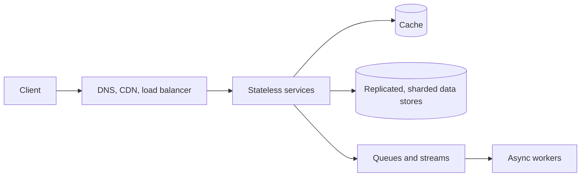

This primer is a compact refresher of the core vocabulary used throughout the course. Each entry gives a one-line definition and the situation where it matters most. Use it for quick review before an interview.

## Scaling

- **Vertical scaling:** bigger machines. Simple, but limited and a single point of failure.
- **Horizontal scaling:** more machines. Requires stateless services or partitioned data.
- **Stateless services:** keep session state in a shared store so any server can handle any request.

## Traffic management

- **DNS:** maps names to addresses; can route by geography or latency.
- **Load balancer:** spreads requests across healthy servers (layer 4 or layer 7), with algorithms such as round robin, least connections and consistent hashing.
- **CDN:** caches static and cacheable content at edges near users.
- **API gateway:** a single entry point for authentication, rate limiting and routing to services.
- **Rate limiter:** caps requests per client with algorithms such as token bucket or sliding window.

## Data storage

| Store | Best for |
| --- | --- |
| Relational database | Structured data, transactions, joins |
| Key-value store | Simple lookups by key at massive scale |
| Wide-column store | High write volumes, time-ordered data per key |
| Document store | Flexible, nested records |
| Search index | Full-text search and filtering |
| Graph database | Traversing relationships |
| Blob store | Large immutable files |
| Time-series database | Metrics and events by time |

- **Replication:** copies data for availability and read scaling (leader-follower, multi-leader, leaderless).
- **Partitioning (sharding):** splits data across nodes by key range or hash.
- **Indexes:** speed up reads at the cost of slower writes and more storage.

## Caching

- **Cache-aside:** the application reads the cache, falls back to the database and fills the cache.
- **Write-through / write-back:** writes go to the cache and then synchronously or asynchronously to the database.
- **Eviction:** LRU, LFU or TTL-based.
- **Hazards:** stale data, cache stampedes on popular keys and hot keys.

## Asynchronous processing

- **Message queue:** decouples producers and consumers and absorbs bursts.
- **Pub-sub:** broadcasts events to many subscribers.
- **Stream processing:** computes continuously over event streams with windows.
- **Batch processing:** processes large datasets periodically.

## Reliability

- **Redundancy** at every layer; no single points of failure.
- **Health checks and failover.**
- **Idempotency** so retries are safe.
- **Retries with exponential backoff and jitter**, plus circuit breakers.
- **Graceful degradation:** shed non-critical features under load.

## Consistency

- **Strong consistency:** reads see the latest write.
- **Eventual consistency:** replicas converge over time.
- **Read-your-writes, monotonic reads, causal consistency:** useful intermediate guarantees.
- **Quorums:** with N replicas, W + R greater than N makes reads overlap the latest write.

## Observability

- **Metrics, logs and traces**, with dashboards and alerts on service-level objectives.

## Security essentials

- **Authentication and authorization:** verify who the caller is (tokens, OAuth) and check what they may do on every request, not only at the edge.
- **Encryption:** TLS in transit, encryption at rest, and per-tenant keys for sensitive multi-tenant data.
- **Least privilege:** services and people get only the permissions they need; secrets live in a secrets manager, never in code.
- **Input validation and rate limiting** at the edge protect against abuse and injection.

## Numbers worth memorizing

| Quantity | Value |
| --- | --- |
| Seconds per day | ~86,400 (round to 100,000) |
| 1 million requests per day | ~12 per second |
| 99.9% / 99.99% availability | ~8.8 hours / ~53 minutes of downtime per year |
| Memory / SSD / cross-continent latency | ~100 ns / ~100 µs / ~150 ms |

<Ponder question="Which single primer concept is most often missing from candidates' designs, even strong ones?">
Idempotency on write paths that can be retried — payments, message sends, order creation, task submission. Without it, every retry after a timeout risks a duplicate, and designs that otherwise scale well quietly double-charge or double-send. Mentioning idempotency keys whenever a client or service retries a write is a small habit with a large payoff.
</Ponder>

<KeyTakeaways>
- Horizontal scaling relies on stateless services and partitioned data.
- DNS, load balancers, CDNs, gateways and rate limiters manage traffic.
- Choose data stores by access pattern; replicate for availability and shard for scale.
- Caches, queues and streams decouple components and absorb load.
- Reliability comes from redundancy, idempotency, backoff, circuit breakers and graceful degradation.
- Security basics — authentication, authorization, encryption and least privilege — belong in every design.
</KeyTakeaways>
