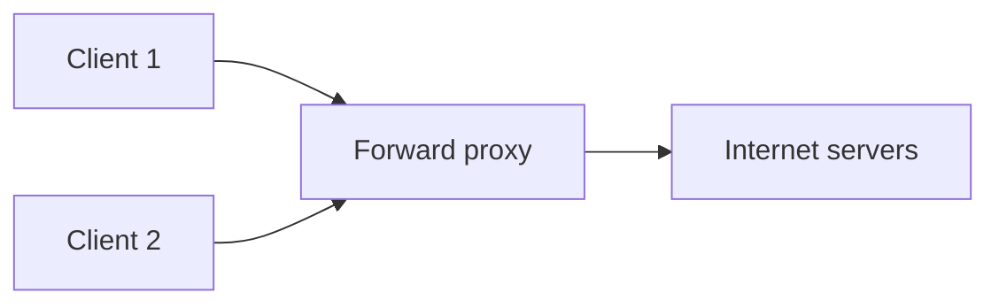
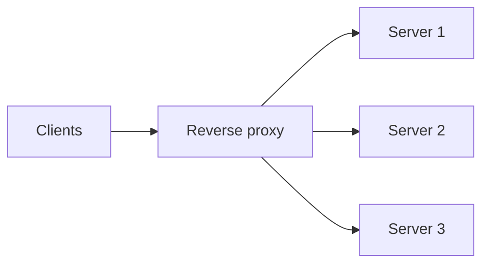

A proxy is an intermediary that sits between clients and servers and forwards requests on someone's behalf. Whose behalf is the difference between the two main kinds: a **forward proxy** acts for clients, and a **reverse proxy** acts for servers. Both appear constantly in system design, sometimes under other names such as load balancer, API gateway or sidecar.

## Forward proxy

A forward proxy sits in front of a group of **clients**, such as the computers in a company network. Clients send their requests to the proxy, which forwards them to servers on the internet. The servers see the proxy's address, not the client's.

Uses:

- **Access control and filtering:** organizations block categories of sites or enforce security policies.
- **Caching:** repeated downloads of the same content are served locally, saving bandwidth.
- **Privacy and anonymity:** servers do not see individual client addresses.
- **Egress control:** in data centers, outbound traffic from services goes through a proxy that allows only approved destinations, which limits damage from compromised services.

The clients know about the forward proxy, since they are configured to use it.

## Reverse proxy

A reverse proxy sits in front of **servers**. Clients send requests to the proxy's address, believing it is the service, and the proxy forwards them to one of the backend servers. Clients usually do not know the backends exist.

Uses:

- **Load balancing** across backend servers.
- **TLS termination:** the proxy handles encryption, offloading work from backends and centralizing certificates.
- **Caching and compression** of responses.
- **Security:** hiding backend addresses, filtering malicious requests (web application firewall), absorbing some denial-of-service traffic.
- **Routing:** sending different paths to different services, which is the core of an API gateway.
- **Rate limiting and authentication** at a single entry point.

CDNs are a globally distributed form of reverse proxy.

## Comparison

| Aspect | Forward proxy | Reverse proxy |
| --- | --- | --- |
| Acts on behalf of | Clients | Servers |
| Who configures it | Client side (users or their organization) | Server side (the service operator) |
| Hides | Client identities from servers | Server topology from clients |
| Typical uses | Filtering, egress control, caching, anonymity | Load balancing, TLS, caching, routing, security |

## Proxies in modern architectures

In a **service mesh**, each service instance has a **sidecar proxy** that handles both directions: outbound calls act like a forward proxy (discovery, retries, encryption), and inbound calls act like a reverse proxy (authentication, rate limiting, metrics). This moves networking concerns out of application code.

Proxies add a hop and can become bottlenecks or single points of failure, so they are deployed redundantly and kept lightweight.

## Where you have already met reverse proxies

| Course component | Reverse-proxy role |
| --- | --- |
| Load balancer | Distributes requests to healthy backends |
| API gateway | Routes by path, authenticates, rate limits |
| CDN edge | Caches and serves content on behalf of origins |
| Search coordinator | Fans out queries to shards on behalf of the client |
| Service mesh sidecar (inbound) | Terminates TLS, enforces policy, records metrics |

<Ponder question="Why do many companies force all outbound traffic from production services through a forward proxy?">
It gives a single place to control and audit which external destinations services may reach. If a service is compromised, the attacker cannot freely send data to arbitrary servers, because the egress proxy only allows approved domains. It also centralizes TLS inspection policies, logging and outbound rate limits to third-party APIs.
</Ponder>

<KeyTakeaways>
- A forward proxy acts for clients; a reverse proxy acts for servers.
- Forward proxies provide filtering, egress control, caching and client anonymity.
- Reverse proxies provide load balancing, TLS termination, caching, routing and security; CDNs and API gateways are reverse proxies.
- Service mesh sidecars act as both, moving networking logic out of applications.
- Proxies add a hop and must be deployed redundantly to avoid becoming single points of failure.
</KeyTakeaways>
